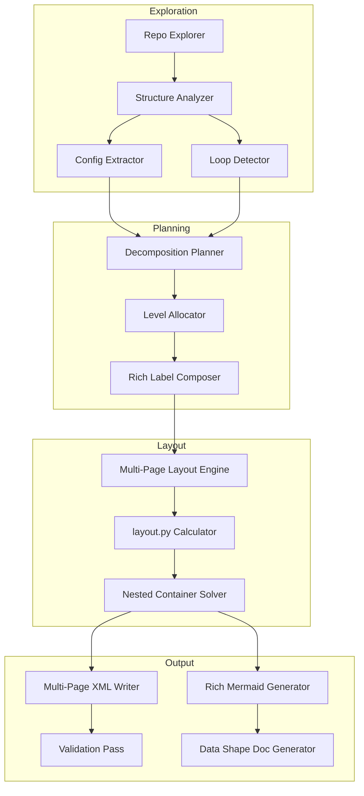
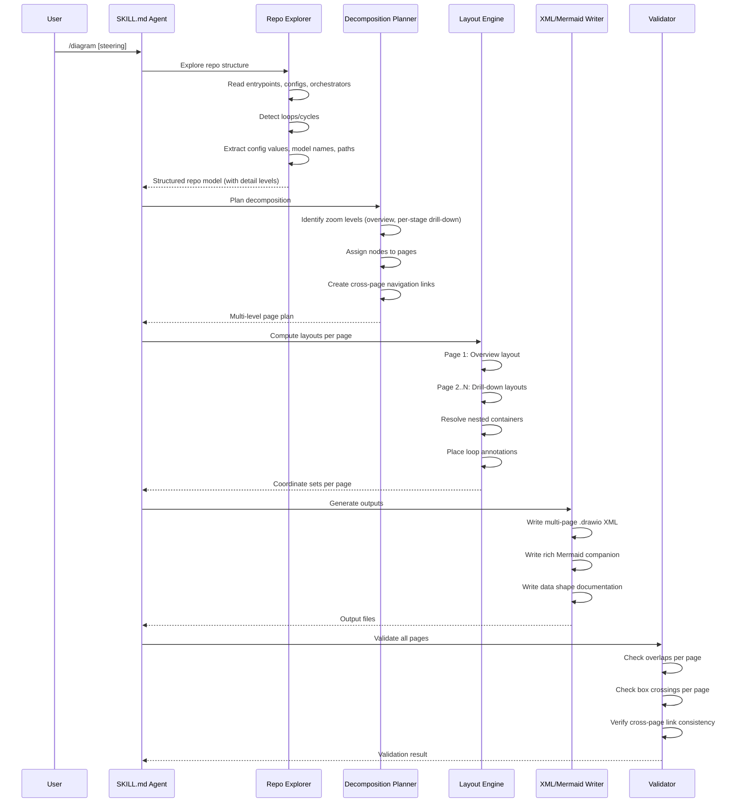
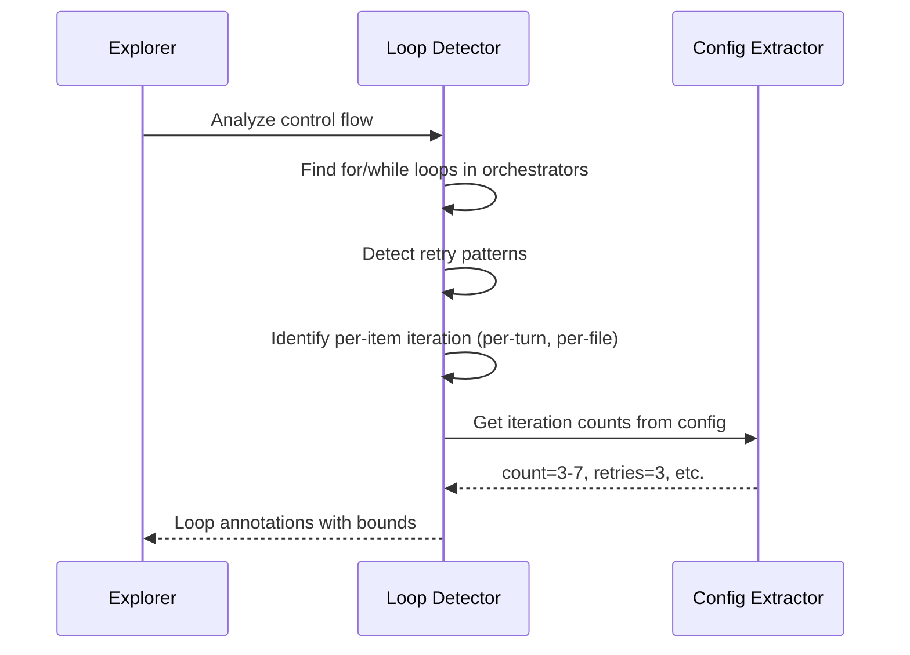

# Design Document: Diagram Quality Upgrade

## Overview

This feature upgrades the drawio-skill to produce multi-level, richly-detailed architecture diagrams that match or exceed the quality of reference documentation like PIPELINE_DIAGRAM.md. The current skill produces flat, single-page diagrams with basic labels and limited routing patterns. The upgrade introduces hierarchical diagram pages (overview → drill-down levels), rich multi-line labels with config values and file paths, loop/cycle representations, conditional routing beyond pass/fail, data shape documentation, and a comprehensive Mermaid companion with subgraph groupings.

The architecture extends the existing exploration → planning → layout → XML generation pipeline by adding a new **decomposition planner** that identifies zoom levels, a **rich label composer** that extracts specific config values and parameters from the codebase, a **loop/cycle detector** that identifies repeated patterns, and a **multi-page layout engine** that coordinates across diagram pages. The layout.py calculator is extended with new commands for nested containers, loop annotations, and multi-page coordinate management.

## Architecture



## Sequence Diagrams

### Main Generation Flow



### Loop Detection Flow



## Components and Interfaces

### Component 1: Decomposition Planner

**Purpose**: Analyzes the repo model and determines how to split the architecture into multiple diagram pages at different zoom levels.

```python
class DecompositionPlanner:
    def plan_levels(self, repo_model: RepoModel) -> List[DiagramPage]:
        """Determine which pages to create and what each contains."""
        ...

    def assign_nodes_to_pages(self, repo_model: RepoModel, pages: List[DiagramPage]) -> PageAssignment:
        """Map each architectural node to its primary page and any summary appearances."""
        ...

    def create_navigation_links(self, assignment: PageAssignment) -> List[NavLink]:
        """Create clickable links between overview nodes and their drill-down pages."""
        ...
```

**Responsibilities**:
- Decide the number of diagram levels (always: 1 overview + N drill-downs)
- Group related stages into coherent drill-down pages
- Ensure every node appears at least once (either in overview or a drill-down)
- Create collapsed/summary representations for drill-down content shown at overview level

### Component 2: Rich Label Composer

**Purpose**: Extracts specific values from configs, source code, and comments to build multi-line labels with concrete details (model names, file paths, parameter values).

```python
class RichLabelComposer:
    def compose_label(self, node: ArchNode, detail_level: DetailLevel) -> str:
        """Build a multi-line HTML label with extracted details."""
        ...

    def extract_config_values(self, node: ArchNode, config_files: List[Path]) -> Dict[str, str]:
        """Pull specific config values relevant to this node."""
        ...

    def format_label_html(self, title: str, details: List[str], max_lines: int = 4) -> str:
        """Format as HTML with <br> separators, respecting line limits per detail level."""
        ...
```

**Responsibilities**:
- Overview labels: title + 1-line summary (max 2 lines)
- Drill-down labels: title + config values + file paths + parameters (up to 4 lines)
- Escape HTML entities in labels
- Compute accurate line counts for step_h calculation

### Component 3: Loop/Cycle Detector

**Purpose**: Identifies iteration patterns in the codebase — for loops, retry logic, per-item processing — and extracts their bounds from config.

```python
class LoopDetector:
    def detect_loops(self, repo_model: RepoModel) -> List[LoopAnnotation]:
        """Find all loop/retry/iteration patterns."""
        ...

    def classify_loop(self, loop: LoopAnnotation) -> LoopType:
        """Classify as fixed-count, bounded-range, retry, or unbounded."""
        ...

    def extract_bounds(self, loop: LoopAnnotation, configs: List[Path]) -> LoopBounds:
        """Pull iteration count/range from config or code constants."""
        ...
```

**Responsibilities**:
- Detect `for item in items` patterns (per-turn, per-file, per-batch)
- Detect retry/backoff patterns
- Extract concrete bounds (e.g., "repeated 3-7 times")
- Produce annotation metadata for the layout engine

### Component 4: Multi-Page Layout Engine

**Purpose**: Extends the existing layout calculator to handle multiple pages, nested containers (groups within swimlanes), and loop annotation boxes.

```python
class MultiPageLayoutEngine:
    def layout_page(self, page: DiagramPage, page_type: PageType) -> PageLayout:
        """Compute full layout for one diagram page."""
        ...

    def layout_nested_container(self, container: NestedContainer, parent_bounds: Rect) -> ContainerLayout:
        """Layout a group/subgraph within a swimlane."""
        ...

    def place_loop_annotation(self, loop: LoopAnnotation, target_bounds: Rect) -> LoopAnnotationLayout:
        """Position a loop repeat indicator around target nodes."""
        ...

    def layout_conditional_routing(self, decision: DecisionNode) -> RoutingLayout:
        """Handle N-way conditional splits (beyond binary pass/fail)."""
        ...
```

**Responsibilities**:
- Manage separate coordinate spaces per page
- Support nested swimlanes (a group inside a swimlane)
- Place dashed-border loop annotation boxes around repeated sections
- Handle N-way routing splits (not just pass/fail but multi-outcome)

### Component 5: Data Shape Document Generator

**Purpose**: Produces a companion document describing data structures flowing between stages — types, schemas, sample values.

```python
class DataShapeDocGenerator:
    def generate(self, repo_model: RepoModel, page_plan: List[DiagramPage]) -> str:
        """Generate markdown documenting data shapes at each stage boundary."""
        ...

    def extract_schema(self, stage_output: StageOutput) -> DataShape:
        """Infer or read the schema of data flowing out of a stage."""
        ...

    def format_config_table(self, config_values: Dict[str, Any]) -> str:
        """Format a markdown table of config parameters."""
        ...
```

**Responsibilities**:
- Document input/output shapes at each stage boundary
- Include config snapshot tables (key parameters with current values)
- Show sample data snippets where available
- Cross-reference diagram node IDs for traceability

## Data Models

### RepoModel

```python
@dataclass
class RepoModel:
    inputs: List[InputNode]
    stages: List[Stage]
    outputs: List[OutputNode]
    configs: List[ConfigFile]
    loops: List[LoopAnnotation]
    connections: List[Connection]

@dataclass
class Stage:
    id: str
    name: str
    sub_steps: List[SubStep]
    decisions: List[Decision]
    loops: List[LoopAnnotation]
    config_refs: List[ConfigRef]       # specific config values used
    source_files: List[Path]           # files implementing this stage
    parallel_with: List[str]           # IDs of stages running in parallel
    detail_level: DetailLevel          # how much detail was found
```

**Validation Rules**:
- Every stage must have at least one sub_step or be marked as atomic
- connections must reference valid stage/node IDs
- loops must reference stages they wrap
- No circular dependencies in stage ordering (loops are annotated separately)

### DiagramPage

```python
@dataclass
class DiagramPage:
    page_id: str
    name: str                          # "Overview", "Step 1: Generation", etc.
    page_type: PageType                # OVERVIEW, DRILL_DOWN, POST_PROCESSING
    nodes: List[ArchNode]
    edges: List[Edge]
    groups: List[NodeGroup]            # subgraph groupings
    loop_annotations: List[LoopAnnotation]
    nav_links: List[NavLink]           # links to other pages
    data_shapes: List[DataShape]       # data flowing in/out of this page

class PageType(Enum):
    OVERVIEW = "overview"
    DRILL_DOWN = "drill_down"
    POST_PROCESSING = "post_processing"
    DATA_FLOW = "data_flow"
```

**Validation Rules**:
- Must have exactly one OVERVIEW page
- Each DRILL_DOWN page must be reachable from the OVERVIEW via nav_links
- nav_links must reference valid page_ids
- groups must contain only nodes present in the same page

### LoopAnnotation

```python
@dataclass
class LoopAnnotation:
    loop_id: str
    loop_type: LoopType
    wrapped_nodes: List[str]           # node IDs inside the loop
    bounds: LoopBounds
    label: str                         # e.g., "per turn · repeated 3-7×"
    condition: Optional[str]           # exit condition if applicable

class LoopType(Enum):
    FIXED_COUNT = "fixed"              # exactly N iterations
    BOUNDED_RANGE = "bounded"          # min-max iterations
    RETRY = "retry"                    # retry with backoff
    PER_ITEM = "per_item"             # once per item in collection
    UNTIL_CONDITION = "until"          # loop until condition met

@dataclass
class LoopBounds:
    min_count: Optional[int]
    max_count: Optional[int]
    source: str                        # where the bound was found (config key, code line)
```

### RichLabel

```python
@dataclass
class RichLabel:
    title: str                         # primary name
    subtitle: Optional[str]            # e.g., model name, script path
    details: List[str]                 # additional lines (config values, parameters)
    detail_level: DetailLevel

class DetailLevel(Enum):
    OVERVIEW = "overview"              # title only or title + 1 line
    STANDARD = "standard"             # title + 2-3 detail lines
    DETAILED = "detailed"             # title + all available details (up to 4-5 lines)

    def max_lines(self) -> int:
        return {self.OVERVIEW: 2, self.STANDARD: 3, self.DETAILED: 5}[self]
```

### ConditionalRouting

```python
@dataclass
class DecisionNode:
    node_id: str
    condition_expr: str                # the decision being made
    outcomes: List[Outcome]            # N possible outcomes (not just pass/fail)

@dataclass
class Outcome:
    label: str                         # edge label (e.g., "score ≥ 0.7", "timeout", "retry")
    target_id: str                     # where this outcome routes to
    color: str                         # edge color
    probability: Optional[str]         # optional hint like "~80%"
```

**Validation Rules**:
- A DecisionNode must have at least 2 outcomes
- All outcome target_ids must reference valid nodes
- Edge colors must be from the approved palette

## Algorithmic Pseudocode

### Algorithm: Multi-Level Decomposition

```python
def plan_decomposition(repo_model: RepoModel) -> List[DiagramPage]:
    """
    Analyze the repo model and create a multi-page diagram plan.
    
    Preconditions:
        - repo_model.stages is non-empty
        - all connections reference valid node IDs
    
    Postconditions:
        - returns at least 1 page (overview)
        - every stage appears in at least one page
        - overview page contains all stages (some as collapsed summaries)
        - drill-down pages exist for stages with >= 3 sub_steps or loops
    """
    pages = []
    
    # Step 1: Always create an overview page
    overview = DiagramPage(
        page_id="overview",
        name="Pipeline Overview",
        page_type=PageType.OVERVIEW,
        nodes=[], edges=[], groups=[], loop_annotations=[], nav_links=[], data_shapes=[]
    )
    
    # Step 2: Identify stages that warrant drill-down pages
    drill_down_candidates = []
    for stage in repo_model.stages:
        complexity = len(stage.sub_steps) + len(stage.decisions) * 2 + len(stage.loops) * 3
        if complexity >= 5 or len(stage.sub_steps) >= 3 or len(stage.loops) > 0:
            drill_down_candidates.append(stage)
    
    # Step 3: Group adjacent related stages into single drill-down pages
    drill_down_groups = group_adjacent_stages(drill_down_candidates, max_group_size=3)
    
    # Step 4: Create drill-down pages
    for group in drill_down_groups:
        page = DiagramPage(
            page_id=f"detail-{group[0].id}",
            name=f"Step {group[0].id}: {group[0].name}",
            page_type=PageType.DRILL_DOWN,
            nodes=expand_stages_to_nodes(group),
            edges=extract_internal_edges(group),
            groups=create_subgraph_groups(group),
            loop_annotations=collect_loops(group),
            nav_links=[],
            data_shapes=extract_boundary_shapes(group, repo_model)
        )
        pages.append(page)
        
        # Add collapsed summary to overview
        summary_node = create_summary_node(group, link_to=page.page_id)
        overview.nodes.append(summary_node)
        overview.nav_links.append(NavLink(source=summary_node.id, target_page=page.page_id))
    
    # Step 5: Add non-drilldown stages directly to overview
    for stage in repo_model.stages:
        if stage not in flatten(drill_down_groups):
            overview.nodes.append(stage_to_node(stage, DetailLevel.STANDARD))
    
    # Step 6: Add overview edges
    overview.edges = compute_overview_edges(overview.nodes, repo_model.connections)
    
    pages.insert(0, overview)
    return pages
```

**Loop Invariants:**
- After processing each stage, every stage seen so far appears in exactly one page (either overview or a drill-down)
- The overview page always has a node (summary or direct) for every stage

### Algorithm: Rich Label Generation

```python
def compose_rich_label(node: ArchNode, detail_level: DetailLevel, 
                        config_files: List[ConfigFile]) -> RichLabel:
    """
    Build a multi-line label with concrete values extracted from the codebase.
    
    Preconditions:
        - node has a non-empty name
        - detail_level is a valid enum value
    
    Postconditions:
        - returned label has at most detail_level.max_lines() total lines
        - title is always present and non-empty
        - all detail strings are <= 40 characters (for wrapping)
        - HTML entities are properly escaped
    """
    title = node.name
    details = []
    
    # Extract config values relevant to this node
    if detail_level in (DetailLevel.STANDARD, DetailLevel.DETAILED):
        config_vals = extract_config_values_for_node(node, config_files)
        for key, value in config_vals.items():
            detail_line = f"{key}: {value}"
            if len(detail_line) > 40:
                detail_line = detail_line[:37] + "..."
            details.append(detail_line)
    
    # Add source file path for detailed level
    if detail_level == DetailLevel.DETAILED and node.source_files:
        primary_file = node.source_files[0]
        path_str = shorten_path(primary_file, max_len=38)
        details.append(f"📄 {path_str}")
    
    # Add model/service names if found
    if node.model_name:
        details.append(f"model: {node.model_name}")
    
    # Truncate to max lines
    max_detail_lines = detail_level.max_lines() - 1  # -1 for title
    details = details[:max_detail_lines]
    
    return RichLabel(
        title=html_escape(title),
        subtitle=details[0] if details else None,
        details=details,
        detail_level=detail_level
    )
```

### Algorithm: Loop Annotation Placement

```python
def place_loop_annotation(loop: LoopAnnotation, node_layouts: Dict[str, Rect],
                           page_bounds: Rect) -> LoopAnnotationLayout:
    """
    Position a dashed-border loop box around the wrapped nodes.
    
    Preconditions:
        - loop.wrapped_nodes is non-empty
        - all wrapped_node IDs exist in node_layouts
        - nodes are in the same page
    
    Postconditions:
        - annotation box fully encloses all wrapped nodes with padding
        - annotation does not extend beyond page_bounds
        - label is positioned at top-right of the annotation box
    
    Loop Invariants:
        - bounding_rect always contains all nodes processed so far
    """
    PADDING = 15  # px around enclosed nodes
    LABEL_HEIGHT = 20
    
    # Compute bounding rect of all wrapped nodes
    bounding_rect = None
    for node_id in loop.wrapped_nodes:
        node_rect = node_layouts[node_id]
        if bounding_rect is None:
            bounding_rect = node_rect.copy()
        else:
            bounding_rect = bounding_rect.union(node_rect)
    
    # Expand with padding
    annotation_rect = Rect(
        x=bounding_rect.x - PADDING,
        y=bounding_rect.y - PADDING - LABEL_HEIGHT,
        width=bounding_rect.width + 2 * PADDING,
        height=bounding_rect.height + 2 * PADDING + LABEL_HEIGHT
    )
    
    # Clamp to page bounds
    annotation_rect = annotation_rect.clamp_within(page_bounds)
    
    # Position label at top-right
    label_position = Point(
        x=annotation_rect.x + annotation_rect.width - 10,
        y=annotation_rect.y + 5
    )
    
    return LoopAnnotationLayout(
        rect=annotation_rect,
        label_position=label_position,
        label_text=loop.label,
        style="dashed;strokeColor=#999999;fillColor=none;opacity=60;"
    )
```

### Algorithm: N-Way Conditional Routing

```python
def layout_conditional_routing(decision: DecisionNode, decision_rect: Rect,
                                target_rects: Dict[str, Rect]) -> RoutingLayout:
    """
    Layout edges for N-way conditional splits (generalizes pass/fail to N outcomes).
    
    Preconditions:
        - decision.outcomes has at least 2 entries
        - all outcome.target_ids exist in target_rects
        - decision_rect is positioned in the page
    
    Postconditions:
        - all outcome edges have non-overlapping exit points
        - exit points are evenly distributed along the bottom edge of decision_rect
        - each edge has a label positioned to avoid overlap with adjacent labels
    
    Loop Invariants:
        - exit_points assigned so far are at least min_gap apart
    """
    n = len(decision.outcomes)
    edges = []
    
    # Distribute exit points evenly along bottom of decision box
    # For 2 outcomes: exitX=0.25, exitX=0.75 (avoid extreme corners for clarity)
    # For 3 outcomes: exitX=0.2, exitX=0.5, exitX=0.8
    # For N outcomes: evenly spaced from 0.1 to 0.9
    exit_positions = [0.1 + (0.8 * i / (n - 1)) for i in range(n)]
    
    for i, outcome in enumerate(decision.outcomes):
        exit_x = exit_positions[i]
        target_rect = target_rects[outcome.target_id]
        
        # Choose entry point on target - spread across top
        entry_x = 0.1 + (0.8 * i / (n - 1)) if n > 2 else (0.3 if i == 0 else 0.7)
        
        # Compute routing band (each edge gets its own band to avoid overlap)
        band_y = decision_rect.bottom + 10 + (i * 10)
        
        edge = RoutedEdge(
            source_id=decision.node_id,
            target_id=outcome.target_id,
            exit_x=exit_x,
            exit_y=1.0,
            entry_x=entry_x,
            entry_y=0.0,
            waypoints=[
                Point(decision_rect.x + exit_x * decision_rect.width, band_y),
                Point(target_rect.x + entry_x * target_rect.width, band_y)
            ],
            label=outcome.label,
            color=outcome.color
        )
        edges.append(edge)
    
    return RoutingLayout(edges=edges)
```

## Key Functions with Formal Specifications

### Function: layout.py `cmd_nested_container`

```python
def cmd_nested_container(parent_sw_w: int, parent_start_y: int, 
                          n_children: int, lines_per_child: List[int]) -> None:
    """Compute layout for a nested group container within a swimlane."""
```

**Preconditions:**
- `parent_sw_w >= 100` (minimum swimlane width for nesting)
- `parent_start_y >= 0`
- `n_children >= 1`
- `len(lines_per_child) == n_children`
- all values in `lines_per_child >= 1`

**Postconditions:**
- Prints container dimensions that fit within parent swimlane
- Inner padding of 12px on each side
- Child step width = parent_sw_w - 36 - 24 (parent padding + container padding)
- Container has its own header area (20px)

### Function: layout.py `cmd_loop_annotation`

```python
def cmd_loop_annotation(first_node_y: int, last_node_y: int, last_node_h: int,
                         sw_w: int, label_text: str) -> None:
    """Compute bounding box for a loop annotation around nodes."""
```

**Preconditions:**
- `first_node_y >= 0`
- `last_node_y >= first_node_y`
- `last_node_h >= 36`
- `sw_w >= 100`

**Postconditions:**
- Annotation rect fully encloses all nodes from first_node_y to last_node_y + last_node_h
- 15px padding on all sides
- 20px extra at top for label
- Annotation width = sw_w - 8 (4px margin on each side within swimlane)

### Function: layout.py `cmd_multipage`

```python
def cmd_multipage(n_pages: int, page_type: str) -> None:
    """Output page configuration for multi-page diagram."""
```

**Preconditions:**
- `n_pages >= 1`
- `page_type in ("overview", "drill_down", "data_flow")`

**Postconditions:**
- Prints page dimensions (overview uses standard 827x1169)
- Drill-down pages may use wider format (1169x827 landscape) if many parallel lanes
- Each page gets a unique diagram ID

### Function: `generate_multi_page_xml`

```python
def generate_multi_page_xml(pages: List[PageLayout]) -> str:
    """Generate a multi-page draw.io XML file."""
```

**Preconditions:**
- `pages` is non-empty
- First page has `page_type == OVERVIEW`
- All node IDs are unique across all pages
- All edge source/target IDs reference valid nodes within the same page

**Postconditions:**
- Returns valid XML with one `<diagram>` element per page
- Each diagram has a unique `id` attribute
- Navigation links are encoded as `style="...link=..."` attributes
- All coordinates are absolute within each page's coordinate space

### Function: `generate_rich_mermaid`

```python
def generate_rich_mermaid(pages: List[DiagramPage], repo_model: RepoModel) -> str:
    """Generate comprehensive Mermaid markdown with subgraphs and detail."""
```

**Preconditions:**
- `pages` is non-empty
- `repo_model` has valid stages and connections

**Postconditions:**
- Returns markdown with multiple Mermaid code blocks (one per zoom level)
- Overview diagram uses `flowchart TD` with subgraph groupings
- Drill-down diagrams include rich node labels with config values
- Loop patterns represented with note annotations
- All node IDs are valid Mermaid identifiers (alphanumeric + underscore)

## Example Usage

```python
# Example 1: Running the upgraded skill on a repo
# The skill agent follows these steps internally:

# 1. Explore and build repo model
repo_model = explore_repo("/path/to/auto-eval")
# Returns: RepoModel with stages=[Generation, Annotation, Scoring, PostProcessing]
#          loops=[LoopAnnotation(type=PER_ITEM, bounds=(3,7), label="per turn")]
#          configs=[ConfigFile(path="config.yaml", values={"model": "gpt-4", ...})]

# 2. Plan decomposition
pages = plan_decomposition(repo_model)
# Returns: [
#   DiagramPage(name="Pipeline Overview", type=OVERVIEW, nodes=4 summary nodes),
#   DiagramPage(name="Step 1: Generation Internals", type=DRILL_DOWN, ...),
#   DiagramPage(name="Step 2: Annotation & Scoring", type=DRILL_DOWN, ...),
#   DiagramPage(name="Post-Processing", type=DRILL_DOWN, ...)
# ]

# 3. Compute layouts per page
layouts = [layout_page(page) for page in pages]

# 4. Generate multi-page draw.io XML
xml = generate_multi_page_xml(layouts)
write_file("architecture.drawio", xml)

# 5. Generate rich Mermaid companion
mermaid_md = generate_rich_mermaid(pages, repo_model)
write_file("architecture.md", mermaid_md)

# 6. Generate data shape documentation
data_doc = generate_data_shapes(repo_model, pages)
append_to_file("architecture.md", data_doc)
```

```python
# Example 2: Using the extended layout.py calculator

# New command: nested container within a swimlane
# python3 layout.py nested-container <parent_sw_w> <parent_start_y> <n_children> <lines...>
$ python3 layout.py nested-container 316 45 3 1 2 1
# container_x=12  container_y=45  container_w=292
# child_step_w=256  child_step_x=18
# child[0]: y=20  h=40
# child[1]: y=76  h=58
# child[2]: y=150  h=40
# container_h=210

# New command: loop annotation bounds
# python3 layout.py loop-annotation <first_y> <last_y> <last_h> <sw_w>
$ python3 layout.py loop-annotation 45 200 58 316
# annotation_x=4  annotation_y=10  annotation_w=308  annotation_h=318
# label_x=292  label_y=15

# New command: N-way split (generalizes binary pass/fail)
# python3 layout.py n-split <sw_w> <last_step_y> <last_step_h> <n_outcomes> [split_gap]
$ python3 layout.py n-split 316 200 40 3 50
# split_y=290
# outcome[0]: x=18  w=85  (left)
# outcome[1]: x=113  w=85  (center)
# outcome[2]: x=208  w=86  (right)
# sl_height=346
```

```python
# Example 3: Multi-page XML structure
xml_output = """<?xml version="1.0" encoding="UTF-8"?>
<mxfile host="ac.draw.io">
  <diagram id="overview" name="Pipeline Overview">
    <mxGraphModel ...>
      <root>
        <mxCell id="0"/>
        <mxCell id="1" parent="0"/>
        <!-- Summary nodes with navigation links -->
        <mxCell id="gen-summary" parent="1" vertex="1"
          style="rounded=1;fillColor=#ffe6cc;strokeColor=#d79b00;html=1;"
          value="Generation&lt;br&gt;gpt-4 · 3-7 turns">
          <mxGeometry x="255" y="100" width="316" height="58" as="geometry"/>
        </mxCell>
      </root>
    </mxGraphModel>
  </diagram>
  <diagram id="detail-gen" name="Step 1: Generation">
    <mxGraphModel ...>
      <root>
        <!-- Detailed drill-down with loops, rich labels -->
      </root>
    </mxGraphModel>
  </diagram>
</mxfile>
"""
```

## Correctness Properties

*A property is a characteristic or behavior that should hold true across all valid executions of a system — essentially, a formal statement about what the system should do. Properties serve as the bridge between human-readable specifications and machine-verifiable correctness guarantees.*

### Property 1: Complete Stage Coverage

*For any* valid RepoModel, after decomposition every stage in the model must appear in at least one DiagramPage either as a full node or as a collapsed summary node.

**Validates: Requirements 1.3, 1.4**

### Property 2: Overview Completeness

*For any* valid RepoModel, the OVERVIEW page must contain a node (summary or direct) for every stage in the model, ensuring no architectural component is invisible at the top level.

**Validates: Requirements 1.1, 1.3, 1.4**

### Property 3: Navigation Consistency

*For any* multi-page diagram output, every NavLink must reference a target_page that exists in the page set, and the NavLink source must be a valid node on the OVERVIEW page.

**Validates: Requirements 1.5, 7.3**

### Property 4: Drill-Down Page Limit

*For any* RepoModel regardless of complexity, the Decomposition_Planner must produce at most 8 drill-down pages.

**Validates: Requirements 1.6**

### Property 5: Label Line Limit

*For any* node and any DetailLevel, the Rich_Label_Composer must produce a label whose total line count does not exceed the maximum for that level (OVERVIEW: 2, STANDARD: 3, DETAILED: 5).

**Validates: Requirements 2.1, 2.2, 2.3**

### Property 6: Label Line Truncation

*For any* detail line in a composed label, if the source text exceeds 40 characters, the output line must be truncated to at most 40 characters including an ellipsis suffix.

**Validates: Requirements 2.4**

### Property 7: HTML Entity Escaping

*For any* input text containing HTML special characters (<, >, &, "), the Rich_Label_Composer output must contain the corresponding escaped entities and no raw HTML characters.

**Validates: Requirements 2.5**

### Property 8: Loop Enclosure

*For any* LoopAnnotation and its set of wrapped nodes, the computed annotation rectangle must fully contain every wrapped node's bounding box with at least 15 pixels of padding on all sides.

**Validates: Requirements 3.5, 5.3, 5.4**

### Property 9: N-Way Split Non-Overlapping Exit Points

*For any* DecisionNode with N ≥ 2 outcomes, the Layout_Engine must produce N exit points evenly distributed in [0.1, 0.9] along the bottom edge, each assigned a distinct routing band y-value.

**Validates: Requirements 4.1, 4.2, 4.3**

### Property 10: Nested Container Containment

*For any* parent swimlane width ≥ 100 and any number of children, the nested-container computation must produce child positions that fit within the parent swimlane bounds, with child step width equal to parent_sw_w − 60.

**Validates: Requirements 5.1, 5.2**

### Property 11: N-Split Box Coverage

*For any* N outcomes and step width, the n-split computation must produce N non-overlapping outcome boxes whose combined widths fill the available step width.

**Validates: Requirements 5.5**

### Property 12: Mermaid Identifier Validity

*For any* node in the architecture, the generated Mermaid node ID must contain only alphanumeric characters and underscores (matching pattern `[a-zA-Z0-9_]+`).

**Validates: Requirements 6.4**

### Property 13: Unique IDs Across Pages

*For any* multi-page diagram, all node IDs must be unique across all pages, and all diagram element IDs must be unique within the mxfile.

**Validates: Requirements 7.4, 8.1, 8.2**

### Property 14: Minimum Approach Distance

*For any* edge with explicit waypoints, the last waypoint must maintain at least 20 pixels of distance from the target node in the entry direction (top: waypoint_y ≤ target_top − 20, bottom: waypoint_y ≥ target_bottom + 20, etc.).

**Validates: Requirements 7.5**

### Property 15: Secret Filtering

*For any* config dictionary containing keys matching secret patterns (_KEY, _SECRET, _TOKEN, password), those values must never appear in any generated label text.

**Validates: Requirements 9.1**

### Property 16: Relative Path Only

*For any* file path included in a label, the path must be relative and must not contain home directory prefixes or absolute path indicators.

**Validates: Requirements 9.2**

**Validates: Requirement 9.2**

## Error Handling

### Error Scenario 1: Repo Too Simple for Multi-Level

**Condition**: Repo has fewer than 3 stages or no stage has sufficient complexity for drill-down
**Response**: Fall back to single-page diagram with enhanced labels (still richer than current)
**Recovery**: The decomposition planner returns only an overview page; no drill-down pages are created

### Error Scenario 2: Config Values Not Found

**Condition**: RichLabelComposer cannot find config values for a node
**Response**: Use generic label (title + source file path) instead of config-specific details
**Recovery**: Graceful degradation — labels are still multi-line but with available info only

### Error Scenario 3: Loop Bounds Unknown

**Condition**: LoopDetector finds a loop but cannot determine bounds from config or code
**Response**: Annotate with "repeated N×" (unknown count) or "per item" without specific count
**Recovery**: The loop annotation is still placed; only the label text differs

### Error Scenario 4: Too Many Pages

**Condition**: Decomposition planner identifies > 8 drill-down candidates
**Response**: Group related stages more aggressively (max 3 stages per drill-down page, raise complexity threshold)
**Recovery**: Re-run grouping with stricter thresholds until page count ≤ 8

### Error Scenario 5: Nested Container Too Deep

**Condition**: A stage contains sub-stages that themselves contain sub-steps (3+ levels)
**Response**: Flatten to max 2 levels of nesting (swimlane → group → steps)
**Recovery**: Excess depth is collapsed into multi-line labels with a "..." indicator

## Testing Strategy

### Unit Testing Approach

- Test decomposition planner with mock RepoModels of varying complexity
- Test rich label composer with known config files and expected output strings
- Test loop detector against sample Python/JS orchestrator files
- Test layout.py new commands with known inputs and expected coordinate outputs
- Test XML generation produces valid XML parseable by draw.io

### Property-Based Testing Approach

**Property Test Library**: hypothesis (Python)

Key properties to test with random inputs:
- `layout_nested_container` always produces rects that fit within parent bounds
- `place_loop_annotation` always encloses all wrapped node rects
- `layout_conditional_routing` with N outcomes always produces N non-overlapping exit points
- `compose_rich_label` never exceeds max_lines for any detail_level
- `plan_decomposition` always places every stage in at least one page

### Integration Testing Approach

- Run full skill against the auto-eval repo and validate:
  - Output contains multiple `<diagram>` elements
  - Each page passes the existing diagram-validate checks
  - Mermaid markdown renders without syntax errors
  - All cross-page navigation links reference existing pages
- Compare output quality against PIPELINE_DIAGRAM.md reference manually

## Performance Considerations

- The decomposition planner runs once and is O(n) in number of stages — negligible
- Rich label extraction reads config files once and caches; no repeated I/O
- Layout calculation is O(n²) for edge overlap checking per page — acceptable for typical repos (< 50 nodes per page)
- Multi-page XML generation is proportional to total nodes; keep pages under 30 nodes each for readability

## Security Considerations

- Config value extraction must not expose secrets (API keys, tokens) — filter known secret patterns (keys matching `*_KEY`, `*_SECRET`, `*_TOKEN`, `password`)
- File paths in labels use relative paths only (no home directory exposure)
- The skill reads but never executes code from the target repo

## Dependencies

- `python3` (standard library only) — for layout.py calculator
- No new external packages required
- draw.io/diagrams.net — for rendering the output XML
- Any Mermaid renderer — for viewing the companion markdown
