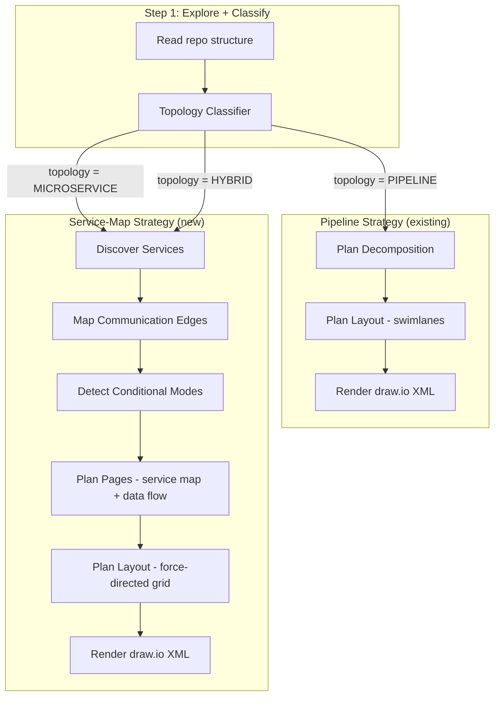
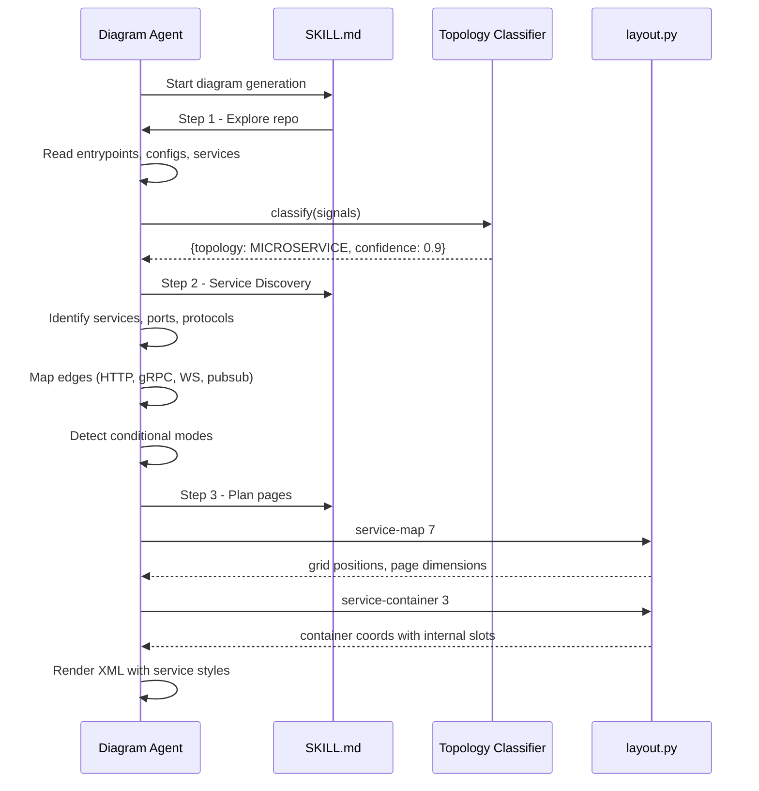
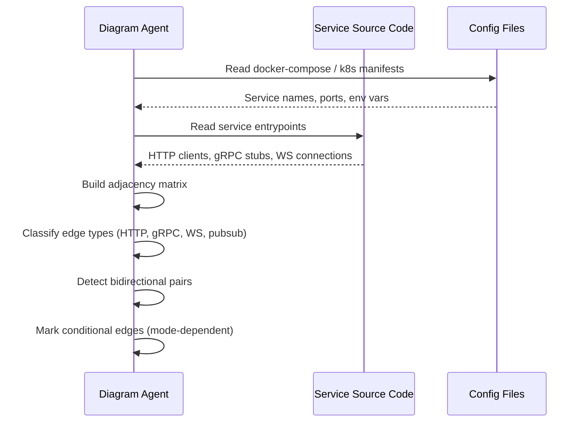

# Design Document: Microservice Topology Support

## Overview

This feature extends the drawio-skill to handle microservice/distributed system architectures alongside the existing pipeline diagram capability. The core idea is a **topology classifier** that runs before any diagramming begins — it determines whether a repo is a pipeline (sequential stages with pass/fail), a microservice system (always-running services with bidirectional communication), or a hybrid. The classifier's output selects the appropriate diagramming strategy: pipeline repos use the existing proven approach unchanged, microservice repos use a new service-map strategy with different layout rules, edge styles, and grouping patterns.

The design introduces new layout.py commands (`service-map`, `service-container`, `bidirectional-edge`, `conditional-group`), a new page type (`SERVICE_MAP`), and extends the SKILL.md exploration step with topology-aware questions. The critical constraint is backward compatibility: nothing in the pipeline path changes. The topology classifier acts as a pure branching gate — if it says "pipeline", execution proceeds exactly as before.

The test case is the `convai` repo: 7 services communicating via HTTP/gRPC/WebSockets/LiveKit, with bidirectional flows, conditional topology (cascade vs openai modes), and complex state machines.

## Architecture



## Sequence Diagrams

### Main Flow: Topology Detection and Branch



### Edge Discovery Flow



## Components and Interfaces

### Component 1: Topology Classifier

**Purpose**: Analyzes repo signals and determines the topology type with confidence score.

```python
class TopologyType(Enum):
    PIPELINE = "pipeline"
    MICROSERVICE = "microservice"
    HYBRID = "hybrid"

class TopologySignal:
    """A single signal contributing to classification."""
    name: str           # e.g., "docker_compose_services"
    weight: float       # 0.0 - 1.0
    detected: bool
    evidence: str       # what was found

class ClassificationResult:
    topology: TopologyType
    confidence: float   # 0.0 - 1.0
    signals: list[TopologySignal]
    services: list[str]  # discovered service names (empty for PIPELINE)
```

**Responsibilities**:
- Scan for pipeline indicators (orchestrator scripts, sequential stage configs, pass/fail patterns)
- Scan for microservice indicators (docker-compose, k8s manifests, multiple service dirs, inter-service HTTP/gRPC)
- Weight signals and determine dominant topology
- Return discovered service names for downstream use

### Component 2: Service Discovery

**Purpose**: Deep analysis of a microservice repo to extract services, their internal components, communication edges, and conditional topologies.

```python
class Service:
    name: str
    path: str               # relative path to service root
    runtime: str            # "always-running" | "one-shot" | "triggered"
    components: list[str]   # internal sub-components
    ports: dict[str, int]   # protocol -> port
    dependencies: list[str] # services this one calls

class CommunicationEdge:
    source: str         # service name
    target: str         # service name
    protocol: str       # "HTTP" | "gRPC" | "WebSocket" | "pubsub" | "database"
    bidirectional: bool
    label: str          # e.g., "audio frames", "transcription"
    conditional: str | None  # mode name if edge only exists in certain configs

class ConditionalMode:
    name: str               # e.g., "cascade", "openai"
    config_key: str         # e.g., "PIPELINE_TYPE"
    services: list[str]     # services active in this mode
    edges: list[str]        # edge IDs active in this mode

class ServiceTopology:
    services: list[Service]
    edges: list[CommunicationEdge]
    modes: list[ConditionalMode]
    infrastructure: list[str]  # e.g., ["Redis", "PostgreSQL", "LiveKit"]
```

**Responsibilities**:
- Walk service directories and identify entrypoints
- Extract inter-service communication from code (HTTP clients, gRPC stubs, WS connections)
- Parse infrastructure configs (docker-compose, helm charts, tilt files) for topology
- Detect bidirectional communication patterns
- Identify conditional topology modes from env vars and config switches

### Component 3: Service-Map Layout Engine (layout.py extensions)

**Purpose**: Compute coordinates for service-map diagrams with containers, bidirectional edges, and conditional groups.

```python
# New layout.py commands

def cmd_service_map(n_services: int, page_type: str = "service_map") -> dict:
    """Compute grid positions for N services on a service map page."""
    ...

def cmd_service_container(n_internal_components: int, container_w: int = 200) -> dict:
    """Compute internal layout for a service container with sub-components."""
    ...

def cmd_bidirectional_edge(source_x: int, source_y: int, 
                           target_x: int, target_y: int,
                           offset: int = 8) -> dict:
    """Compute parallel offset paths for bidirectional edge pair."""
    ...

def cmd_conditional_group(service_positions: list[tuple[int,int,int,int]], 
                          padding: int = 20) -> dict:
    """Compute dashed boundary box around a set of services (conditional mode)."""
    ...
```

**Responsibilities**:
- Grid-based placement for service nodes (avoiding overlap)
- Internal container layout with component slots
- Parallel edge offset computation for bidirectional arrows
- Bounding box computation for conditional mode groups

### Component 4: Page Planner (Topology-Aware)

**Purpose**: Decides which pages to generate based on topology type.

```python
class PageType(Enum):
    OVERVIEW = "overview"           # existing
    DRILL_DOWN = "drill_down"       # existing
    DATA_FLOW = "data_flow"         # existing
    SERVICE_MAP = "service_map"     # NEW
    DEPLOYMENT = "deployment"       # NEW

class DiagramPage:
    page_type: PageType
    name: str
    services: list[str]     # which services appear on this page
    mode: str | None        # if this page shows a specific conditional mode
```

**Responsibilities**:
- For PIPELINE: use existing decomposition rules unchanged
- For MICROSERVICE: generate SERVICE_MAP overview + optional DEPLOYMENT + DATA_FLOW per major flow
- For HYBRID: generate both pipeline and service-map pages

## Data Models

### Model 1: Topology Signals

```python
PIPELINE_SIGNALS = [
    "orchestrator_script",      # main.py / run.py with sequential calls
    "stage_config",             # config listing stages in order
    "pass_fail_patterns",       # score thresholds, quality gates
    "output_chain",             # stage N output = stage N+1 input
    "single_execution_flow",    # runs once to completion
]

MICROSERVICE_SIGNALS = [
    "docker_compose_services",  # multiple services in docker-compose
    "kubernetes_manifests",     # k8s deployments/services
    "multiple_service_dirs",    # separate directories per service
    "inter_service_http",       # HTTP client calls between services
    "grpc_proto_files",         # .proto files defining service interfaces
    "websocket_connections",    # WebSocket server/client patterns
    "message_queue_usage",      # Redis pubsub, Kafka, SQS
    "always_running_processes", # web servers, workers with event loops
    "helm_charts",              # Helm chart directories
    "tilt_file",               # Tiltfile for dev orchestration
]
```

**Validation Rules**:
- At least 3 microservice signals → MICROSERVICE classification
- At least 2 pipeline signals with no microservice signals → PIPELINE
- Both present → HYBRID (use service count as tiebreaker: ≥3 services = MICROSERVICE-dominant)

### Model 2: Visual Styles for Service-Map

```python
SERVICE_MAP_STYLES = {
    "service_container": (
        "rounded=1;whiteSpace=wrap;html=1;fillColor=#e1d5e7;"
        "strokeColor=#9673a6;verticalAlign=top;fontStyle=1;"
        "fontSize=11;swimlane;startSize=26;"
    ),
    "internal_component": (
        "rounded=1;whiteSpace=wrap;html=1;fillColor=#f5f5f5;"
        "strokeColor=#666666;fontSize=10;"
    ),
    "infrastructure_node": (
        "shape=cylinder3;whiteSpace=wrap;html=1;fillColor=#dae8fc;"
        "strokeColor=#6c8ebf;boundedLbl=1;backgroundOutline=1;"
        "size=10;"
    ),
    "client_node": (
        "shape=mxgraph.aws4.client;fillColor=#dae8fc;"
        "strokeColor=#6c8ebf;whiteSpace=wrap;html=1;"
    ),
    "conditional_group": (
        "rounded=1;whiteSpace=wrap;html=1;fillColor=none;"
        "strokeColor=#d79b00;strokeWidth=2;dashed=1;opacity=70;"
        "verticalAlign=top;fontStyle=2;fontSize=10;"
    ),
    "edge_http": "edgeStyle=orthogonalEdgeStyle;strokeColor=#6c8ebf;",
    "edge_grpc": "edgeStyle=orthogonalEdgeStyle;strokeColor=#9673a6;strokeWidth=2;",
    "edge_websocket": "edgeStyle=orthogonalEdgeStyle;strokeColor=#d79b00;dashed=1;",
    "edge_pubsub": "edgeStyle=orthogonalEdgeStyle;strokeColor=#82b366;dashed=1;dashPattern=8 4;",
    "edge_bidirectional": "edgeStyle=orthogonalEdgeStyle;startArrow=classic;endArrow=classic;",
}
```

**Validation Rules**:
- Service containers must have at least a name and one port
- Infrastructure nodes use cylinder shape (databases, caches) or specific AWS/cloud shapes
- Conditional groups must reference at least 2 services
- Bidirectional edges rendered as two parallel offset arrows (not double-headed single arrow)

### Model 3: Node Shapes by Runtime Type

```python
NODE_SHAPES = {
    "always_running": "rounded=1",           # rounded rectangle (services)
    "one_shot": "shape=process",             # rectangular process box (pipeline stages)
    "triggered": "shape=hexagon",            # hexagon (event-triggered functions)
    "infrastructure": "shape=cylinder3",     # cylinder (databases, caches)
    "external": "shape=cloud",              # cloud (external APIs)
    "client": "shape=mxgraph.aws4.client",  # browser/mobile client
}
```

## Algorithmic Pseudocode

### Algorithm 1: Topology Classification

```python
def classify_topology(repo_path: str) -> ClassificationResult:
    """
    Classify a repository's architecture topology.
    
    Preconditions:
      - repo_path exists and is a valid git repository
      - repo_path contains at least one source file
    
    Postconditions:
      - Returns ClassificationResult with topology in {PIPELINE, MICROSERVICE, HYBRID}
      - confidence is between 0.0 and 1.0
      - If topology == MICROSERVICE, services list is non-empty
    """
    signals = []
    
    # Phase 1: Scan for pipeline indicators
    has_orchestrator = scan_for_orchestrator(repo_path)  # main.py with sequential calls
    has_stage_config = scan_for_stage_config(repo_path)  # yaml/json with stages list
    has_pass_fail = scan_for_quality_gates(repo_path)    # threshold checks
    has_output_chain = scan_for_output_chaining(repo_path)  # stage outputs → next inputs
    
    pipeline_score = sum([
        0.3 if has_orchestrator else 0,
        0.25 if has_stage_config else 0,
        0.2 if has_pass_fail else 0,
        0.25 if has_output_chain else 0,
    ])
    
    # Phase 2: Scan for microservice indicators
    docker_services = scan_docker_compose(repo_path)   # list of service names
    k8s_manifests = scan_kubernetes(repo_path)         # deployment/service yamls
    service_dirs = scan_service_directories(repo_path) # dirs with own entrypoints
    has_grpc = scan_for_proto_files(repo_path)
    has_http_clients = scan_for_inter_service_http(repo_path)
    has_websockets = scan_for_websocket_patterns(repo_path)
    has_message_queues = scan_for_pubsub(repo_path)
    has_helm = scan_for_helm_charts(repo_path)
    has_tilt = path_exists(repo_path, "Tiltfile")
    
    service_count = max(
        len(docker_services),
        len(k8s_manifests),
        len(service_dirs)
    )
    
    microservice_score = sum([
        0.2 if service_count >= 3 else 0.1 if service_count >= 2 else 0,
        0.15 if has_grpc else 0,
        0.15 if has_http_clients else 0,
        0.1 if has_websockets else 0,
        0.1 if has_message_queues else 0,
        0.15 if has_helm or has_tilt else 0,
        0.15 if k8s_manifests else 0,
    ])
    
    # Phase 3: Classification decision
    if microservice_score >= 0.5 and pipeline_score < 0.3:
        topology = TopologyType.MICROSERVICE
        confidence = microservice_score
    elif pipeline_score >= 0.5 and microservice_score < 0.3:
        topology = TopologyType.PIPELINE
        confidence = pipeline_score
    elif microservice_score >= 0.3 and pipeline_score >= 0.3:
        topology = TopologyType.HYBRID
        confidence = max(microservice_score, pipeline_score) * 0.8
    else:
        # Low confidence — default to pipeline (existing behavior)
        topology = TopologyType.PIPELINE
        confidence = max(pipeline_score, 0.3)
    
    # Collect discovered service names
    services = (docker_services or k8s_manifests or service_dirs 
                if topology != TopologyType.PIPELINE else [])
    
    return ClassificationResult(
        topology=topology,
        confidence=confidence,
        signals=signals,
        services=services,
    )
```

**Preconditions:**
- `repo_path` is a valid directory containing source code
- File system is readable

**Postconditions:**
- Returns exactly one of PIPELINE, MICROSERVICE, or HYBRID
- confidence ∈ [0.0, 1.0]
- If MICROSERVICE or HYBRID, `services` list contains ≥ 2 service names

**Loop Invariants:** N/A (no iteration loops in classification)

### Algorithm 2: Service Edge Discovery

```python
def discover_edges(services: list[Service], repo_path: str) -> list[CommunicationEdge]:
    """
    Map all communication edges between discovered services.
    
    Preconditions:
      - services list has at least 2 services
      - Each service has a valid path relative to repo_path
    
    Postconditions:
      - All returned edges reference valid service names from input
      - Bidirectional edges detected (A→B and B→A collapsed to one bidi edge)
      - No duplicate edges (same source, target, protocol)
    """
    raw_edges: list[CommunicationEdge] = []
    
    for service in services:
        # Scan service source code for outbound connections
        source_files = find_source_files(repo_path, service.path)
        
        for file in source_files:
            # Look for HTTP client calls to other services
            http_targets = extract_http_targets(file, services)
            for target, label in http_targets:
                raw_edges.append(CommunicationEdge(
                    source=service.name, target=target,
                    protocol="HTTP", bidirectional=False, label=label,
                    conditional=None
                ))
            
            # Look for gRPC stubs
            grpc_targets = extract_grpc_targets(file, services)
            for target, label in grpc_targets:
                raw_edges.append(CommunicationEdge(
                    source=service.name, target=target,
                    protocol="gRPC", bidirectional=False, label=label,
                    conditional=None
                ))
            
            # Look for WebSocket connections
            ws_targets = extract_websocket_targets(file, services)
            for target, label in ws_targets:
                raw_edges.append(CommunicationEdge(
                    source=service.name, target=target,
                    protocol="WebSocket", bidirectional=True, label=label,
                    conditional=None
                ))
            
            # Look for pub/sub patterns (Redis, message queues)
            pubsub_targets = extract_pubsub_targets(file, services)
            for target, label in pubsub_targets:
                raw_edges.append(CommunicationEdge(
                    source=service.name, target=target,
                    protocol="pubsub", bidirectional=False, label=label,
                    conditional=None
                ))
    
    # Collapse bidirectional pairs
    edges = collapse_bidirectional(raw_edges)
    
    # Detect conditional edges from config analysis
    edges = annotate_conditional_edges(edges, repo_path)
    
    return deduplicate(edges)
```

**Preconditions:**
- `services` has ≥ 2 entries
- Each service.path is a valid relative directory

**Postconditions:**
- Every edge.source and edge.target ∈ {s.name for s in services}
- No (source, target, protocol) triple appears twice
- Bidirectional pairs are represented as single edge with `bidirectional=True`

**Loop Invariants:**
- For the outer service loop: all edges from previously-scanned services remain valid
- For the file loop: `raw_edges` grows monotonically (no deletions during scanning)

### Algorithm 3: Service-Map Grid Layout

```python
def compute_service_map_layout(
    services: list[Service],
    edges: list[CommunicationEdge],
    page_w: int = 1169,
    page_h: int = 827
) -> dict[str, tuple[int, int, int, int]]:
    """
    Compute (x, y, w, h) for each service on the service map page.
    Uses a layered grid approach: clients on top, services in middle, 
    infrastructure on bottom.
    
    Preconditions:
      - services list is non-empty (1-15 services)
      - page_w and page_h are positive
    
    Postconditions:
      - All services have non-overlapping bounding boxes
      - All positions are within page bounds
      - Services in the same layer are horizontally distributed
    """
    # Layer assignment
    layers = {
        "client": [],      # top row: browsers, mobile apps
        "gateway": [],     # second row: API gateways, load balancers
        "service": [],     # middle rows: application services
        "worker": [],      # lower-middle: background workers
        "infrastructure": []  # bottom row: databases, caches, queues
    }
    
    for svc in services:
        layer = classify_service_layer(svc)
        layers[layer].append(svc)
    
    # Compute positions per layer
    positions = {}
    layer_order = ["client", "gateway", "service", "worker", "infrastructure"]
    margin_x = 40
    margin_y = 60
    layer_gap = 100
    
    current_y = margin_y
    container_w = 180  # default service container width
    container_h = 120  # default service container height
    
    for layer_name in layer_order:
        layer_services = layers[layer_name]
        if not layer_services:
            continue
        
        n = len(layer_services)
        available_w = page_w - 2 * margin_x
        gap = max(30, min(60, (available_w - n * container_w) // max(1, n - 1)))
        total_w = n * container_w + (n - 1) * gap
        start_x = (page_w - total_w) // 2
        
        for i, svc in enumerate(layer_services):
            x = start_x + i * (container_w + gap)
            positions[svc.name] = (x, current_y, container_w, container_h)
        
        current_y += container_h + layer_gap
    
    # Edge-crossing minimization: swap within layers to reduce crossings
    positions = minimize_crossings(positions, edges, layers)
    
    return positions
```

**Preconditions:**
- 1 ≤ len(services) ≤ 15
- page_w > 0, page_h > 0

**Postconditions:**
- ∀ s ∈ services: positions[s.name] is defined
- No two bounding boxes overlap
- All (x, y, w, h) tuples satisfy: x ≥ 0, y ≥ 0, x+w ≤ page_w, y+h ≤ page_h

**Loop Invariants:**
- For the layer loop: `current_y` increases monotonically → no vertical overlap between layers
- For the service-within-layer loop: `x` increases monotonically → no horizontal overlap

### Algorithm 4: Bidirectional Edge Offset

```python
def compute_bidirectional_edge(
    source_x: int, source_y: int, source_w: int, source_h: int,
    target_x: int, target_y: int, target_w: int, target_h: int,
    offset: int = 8
) -> tuple[dict, dict]:
    """
    Compute two parallel edge paths for a bidirectional connection.
    Returns (forward_edge, reverse_edge) with waypoints.
    
    Preconditions:
      - Source and target do not overlap
      - offset > 0
    
    Postconditions:
      - Two edges are parallel, separated by 2*offset pixels
      - Forward edge: source→target (right/bottom side of pair)
      - Reverse edge: target→source (left/top side of pair)
      - Neither edge passes through the other's source/target box
    """
    # Determine dominant direction
    dx = (target_x + target_w / 2) - (source_x + source_w / 2)
    dy = (target_y + target_h / 2) - (source_y + source_h / 2)
    
    if abs(dx) > abs(dy):
        # Horizontal dominant: edges run left-right, offset vertically
        forward_exit_y = 0.5 - (offset / source_h)
        forward_entry_y = 0.5 - (offset / target_h)
        reverse_exit_y = 0.5 + (offset / target_h)
        reverse_entry_y = 0.5 + (offset / source_h)
        
        if dx > 0:  # target is to the right
            forward = {"exitX": 1, "exitY": forward_exit_y,
                      "entryX": 0, "entryY": forward_entry_y}
            reverse = {"exitX": 0, "exitY": reverse_exit_y,
                      "entryX": 1, "entryY": reverse_entry_y}
        else:  # target is to the left
            forward = {"exitX": 0, "exitY": forward_exit_y,
                      "entryX": 1, "entryY": forward_entry_y}
            reverse = {"exitX": 1, "exitY": reverse_exit_y,
                      "entryX": 0, "entryY": reverse_entry_y}
    else:
        # Vertical dominant: edges run top-bottom, offset horizontally
        forward_exit_x = 0.5 + (offset / source_w)
        forward_entry_x = 0.5 + (offset / target_w)
        reverse_exit_x = 0.5 - (offset / target_w)
        reverse_entry_x = 0.5 - (offset / source_w)
        
        if dy > 0:  # target is below
            forward = {"exitX": forward_exit_x, "exitY": 1,
                      "entryX": forward_entry_x, "entryY": 0}
            reverse = {"exitX": reverse_exit_x, "exitY": 0,
                      "entryX": reverse_entry_x, "entryY": 1}
        else:  # target is above
            forward = {"exitX": forward_exit_x, "exitY": 0,
                      "entryX": forward_entry_x, "entryY": 1}
            reverse = {"exitX": reverse_exit_x, "exitY": 1,
                      "entryX": reverse_entry_x, "entryY": 0}
    
    return (forward, reverse)
```

**Preconditions:**
- Source and target bounding boxes do not intersect
- offset > 0 and offset < min(source_h, source_w, target_h, target_w) / 2

**Postconditions:**
- Returns two edge descriptors with non-overlapping paths
- Forward and reverse arrows are visually distinguishable (separated by 2*offset)
- Edges approach their targets at valid entry points

### Algorithm 5: Conditional Mode Group Boundary

```python
def compute_conditional_group(
    service_positions: dict[str, tuple[int, int, int, int]],
    mode_services: list[str],
    padding: int = 20
) -> dict:
    """
    Compute the dashed boundary rectangle around services in a conditional mode.
    
    Preconditions:
      - All names in mode_services exist in service_positions
      - mode_services has at least 2 entries
      - padding > 0
    
    Postconditions:
      - Returned rectangle contains all mode_services with padding on all sides
      - Rectangle does not contain services NOT in mode_services (best-effort)
    """
    positions = [service_positions[name] for name in mode_services]
    
    min_x = min(x for x, y, w, h in positions)
    min_y = min(y for x, y, w, h in positions)
    max_x = max(x + w for x, y, w, h in positions)
    max_y = max(y + h for x, y, w, h in positions)
    
    return {
        "x": min_x - padding,
        "y": min_y - padding - 20,  # extra space for label
        "w": (max_x - min_x) + 2 * padding,
        "h": (max_y - min_y) + 2 * padding + 20,
        "label_x": min_x - padding + 10,
        "label_y": min_y - padding - 15,
    }
```

**Preconditions:**
- ∀ name ∈ mode_services: name ∈ service_positions
- len(mode_services) ≥ 2
- padding > 0

**Postconditions:**
- Returned bounding box contains all specified service positions
- Label position is inside the box near the top-left corner

## Key Functions with Formal Specifications

### Function: classify_service_layer()

```python
def classify_service_layer(service: Service) -> str:
    """Assign a service to a visual layer for vertical positioning."""
```

**Preconditions:**
- `service` is a valid Service object with name, path, and runtime fields

**Postconditions:**
- Returns exactly one of: "client", "gateway", "service", "worker", "infrastructure"
- Classification is deterministic (same input → same output)
- Rules:
  - "client" if service.name contains "web", "frontend", "browser", or "client"
  - "gateway" if service.name contains "api", "gateway", or "proxy"
  - "infrastructure" if service.runtime == "infrastructure" or name contains "db", "redis", "postgres", "queue"
  - "worker" if service.runtime == "triggered" or name contains "worker"
  - "service" otherwise (default)

### Function: collapse_bidirectional()

```python
def collapse_bidirectional(edges: list[CommunicationEdge]) -> list[CommunicationEdge]:
    """Detect A→B and B→A pairs and merge into single bidirectional edge."""
```

**Preconditions:**
- All edges have valid source and target fields
- Edges may contain duplicates

**Postconditions:**
- If edge A→B and edge B→A exist with same protocol: merged into one edge with bidirectional=True
- Merged edge keeps the label from whichever edge has a non-empty label (or joins both with " / ")
- No duplicate (source, target, protocol) triples in output
- len(output) ≤ len(input)

### Function: minimize_crossings()

```python
def minimize_crossings(
    positions: dict[str, tuple[int, int, int, int]],
    edges: list[CommunicationEdge],
    layers: dict[str, list[Service]]
) -> dict[str, tuple[int, int, int, int]]:
    """Swap service positions within layers to reduce edge crossings."""
```

**Preconditions:**
- All edge source/target names exist in positions
- Layers partition the full service set (each service in exactly one layer)

**Postconditions:**
- Output has same keys as input positions
- Positions only swapped within the same layer (y-coordinates unchanged)
- Number of edge crossings in output ≤ number in input
- Algorithm terminates in O(n² × m) where n = services, m = edges

**Loop Invariants:**
- After each swap iteration: crossing_count(current) ≤ crossing_count(previous)
- Layer assignments never change during optimization

## Example Usage

```python
# Example 1: Classifying a repository
result = classify_topology("/path/to/convai")
# → ClassificationResult(
#     topology=TopologyType.MICROSERVICE,
#     confidence=0.85,
#     services=["api", "realtime", "llm", "stt", "tts", "guardrails", "web"]
# )

# Example 2: Using the new layout.py commands
# $ python3 layout.py service-map 7
# → page_w=1169  page_h=827  orientation=landscape
# → grid_cols=4  grid_rows=2
# → service[0]: x=40 y=60 w=180 h=120
# → service[1]: x=280 y=60 w=180 h=120
# → ...

# $ python3 layout.py service-container 3
# → container_w=180  container_h=120
# → component[0]: x=10 y=30 w=160 h=24
# → component[1]: x=10 y=58 w=160 h=24
# → component[2]: x=10 y=86 w=160 h=24

# $ python3 layout.py bidirectional-edge 100 200 400 200 8
# → forward: exitX=1 exitY=0.43 entryX=0 entryY=0.43
# → reverse: exitX=0 exitY=0.57 entryX=1 entryY=0.57

# $ python3 layout.py conditional-group 40,60,180,120 280,60,180,120 520,60,180,120
# → group_x=20  group_y=20  group_w=700  group_h=180
# → label_x=30  label_y=25

# Example 3: Page planning for microservice topology
pages = plan_pages(topology=TopologyType.MICROSERVICE, services=convai_services)
# → [
#     DiagramPage(SERVICE_MAP, "Service Map", all_services, mode=None),
#     DiagramPage(DATA_FLOW, "Voice Pipeline (Cascade)", voice_services, mode="cascade"),
#     DiagramPage(DATA_FLOW, "Voice Pipeline (OpenAI)", openai_services, mode="openai"),
#     DiagramPage(DEPLOYMENT, "Deployment View", all_services, mode=None),
# ]
```

## Correctness Properties

*A property is a characteristic or behavior that should hold true across all valid executions of a system — essentially, a formal statement about what the system should do. Properties serve as the bridge between human-readable specifications and machine-verifiable correctness guarantees.*

### Property 1: Backward Compatibility

*For any* repository where the topology classifier returns PIPELINE, the entire downstream diagram generation process SHALL produce identical output to the pre-feature system, and all existing layout.py commands (swimlanes, inputs, outputs, steps, split, check-approach, nested-container, loop-annotation, n-split, multipage) SHALL produce unchanged output for the same arguments.

**Validates: Requirements 1.2, 10.1, 10.2, 10.3**

### Property 2: Classification Completeness

*For any* set of repository signals (including empty, contradictory, or partial signals), the topology classifier SHALL return exactly one valid TopologyType from {PIPELINE, MICROSERVICE, HYBRID} with a confidence score in [0.0, 1.0], never raising an exception or returning None. When confidence is indeterminate, the fallback is PIPELINE with confidence ≥ 0.3.

**Validates: Requirements 1.1, 1.3**

### Property 3: Classification Correctness

*For any* set of repository signals: if at least 3 microservice signals are detected with pipeline score below 0.3, the result SHALL be MICROSERVICE; if at least 2 pipeline signals are detected with no microservice signals, the result SHALL be PIPELINE; if both scores are at or above 0.3, the result SHALL be HYBRID.

**Validates: Requirements 1.4, 1.5, 1.6, 11.4**

### Property 4: Edge Referential Integrity

*For any* set of edges produced by service edge discovery, every edge.source and edge.target SHALL be a member of the discovered service name set, and edge.source SHALL NOT equal edge.target.

**Validates: Requirements 2.3, 3.3**

### Property 5: Edge Deduplication and Bidirectional Collapse

*For any* set of raw communication edges, after processing: no (source, target, protocol) triple SHALL appear more than once, and if edges A→B and B→A exist with the same protocol, they SHALL be collapsed into a single bidirectional edge.

**Validates: Requirements 3.2, 3.3**

### Property 6: No-Overlap and Page Containment

*For any* service count N in [1, 15], the computed service map layout SHALL assign non-overlapping bounding boxes to all services, and all bounding boxes SHALL satisfy x ≥ 0, y ≥ 0, x+w ≤ page_w, y+h ≤ page_h.

**Validates: Requirements 7.1, 7.2, 8.1**

### Property 7: Bidirectional Edge Separation

*For any* source and target node positions that do not overlap, the bidirectional edge computation SHALL produce two parallel paths separated by exactly 2×offset pixels, with the offset applied on the axis perpendicular to the dominant direction (vertical offset for horizontal edges, horizontal offset for vertical edges), and the forward and reverse paths SHALL NOT overlap.

**Validates: Requirements 4.1, 4.2, 4.3, 8.3**

### Property 8: Conditional Group Containment

*For any* set of 2 or more service positions belonging to a conditional mode, the computed dashed boundary rectangle SHALL geometrically contain all service bounding boxes with padding on all sides, and the label position SHALL be inside the boundary near the top-left corner.

**Validates: Requirements 5.1, 5.2, 5.3, 8.4**

### Property 9: Page Type Determination

*For any* topology classification: PIPELINE topologies SHALL produce only OVERVIEW and DRILL_DOWN page types; MICROSERVICE topologies SHALL produce at least one SERVICE_MAP page; HYBRID topologies SHALL produce at least one OVERVIEW or DRILL_DOWN page AND at least one SERVICE_MAP page.

**Validates: Requirements 6.1, 6.2, 6.3**

### Property 10: Monotonic Layer Positioning

*For any* service map layout, all services in the "client" layer SHALL have y-coordinates strictly less than services in "gateway", which SHALL have y-coordinates less than "service" layer, which SHALL have y less than "worker" layer, which SHALL have y less than "infrastructure" layer.

**Validates: Requirements 7.3**

### Property 11: Crossing Minimization

*For any* service map layout with edges, after within-layer position optimization, the number of edge crossings SHALL be less than or equal to the number of edge crossings before optimization.

**Validates: Requirements 7.5**

### Property 12: Secret Filtering

*For any* set of configuration entries or environment variables used to generate node labels, entries with keys matching secret patterns (_KEY, _SECRET, _TOKEN, _PASSWORD, _CREDENTIAL) SHALL be excluded entirely from the output labels, and connection strings SHALL have credentials stripped before inclusion.

**Validates: Requirements 12.1, 12.2, 12.3**

### Property 13: Protocol-Colored Edges

*For any* communication edge rendered in the diagram, the edge style color SHALL match its protocol: blue (strokeColor=#6c8ebf) for HTTP, purple (strokeColor=#9673a6) for gRPC, orange-dashed (strokeColor=#d79b00;dashed=1) for WebSocket, and green-dashed (strokeColor=#82b366;dashed=1) for pub/sub.

**Validates: Requirements 9.3**

## Error Handling

### Error Scenario 1: Ambiguous Classification

**Condition**: Both pipeline_score and microservice_score are between 0.3 and 0.5 (low confidence zone)
**Response**: Default to HYBRID with confidence = 0.5; generate both pipeline and service-map pages
**Recovery**: The agent can override via steering arguments (e.g., `$ARGUMENTS = "treat as microservice"`)

### Error Scenario 2: No Services Discovered

**Condition**: Topology classified as MICROSERVICE but service discovery finds 0 services
**Response**: Fall back to PIPELINE classification with warning in Mermaid companion
**Recovery**: Reclassify with boosted pipeline signals; proceed with existing pipeline approach

### Error Scenario 3: Too Many Services (>15)

**Condition**: Service discovery finds more than 15 services
**Response**: Group related services into logical clusters (by namespace, directory prefix, or communication density). Present clusters as service containers with internal services listed in labels.
**Recovery**: If still > 15 after grouping, split across multiple SERVICE_MAP pages (first page shows clusters, subsequent pages drill into each cluster)

### Error Scenario 4: Circular Edge Dependencies

**Condition**: Edge graph has cycles (A→B→C→A) making layered layout impossible
**Response**: Break cycles at the weakest edge (lowest protocol priority: pubsub < HTTP < gRPC) for layout purposes. Still render all edges in the final diagram but place the cycle-breaking edge as a back-edge (drawn upward with different routing).
**Recovery**: Use the cycle-broken DAG for layer assignment, then restore all edges for rendering

### Error Scenario 5: Missing Infrastructure Config

**Condition**: No docker-compose, k8s manifests, or Tiltfile found but code shows inter-service communication
**Response**: Infer services from directory structure and import/require patterns. Mark confidence as lower (−0.2).
**Recovery**: Proceed with discovered services; label uncertain edges as "inferred" in Mermaid companion

## Testing Strategy

### Unit Testing Approach

Test the layout.py extensions with the same property-based testing approach used for existing commands:

- `test_service_map`: verify grid positions don't overlap for N=1..15
- `test_service_container`: verify internal component positions fit within container
- `test_bidirectional_edge`: verify forward/reverse edges don't overlap, maintain offset
- `test_conditional_group`: verify bounding box contains all specified services

### Property-Based Testing Approach

**Property Test Library**: hypothesis (Python)

Key properties to test:
1. **No-overlap property**: For any N services (1..15), no two bounding boxes intersect
2. **Containment property**: All service positions are within page bounds
3. **Bidirectional offset property**: For any source/target pair, the two edges maintain exactly `2*offset` separation
4. **Conditional group enclosure**: For any subset of positioned services, the computed bounding box contains all of them
5. **Classification determinism**: Same repo signals always produce same classification

### Integration Testing Approach

- Run the full skill against the `convai` repo and verify the output `.drawio` file:
  - Contains at least one SERVICE_MAP page
  - All 7 services appear as containers
  - Bidirectional edges between voice worker ↔ STT/LLM/TTS
  - Conditional mode groups for cascade vs openai
  - No regression on pipeline repos (run against `auto-eval` repo, compare output)

## Performance Considerations

- Topology classification should complete in < 2 seconds (file scanning, no network calls)
- Service map layout for 15 services: < 100ms (grid computation)
- Edge-crossing minimization: bounded to 100 swap iterations maximum (O(n² × m) per iteration)
- The layout.py script remains zero-dependency Python (no numpy, no networkx) — all algorithms use simple arithmetic

## Security Considerations

- All existing secret filtering rules apply to service-map labels (API keys, tokens, passwords)
- Infrastructure connection strings in docker-compose/k8s are stripped of credentials before labeling
- Environment variables matching secret patterns are excluded entirely from node labels
- No execution of discovered code — only static analysis (file reading + pattern matching)

## Dependencies

- Python 3.8+ (existing requirement for layout.py)
- No new third-party packages (maintains zero-dependency constraint)
- Existing `layout.py` commands remain backward-compatible (new commands are additive)
- SKILL.md extensions are additive — new sections gated behind topology classification result
