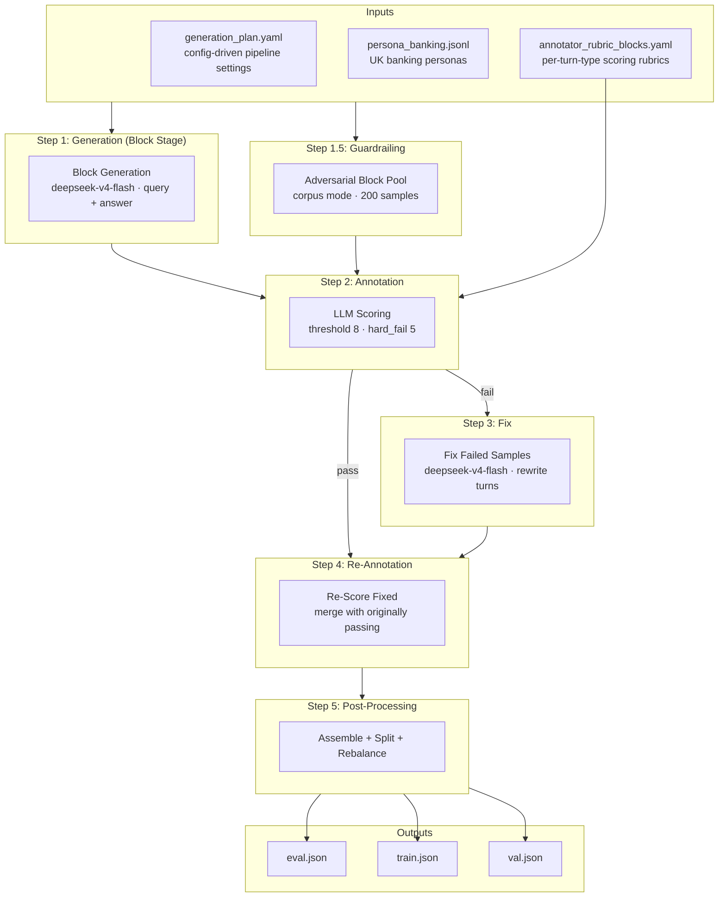
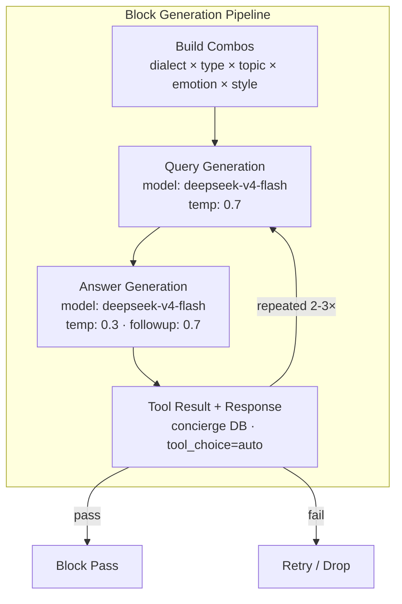
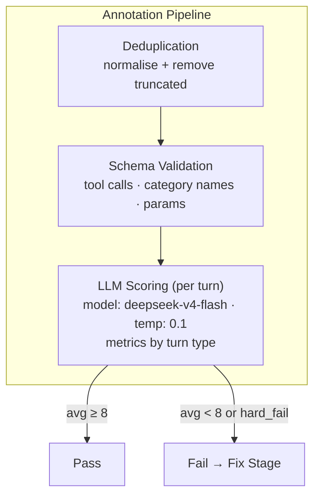
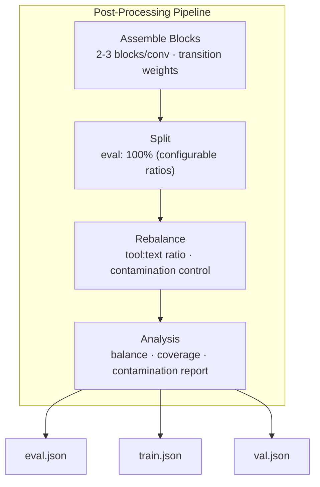

# Architecture

## Pipeline Overview



---

### Step 1: Generation Internals



---

### Step 2: Annotation Internals



---

### Step 5: Post-Processing Internals



---

## Data Shapes

| Stage | Input | Output |
|---|---|---|
| Generation | config YAML, personas JSONL, context prompt | `output/raw/multi_turn.json` (block pool) |
| Guardrailing | config YAML, corpus/LLM | `guardrailing_raw/guardrailing_blocks.json` |
| Annotation | raw blocks, rubric YAML | `output/final/multi_turn.json` (passing), `*_scored.json` (all) |
| Fix | scored failing samples | `output/fixed/multi_turn.json` (rewritten) |
| Re-Annotation | fixed samples | `output/rescored/multi_turn.json` |
| Post-Processing | final blocks + guardrailing pool | `eval.json`, `train.json`, `val.json` |

### Block Schema (per sample)

```json
{
  "messages": [
    {"role": "system", "content": "..."},
    {"role": "user", "content": "..."},
    {"role": "assistant", "content": "...", "tool_calls": [...]},
    {"role": "tool", "content": "..."},
    {"role": "assistant", "content": "..."}
  ],
  "metadata": {
    "block_id": "uuid",
    "persona_id": "string",
    "persona": "description",
    "dialect": "Standard British English",
    "block_type": "tool|nlr",
    "emotion": "neutral",
    "typing_style": "casual",
    "topic": "trends|comparisons|...",
    "date": "2026-MM-DD"
  }
}
```

### Scored Sample (annotation output)

```json
{
  "messages": [...],
  "metadata": {...},
  "scores": {
    "pass": true,
    "turns": [
      {
        "turn_index": 0,
        "position": "opening",
        "kind": "tool",
        "metrics": {"naturalness": 9, "when2call": 10, ...},
        "avg": 9.2
      }
    ]
  }
}
```

---

## Config Snapshot

| Parameter | Value |
|---|---|
| query model | deepseek/deepseek-v4-flash |
| answer model | deepseek/deepseek-v4-flash |
| query temp | 0.7 |
| answer temp | 0.3 |
| followup temp | 0.7 |
| annotator model | deepseek/deepseek-v4-flash |
| annotator temp | 0.1 |
| threshold | 8 |
| hard_fail_threshold | 5 |
| insight_threshold | 5 |
| fixer model | deepseek/deepseek-v4-flash |
| fixer temp | 0.3 |
| max_retries | 3 |
| batch_size | 50 |
| blocks_per_conversation | 2-3 |
| followups per block | 2-3 |
| type_ratio | tool: 0.5, nlr: 0.5 |
| eval_ratio | 1.0 |
| guardrailing | enabled (corpus mode, 200 samples) |
| concierge DB | enabled (PostgreSQL) |
