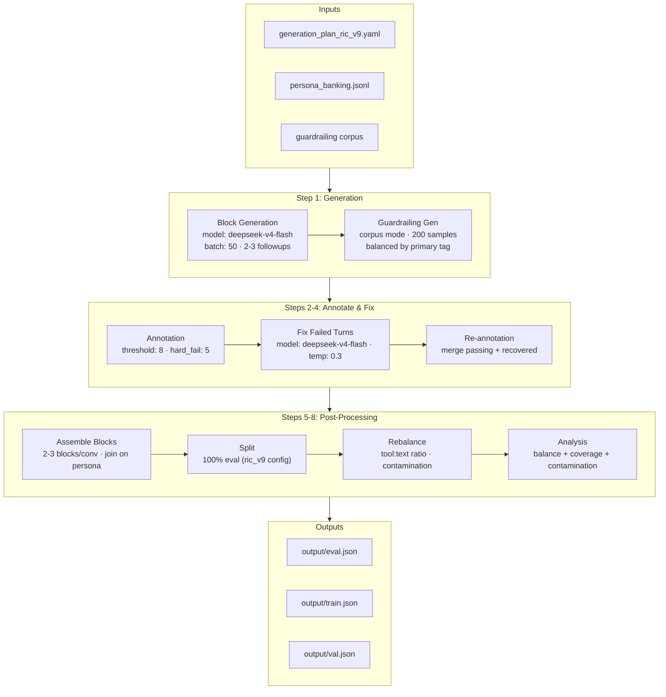
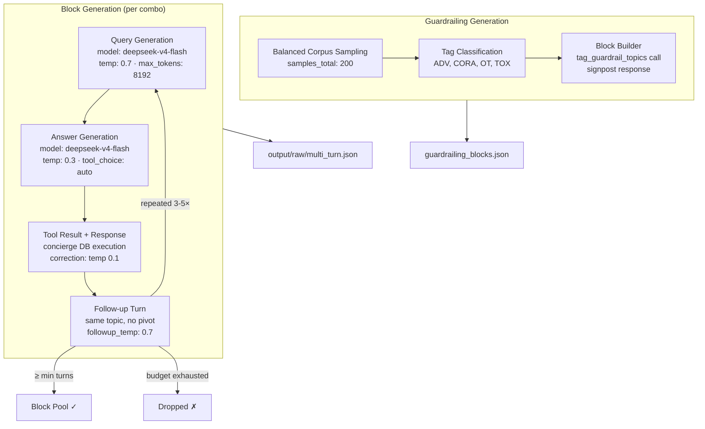
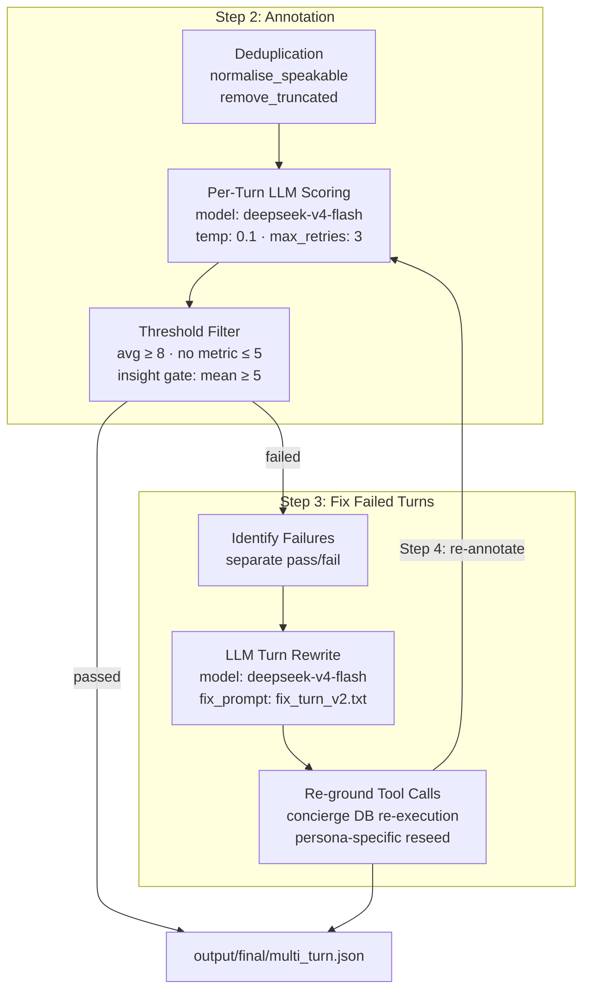
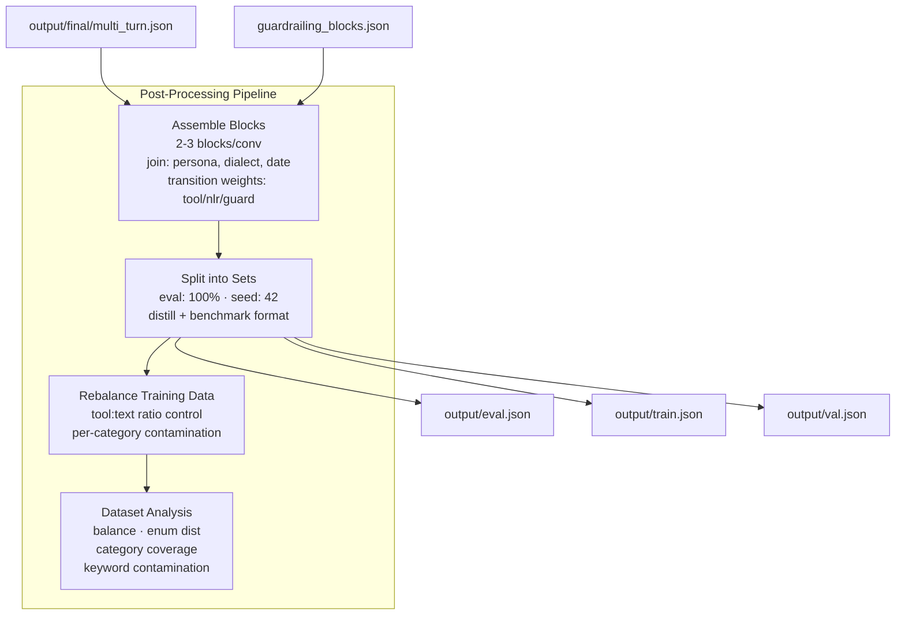

# Architecture

## Pipeline Overview

---

### Step 1: Generation Internals

---

### Steps 2-4: Annotation & Fix Internals

---

### Steps 5-8: Post-Processing Internals

---

## Data Shapes

| Stage | Input | Output |
|---|---|---|
| Block Generation | config YAML, personas JSONL | output/raw/multi_turn.json |
| Guardrailing Gen | labelled corpus JSON | guardrailing_raw/guardrailing_blocks.json |
| Annotation | output/raw/multi_turn.json | output/final/multi_turn.json, multi_turn_scored.json |
| Fix | multi_turn_scored.json (failed) | fixed/multi_turn.json |
| Assemble | final/multi_turn.json + guardrailing_blocks.json | final/multi_turn.json (overwritten) |
| Split | final/multi_turn.json | eval.json, train.json, val.json |
| Rebalance | output/train.json | output/train.json (filtered) |
| Analysis | output/train.json | report.md |

---

## Config Snapshot

| Parameter | Value | Source |
|---|---|---|
| query model | deepseek/deepseek-v4-flash | generator.query.model |
| answer model | deepseek/deepseek-v4-flash | generator.answer.model |
| annotator model | deepseek/deepseek-v4-flash | annotator.model |
| fixer model | deepseek/deepseek-v4-flash | fixer.model |
| query temp | 0.7 | generator.query.temperature |
| answer temp | 0.3 | generator.answer.temperature |
| followup temp | 0.7 | generator.answer.followup_temperature |
| annotator temp | 0.1 | annotator.temperature |
| fixer temp | 0.3 | fixer.temperature |
| batch_size | 50 | generator.batch_size |
| threshold | 8 | annotator.threshold |
| hard_fail_threshold | 5 | annotator.hard_fail_threshold |
| insight_threshold | 5 | annotator.insight_threshold |
| insight_hard_fail_floor | 2 | annotator.insight_hard_fail_floor |
| max_retries | 3 | annotator.max_retries |
| followups | min: 2, max: 3 | pipeline.block.followups |
| blocks_per_conversation | min: 2, max: 3 | pipeline.assemble |
| samples_per_combo | 1 | taxonomy.scenarios[0] |
| guardrailing samples | 200 | guardrailing.samples_total |
| eval_ratio | 1.0 | output.eval_ratio |
| base_url | openrouter.ai/api/v1 | generator.query.base_url |
| concierge enabled | true | generator.concierge.enabled |
| capture_response | true | generator.capture_response.enabled |
| guardrail_in_generation | true | generator.guardrail_in_generation.enabled |
