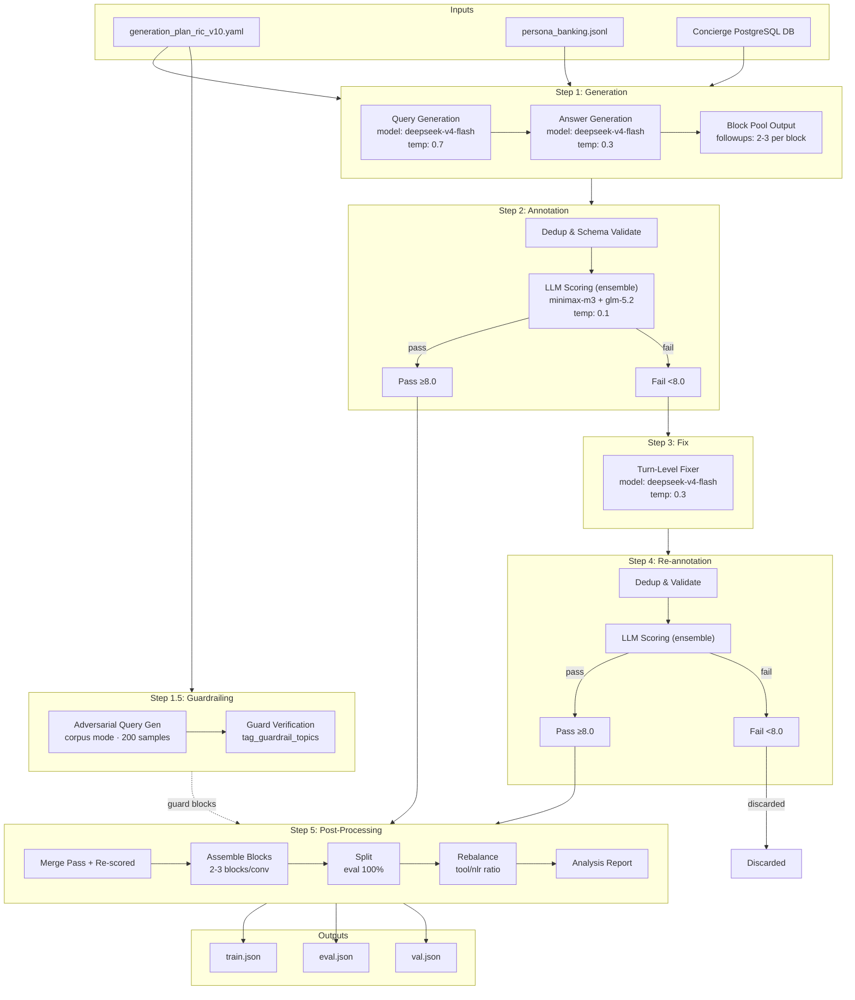
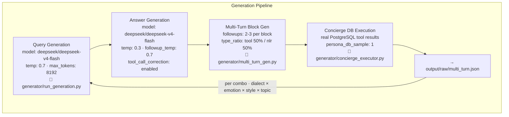
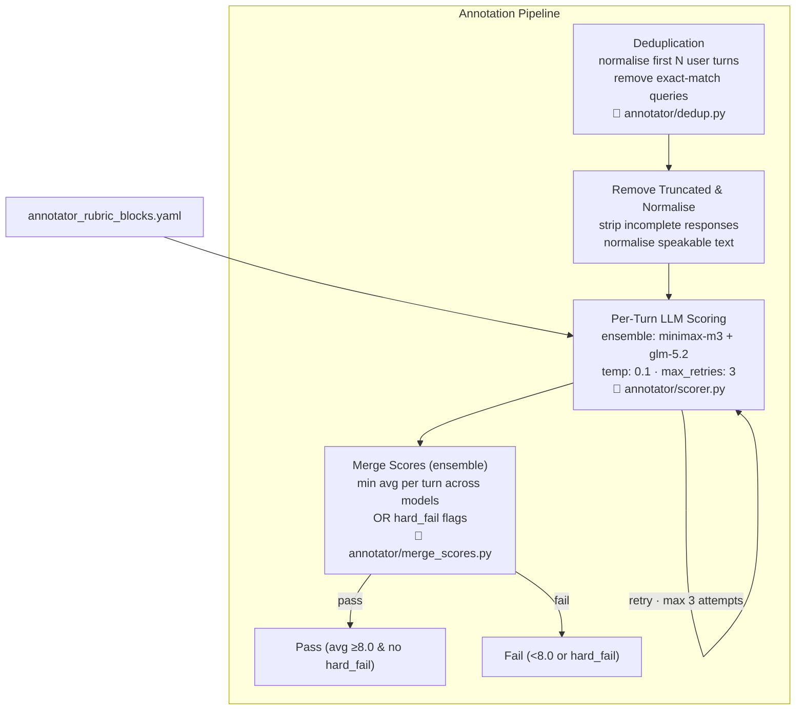
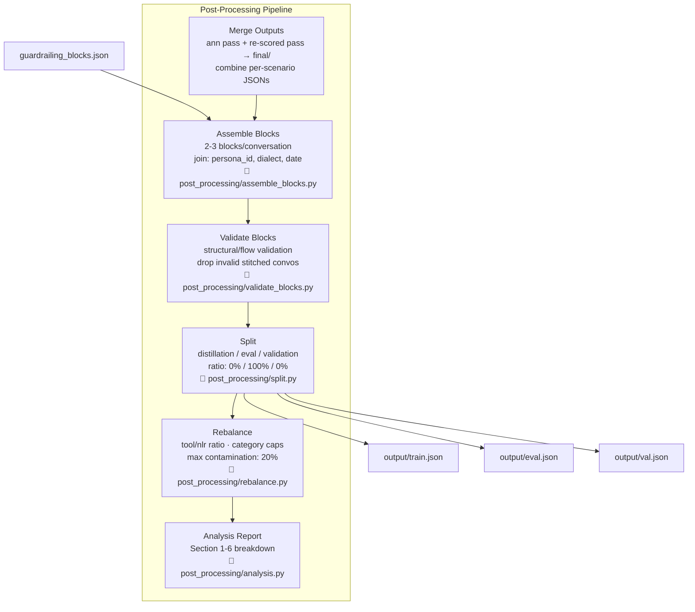

# Architecture

## Pipeline Overview

---

### Step 1: Generation Internals

---

### Step 2: Annotation Internals

---

### Step 5: Post-Processing Internals

---

## Data Shapes

| Stage | Input | Output |
|---|---|---|
| Generation | config YAML, persona_banking.jsonl, Concierge DB | output/raw/multi_turn.json |
| Guardrailing | config YAML, corpus file | guardrailing_raw/guardrailing_blocks.json |
| Annotation | output/raw/multi_turn.json | output/ann/multi_turn.json + _scored.json + summary.json |
| Fix | output/ann/*_scored.json (failed) | output/fixed/multi_turn.json + passing/ |
| Re-annotation | output/fixed/multi_turn.json | output/rescored/multi_turn.json + summary.json |
| Post-Processing (Merge) | ann/ + rescored/ + passing/ | final/multi_turn.json |
| Post-Processing (Assemble) | final/multi_turn.json + guardrailing_blocks.json | final/multi_turn.json (overwritten) |
| Post-Processing (Split) | final/multi_turn.json | train.json, eval.json, val.json |
| Post-Processing (Rebalance) | train.json | train.json (overwritten) |
| Post-Processing (Analysis) | train.json | terminal report |

---

## Config Snapshot

| Parameter | Value | Source |
|---|---|---|
| Query model | deepseek/deepseek-v4-flash | generator.query.model |
| Query temperature | 0.7 | generator.query.temperature |
| Answer model | deepseek/deepseek-v4-flash | generator.answer.model |
| Answer temperature | 0.3 | generator.answer.temperature |
| Answer followup_temperature | 0.7 | generator.answer.followup_temperature |
| Fixer model | deepseek/deepseek-v4-flash | fixer.model |
| Fixer temperature | 0.3 | fixer.temperature |
| Annotator models | minimax/minimax-m3, z-ai/glm-5.2 | annotator.models |
| Annotator temperature | 0.1 | annotator.temperature |
| Pass threshold | 8.0 | annotator.threshold |
| Hard fail threshold | 5 | annotator.hard_fail_threshold |
| Insight threshold | 5 | annotator.insight_threshold |
| Batch size | 50 | generator.batch_size |
| Max retries (scoring) | 3 | annotator.max_retries |
| Block followups | min: 2, max: 3 | taxonomy.scenarios[0].pipeline[0].followups |
| Blocks per conversation | min: 2, max: 3 | taxonomy.scenarios[0].pipeline[1].blocks_per_conversation |
| Type ratio | tool: 0.5, nlr: 0.5 | taxonomy.scenarios[0].pipeline[0].type_ratio |
| Guardrailing samples | 200 | guardrailing.samples_total |
| Guardrailing query source | corpus | guardrailing.query_source |
| Concierge enabled | true | generator.concierge.enabled |
| Capture response enabled | true | generator.capture_response.enabled |
| Guardrail in generation | true | generator.guardrail_in_generation.enabled |
| Output split ratio | 0% distill / 100% eval / 0% val | output.distillation_ratio / eval_ratio / validation_ratio |
