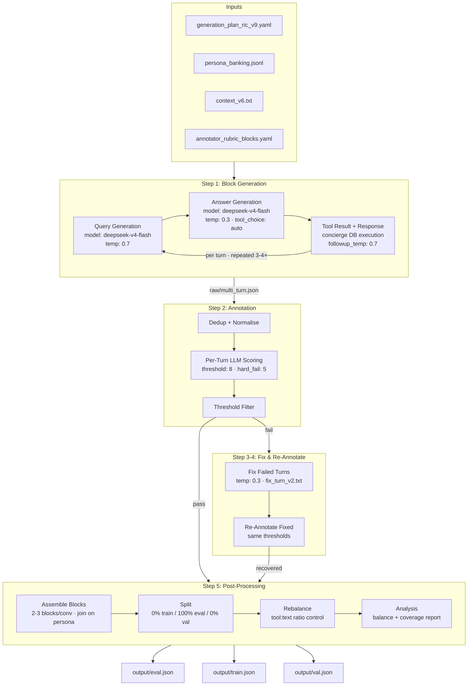
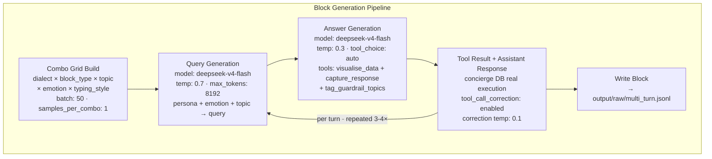
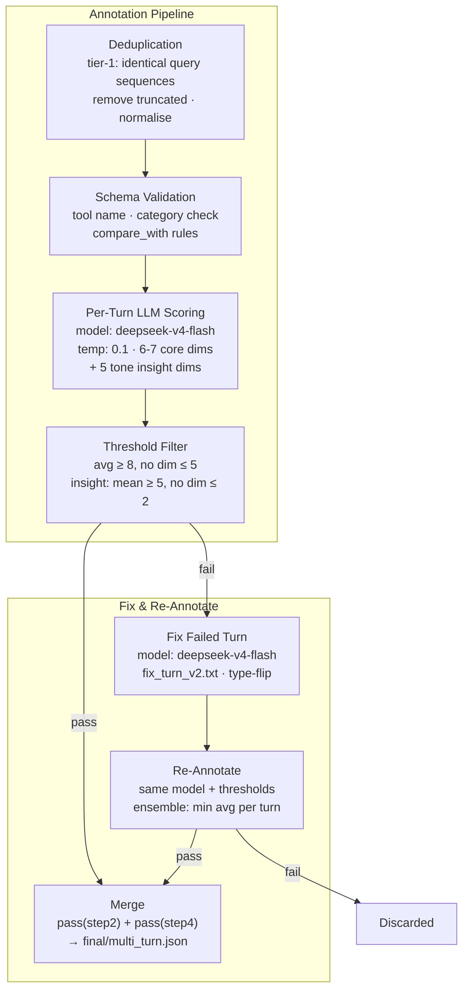
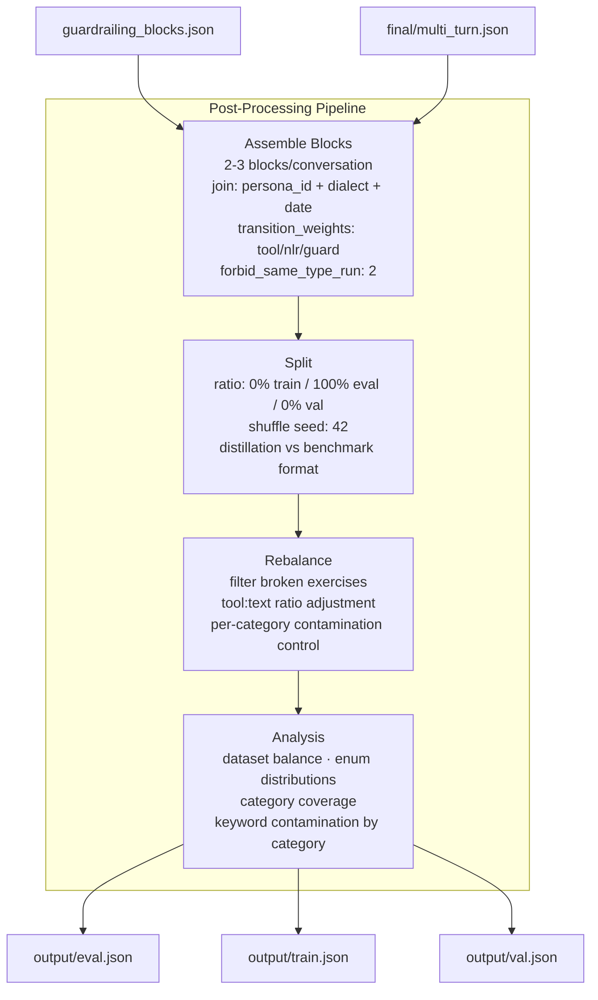

# Architecture

## Pipeline Overview

### Step 1: Block Generation Internals

### Step 2-4: Annotation & Fix Internals

### Step 5: Post-Processing Internals

## Data Shapes

| Stage | Input | Output |
|---|---|---|
| Block Generation | config.yaml, personas.jsonl, context_v6.txt, Concierge DB | output/raw/multi_turn.json |
| Guardrailing Gen | config.yaml, fewshot corpus | guardrailing_raw/guardrailing_blocks.json |
| Annotation | raw/multi_turn.json | final/multi_turn.json + multi_turn_scored.json |
| Fix | *_scored.json (failed only) | fixed/multi_turn.json + fixed/passing/*.json |
| Re-Annotate | fixed/multi_turn.json | rescored/multi_turn.json |
| Assemble | final/multi_turn.json + guardrailing_blocks.json | final/multi_turn.json (overwritten) |
| Split | final/multi_turn.json | eval.json, train.json, val.json |
| Rebalance | train.json | train.json (overwritten) |
| Analysis | train.json | report.md (printed) |

## Config Snapshot

| Parameter | Value |
|---|---|
| query model | deepseek/deepseek-v4-flash |
| answer model | deepseek/deepseek-v4-flash |
| annotator model | deepseek/deepseek-v4-flash |
| fixer model | deepseek/deepseek-v4-flash |
| query temperature | 0.7 |
| answer temperature | 0.3 |
| followup temperature | 0.7 |
| annotator temperature | 0.1 |
| fixer temperature | 0.3 |
| max_tokens | 8192 |
| annotation threshold | 8 |
| hard_fail_threshold | 5 |
| insight_threshold | 5 |
| insight_hard_fail_floor | 2 |
| batch_size | 50 |
| samples_per_combo | 1 |
| followups per block | 2-3 |
| blocks_per_conversation | 2-3 |
| type_ratio | tool: 0.5 / nlr: 0.5 |
| distillation_ratio | 0.0 |
| eval_ratio | 1.0 |
| validation_ratio | 0.0 |
| concierge DB | enabled (PostgreSQL) |
| capture_response | enabled |
| guardrail_in_generation | enabled |
| tool_call_correction | enabled |
| simulation_date_range | 2026-01-01 to 2026-12-31 |
