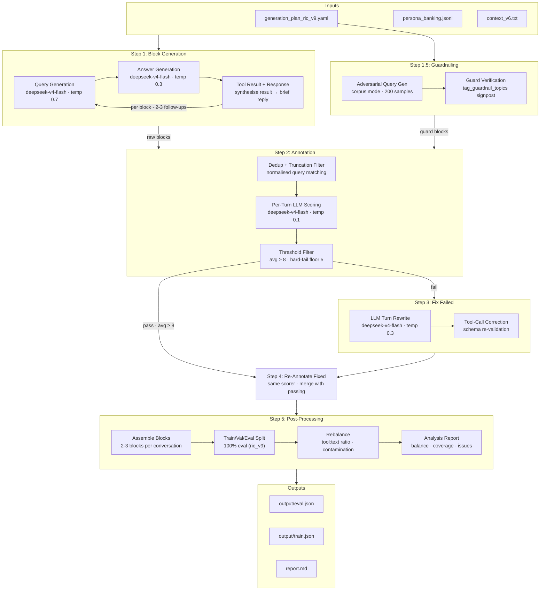
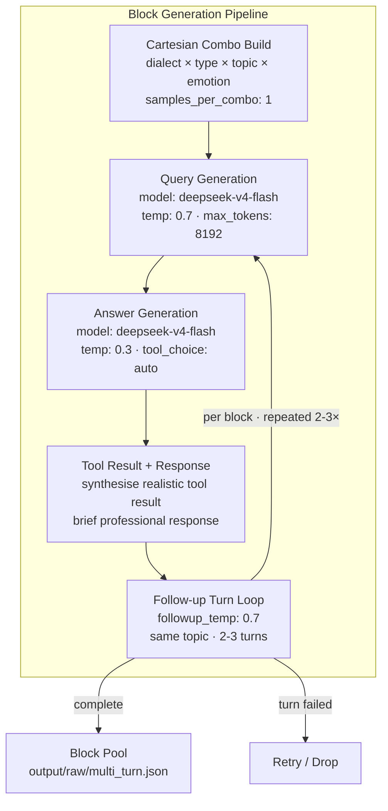
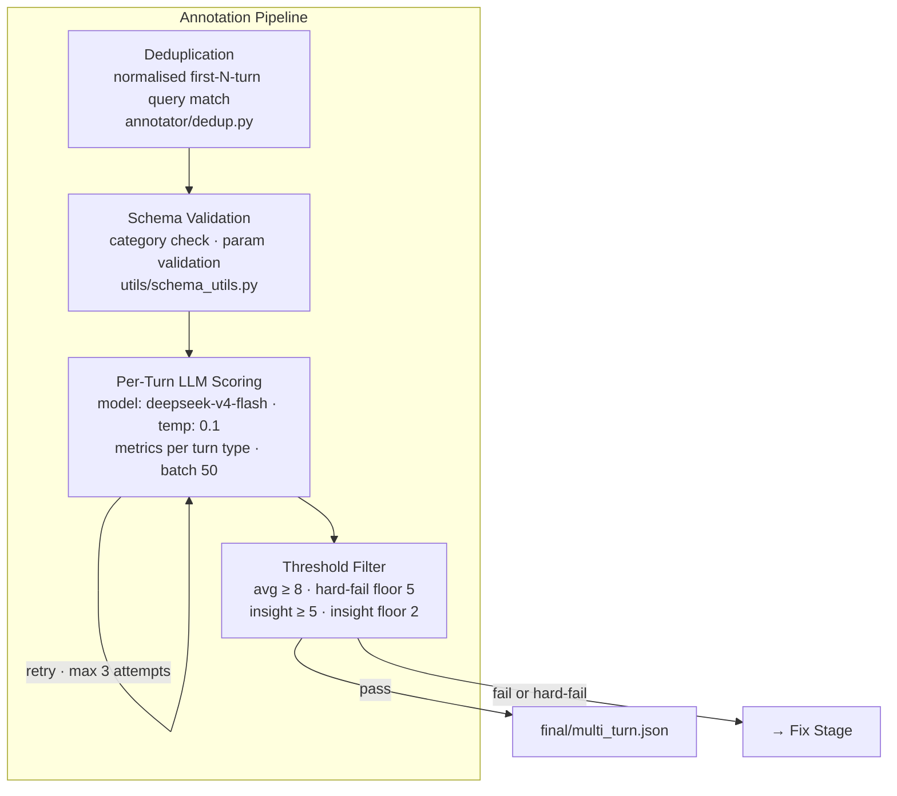
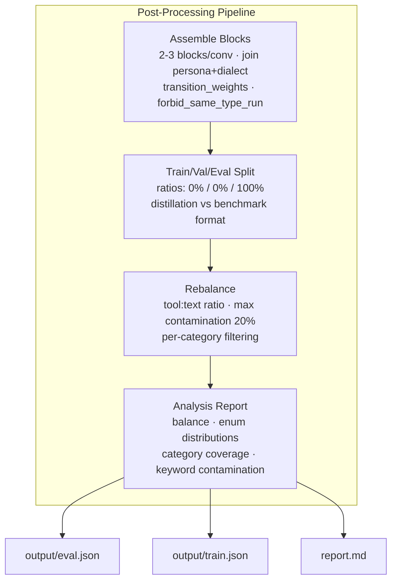

# Architecture

## Pipeline Overview

### Step 1: Block Generation Internals

### Step 2: Annotation Internals

### Step 5: Post-Processing Internals

## Data Shapes

| Stage | Input | Output |
|---|---|---|
| Block Generation | config.yaml, personas.jsonl, context_v6.txt | output/raw/multi_turn.json |
| Guardrailing | config.yaml, fewshot corpus | guardrailing_raw/guardrailing_blocks.json |
| Annotation | output/raw/multi_turn.json, rubric.yaml | final/multi_turn.json, multi_turn_scored.json |
| Fix | multi_turn_scored.json (failed only) | fixed/multi_turn.json, fixed/passing/ |
| Re-Annotation | fixed/multi_turn.json | rescored/multi_turn.json |
| Post-Processing | final/multi_turn.json, guardrailing_blocks.json | eval.json, train.json, report.md |

## Config Snapshot

| Parameter | Value |
|---|---|
| query model | deepseek/deepseek-v4-flash |
| answer model | deepseek/deepseek-v4-flash |
| annotator model | deepseek/deepseek-v4-flash |
| fixer model | deepseek/deepseek-v4-flash |
| query temperature | 0.7 |
| answer temperature | 0.3 |
| followup temperature | 0.7 |
| annotator temperature | 0.1 |
| fixer temperature | 0.3 |
| max_tokens | 8192 |
| annotation threshold | 8 |
| hard_fail_threshold | 5 |
| insight_threshold | 5 |
| insight_hard_fail_floor | 2 |
| batch_size | 50 |
| max_retries | 3 |
| samples_per_combo | 1 |
| followups per block | 2-3 |
| blocks per conversation | 2-3 |
| guardrailing samples | 200 |
| eval_ratio | 1.0 (100% eval) |
| distillation_ratio | 0.0 |
| base_url | openrouter.ai/api/v1 |
