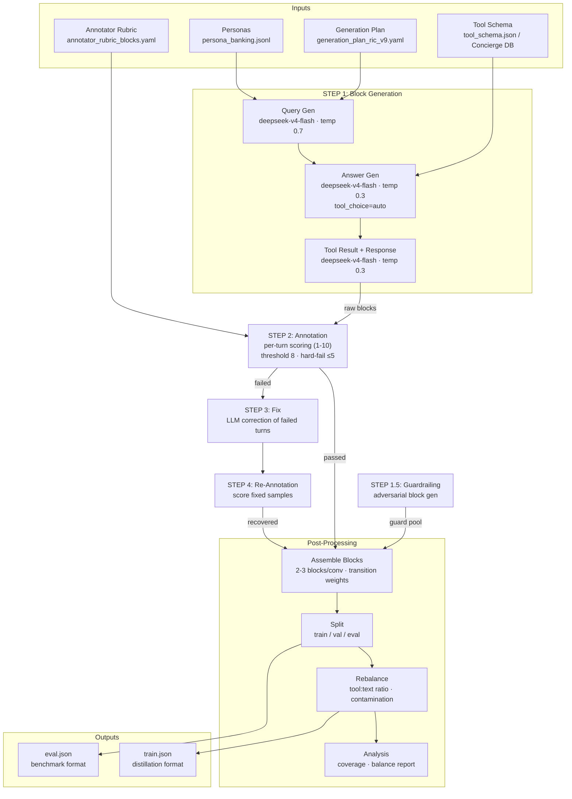
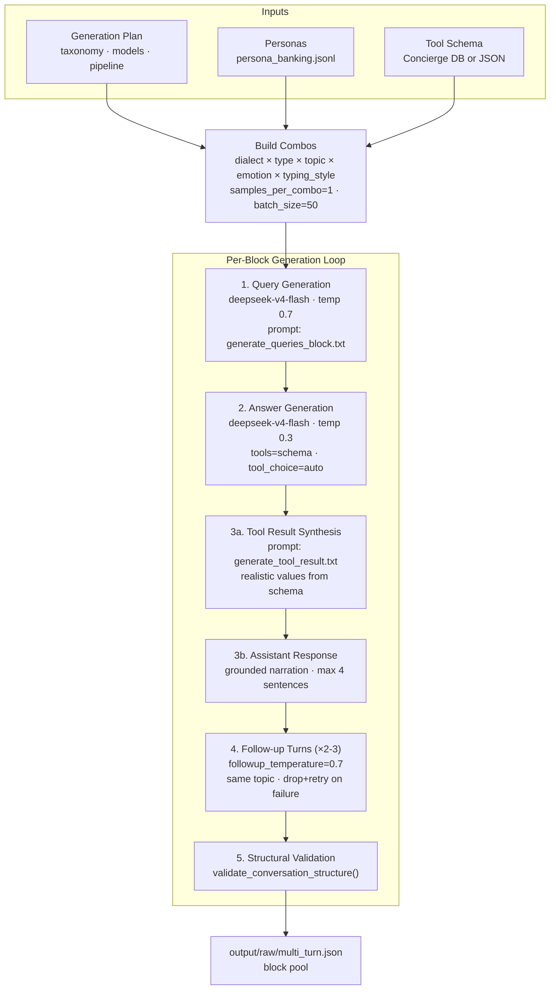

# Synthetic Banking Dataset Pipeline — Architecture

## Overview

## Generation Detail

## Data Shapes

| Stage | Input Format | Output Format |
|-------|-------------|---------------|
| Generation | Cartesian combos (persona × dialect × type × topic × emotion × typing_style) | `{"messages": [...], "metadata": {...}}` blocks |
| Guardrailing | Tag sets (adversarial topics) | `{"messages": [...], "metadata": {...}}` guard blocks |
| Annotation | Raw block JSON | Scored blocks with per-turn `scores` dict |
| Fix | Failed blocks (score < threshold) | Rewritten blocks (same schema) |
| Assemble | Passing blocks + guard pool | Multi-turn conversations (2-3 blocks stitched) |
| Split | Assembled conversations | train.json (distillation) / eval.json (benchmark) |
| Rebalance | train.json | Filtered train.json (balanced tool:text ratio) |
| Analysis | train.json | Markdown report (coverage, contamination, balance) |

## Config Snapshot

| Key | Value | Source |
|-----|-------|--------|
| Query model | `deepseek/deepseek-v4-flash` | `generator.query.model` |
| Answer model | `deepseek/deepseek-v4-flash` | `generator.answer.model` |
| Annotator model | `deepseek/deepseek-v4-flash` | `annotator.model` |
| Query temperature | 0.7 | `generator.query.temperature` |
| Answer temperature | 0.3 | `generator.answer.temperature` |
| Follow-up temperature | 0.7 | `generator.answer.followup_temperature` |
| Annotation threshold | 8 | `annotator.threshold` |
| Hard-fail threshold | 5 | `annotator.hard_fail_threshold` |
| Batch size | 50 | `generator.batch_size` |
| Follow-ups per block | 2-3 | `pipeline[0].followups` |
| Blocks per conversation | 2-3 | `pipeline[1].blocks_per_conversation` |
| Context prompt | `generator/prompts/eval/context_v6.txt` | `domain.context_prompt` |
| Rubric | `config/annotator_rubric_blocks.yaml` | `annotator.rubric_path` |
| Output ratio | 100% eval | `output.eval_ratio` |
| Guardrailing | enabled | `guardrailing.enabled` |
| Capture response | enabled (tool call format) | `generator.capture_response.enabled` |

## Annotation Metrics by Turn Type

| Turn Type | Core Metrics |
|-----------|-------------|
| opening tool | naturalness, parameter_coverage, when2call, tool_result_accuracy, groundedness, assumption_surfacing |
| opening nlr | naturalness, when2call, response_quality, professionalism, groundedness |
| opening clarify | naturalness, when2call, clarification_quality |
| opening guardrail | naturalness, when2call, tag_accuracy |
| followup tool | + context_coherence, topic_coherence |
| followup nlr | + context_coherence, topic_coherence |
| followup clarify | + context_coherence, topic_coherence |
| followup guardrail | + context_coherence |

## Pipeline Steps (run_pipeline.sh)

| Step | Module | Description |
|------|--------|-------------|
| 1 | `generator.run_generation` | Build combo grid, generate blocks (query → answer → tool result) |
| 1.5 | `guardrailing.run_generation` | Adversarial guardrail block pool (optional) |
| 2 | `annotator.run_annotation` | Score each turn (dedup + schema validate + LLM score) |
| 3 | `generator.run_fix` | LLM-rewrite failed turns preserving context |
| 4 | `annotator.run_annotation` | Re-score fixed samples (ensemble merge: min per turn) |
| — | Merge | Combine passed + recovered → final/ |
| — | `post_processing.assemble_blocks` | Stitch blocks into conversations (transition weights) |
| — | `post_processing.split` | Shuffle + split into train/val/eval |
| — | `post_processing.rebalance` | Filter broken exercises, adjust ratios |
| — | `post_processing.analysis` | Generate coverage/balance report |
