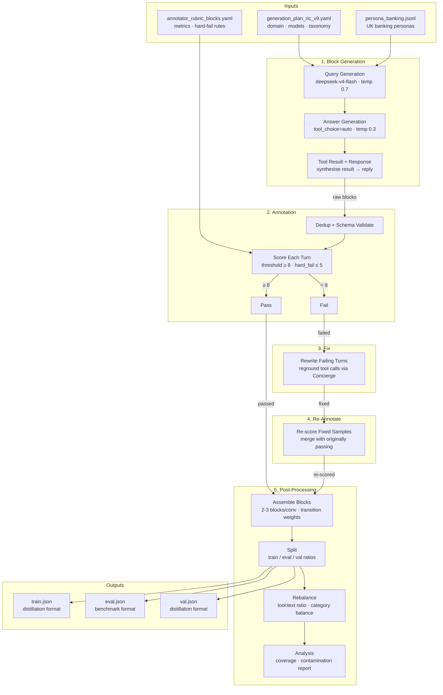
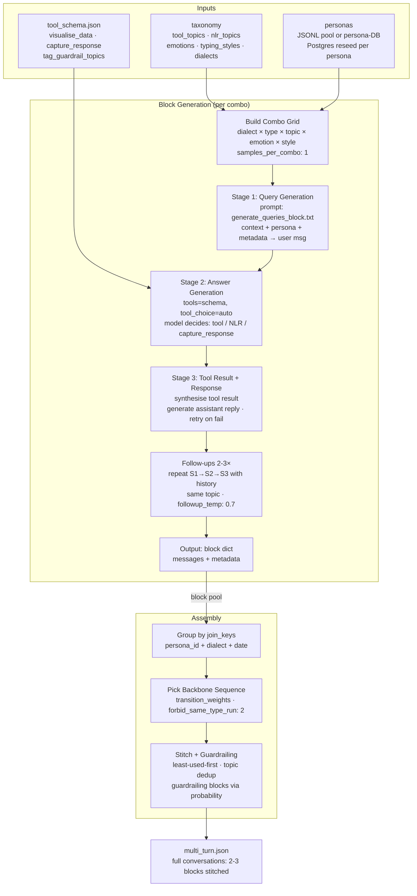

# Synthetic Banking Dataset Pipeline — Architecture

## Overview

## Block Generation Detail

## Data Shapes

| Stage | Input | Output | Format |
|-------|-------|--------|--------|
| Generation | combo grid (taxonomy × personas) | `raw/multi_turn.json` | `[{messages, metadata}]` per block |
| Annotation | raw blocks | `ann/multi_turn.json` (passed) + `*_scored.json` | blocks with `scores.pass` bool |
| Fix | `*_scored.json` (failed) | `fixed/multi_turn.json` | rewritten blocks (scores stripped) |
| Re-annotate | fixed blocks | `rescored/multi_turn.json` | re-scored blocks |
| Merge | passed + re-scored | `final/multi_turn.json` | combined passing blocks |
| Assemble | final blocks | `final/multi_turn.json` (overwritten) | full conversations (multi-block) |
| Split | assembled conversations | `train.json` / `eval.json` / `val.json` | distillation or benchmark format |
| Rebalance | `train.json` | `train.json` (overwritten) | filtered + balanced |
| Analysis | `train.json` | report (stdout) | coverage + contamination stats |

## Config Snapshot

| Key | Value | Source |
|-----|-------|--------|
| Generator model | `deepseek/deepseek-v4-flash` | `generator.answer.model` |
| Query temperature | 0.7 | `generator.query.temperature` |
| Answer temperature | 0.3 | `generator.answer.temperature` |
| Followup temperature | 0.7 | `generator.answer.followup_temperature` |
| Annotator model | `deepseek/deepseek-v4-flash` | `annotator.model` |
| Pass threshold | ≥ 8 (avg) | `annotator.threshold` |
| Hard-fail floor | ≤ 5 | `annotator.hard_fail_threshold` |
| Insight threshold | ≥ 5 | `annotator.insight_threshold` |
| Blocks per conversation | 2-3 | `taxonomy.scenarios[0].pipeline[1].blocks_per_conversation` |
| Join keys | persona_id, dialect, date | `taxonomy.scenarios[0].pipeline[1].join_keys` |
| Type ratio | tool 0.5 / nlr 0.5 | `taxonomy.scenarios[0].pipeline[0].type_ratio` |
| Followups per block | 2-3 | `taxonomy.scenarios[0].pipeline[0].followups` |
| Output split | 0% train / 100% eval / 0% val | `output.distillation_ratio` / `eval_ratio` |
| Orchestrator | `scripts/run_pipeline.sh` | tmux session: pipeline / vllm / gpu |
