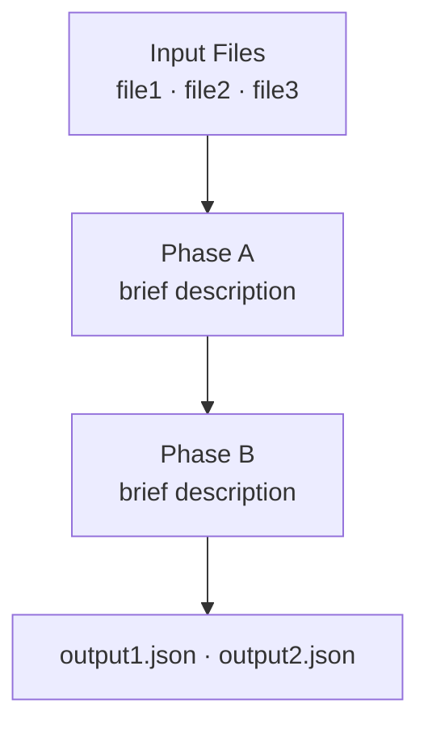

Analyse the repository in the current working directory and produce two files:

1. `architecture.drawio` — full draw.io diagram (or use a custom filename if `$ARGUMENTS` specifies one)
2. `architecture.md` — high-level Mermaid diagram companion

Do all of this in one shot. Do not ask for confirmation between steps.

---

## Steering

If `$ARGUMENTS` is provided, treat it as **free-form guidance** that shapes your
exploration and layout decisions. Examples of what users might pass:

- `"focus on the data pipeline, skip infrastructure nodes"`
- `"the two services run on separate nodes, make that clear in the layout"`
- `"save as pipeline.drawio, only show core stages"`
- `"the annotation and generation run in parallel, treat them as one row"`

Parse the intent naturally. If the user specifies a filename (ends in `.drawio`), use
that instead of `architecture.drawio`. Apply all other guidance during Steps 1–2.

---

## Step 1 — Explore the repo

Read entrypoints, orchestrators, and configs. Answer:

1. What are the **inputs**? (config files, schemas, data sources)
2. What are the **stages**, in order? (scripts, modules, pipeline steps)
3. Within each stage, what are the **internal sub-steps**, in order? (functions called
   sequentially, processing phases, named pipeline stages)
4. What **decisions** happen within each stage? (pass/fail splits, routing)
5. What are the **outputs**? (files written, services called)
6. Which stages are **parallel** (→ side-by-side swimlanes) vs **sequential** (→ stacked)?

Apply any steering from `$ARGUMENTS` here: skip sections the user said to skip, emphasise
what they asked to emphasise.

---

## Step 2 — Plan the layout

Sketch the structure top-to-bottom before computing any numbers:

- **Row 0**: input nodes
- **Row 1..N**: one row per sequential phase; swimlanes side-by-side within a row
- **Row N+1**: output / aggregation nodes

**How to represent each phase:**

| What you found in the code | How to draw it |
|---|---|
| Phase with 2+ sequential internal sub-steps | **Swimlane** — one step per box inside |
| Phase that is a single atomic operation | **Standalone box** (no swimlane) |
| Multiple phases that run in parallel | **Side-by-side swimlanes** in the same row |

The test: if you can name the internal steps separately (e.g. "validate → score → filter"),
use a swimlane. If the phase is genuinely one operation, use a box. Never collapse a
multi-step flow into a single box just because it's convenient.

Then compute coordinates using the formulas below. Do this once, in order. Do not
iterate or adjust after the fact.

---

## Step 3 — Coordinate formulas

**Before computing any coordinates, run the layout calculator.** It is at
`~/.claude/commands/diagram_layout.py` and requires only `python3` — no packages.
Call it once per row/swimlane and use its output directly; do not recalculate.

```bash
# One row of n parallel swimlanes → sw_w, step_w, first_sl_x, sl_x[i]
python3 ~/.claude/commands/diagram_layout.py swimlanes <n>

# Input or output node row → first_x, x[i]
python3 ~/.claude/commands/diagram_layout.py inputs <n>

# Steps inside one swimlane → step[i]: y, h  and  sl_height_no_split
# lines = number of <br> tags + 1 in the step label
python3 ~/.claude/commands/diagram_layout.py steps <sw_w> <startSize> <lines_per_step...>

# Pass/fail split at the bottom of a swimlane → split_y, pass/fail boxes, sl_height
# split_gap defaults to 50 (labelled edges); use 20 for unlabelled
python3 ~/.claude/commands/diagram_layout.py split <sw_w> <last_step_y> <last_step_h> [split_gap]

# Validate a waypoint's approach distance → OK or FAIL with the required value
python3 ~/.claude/commands/diagram_layout.py check-approach \
  <last_wx> <last_wy> <target_x> <target_y> <target_w> <target_h> <entry_x> <entry_y>
```

The formulas below are the reference implementation — read them to understand the
layout, but let the script do the arithmetic.

---

### Page
```
pageWidth  = 827
pageHeight = 1169   ← visual guide only; content may overflow below it
```
**Do not try to compress the diagram to fit within pageHeight.** Draw.io exports
everything regardless of the page fold. Prioritise readable label spacing over fitting
on one page.

### Input nodes (Row 0, y = 30)
```
input_w    = 160
input_h    = 36
input_gap  = 20
total_w    = n_inputs × input_w + (n_inputs − 1) × input_gap
first_x    = (827 − total_w) / 2          ← centre the row
each_x     = first_x + i × (input_w + input_gap)
y          = 30
```

### Swimlane rows
```
sw_gap     = 26                            ← gap between swimlanes
margin     = 60                            ← total left+right page margin

n          = number of swimlanes in row

sw_w       = min(316, floor((827 − margin − (n−1) × sw_gap) / n))
             ← shrinks automatically when n is large; caps at 316

step_w     = sw_w − 36                    ← 18px padding each side
             (recalculate step_w whenever sw_w changes)

total_w    = n × sw_w + (n−1) × sw_gap
first_sl_x = (827 − total_w) / 2          ← centre the row
sl_x(i)    = first_sl_x + i × (sw_w + sw_gap)
sl_y       = previous_row_bottom + row_gap (use 40 between rows)
```

| n lanes | sw_w | step_w | notes |
|---|---|---|---|
| 1 | 316 | 280 | centred |
| 2 | 316 | 280 | centred, 369px total |
| 3 | 238 | 202 | fits in page |
| 4 | 173 | 137 | narrow — consider stacking into 2 rows |
| 5+ | < 140 | < 104 | text will be very cramped; prefer 2-row layout |

If `n ≥ 4`, consider splitting parallel lanes into two side-by-side rows instead of one
wide row. Prefer readable boxes over forcing everything into one row.

**Swimlane title fitting:**
```
Short title (≤ ~40 chars):  startSize=30   step_y(0) = 45   (15px below header)
Long title  (> ~40 chars):  startSize=50   step_y(0) = 65   (15px below header)
                            add whiteSpace=wrap to the swimlane style
```
A title that overflows one line at 316px wide is about 40 characters. When in doubt,
count characters; if borderline, use `startSize=50`.

### Steps inside a swimlane (coordinates relative to swimlane parent)
```
step_x     = 18
step_w     = sw_w − 36            ← derived from swimlane width above
step_gap   = 16

step_y(0)  = 45   (startSize=30)  or  65   (startSize=50)
step_y(M)  = step_y(M−1) + step_h(M−1) + step_gap
```

**Step height formula** — count the `<br>` line breaks you will write in the value:
```
n_lines    = number of <br> tags + 1
step_h     = max(36, 22 + n_lines × 18)
```

Examples:
| Content | n_lines | step_h |
|---|---|---|
| `"Deduplication"` | 1 | 40 |
| `"LLM Scoring&lt;br&gt;naturalness · tool_avoidance"` | 2 | 58 |
| `"Per-Turn Scoring&lt;br&gt;line2&lt;br&gt;line3&lt;br&gt;line4"` | 4 | 94 |

Compute `step_h` for each step **before** computing any `step_y` — the heights cascade.

### Pass / fail split (bottom of a swimlane, relative to swimlane parent)
```
split_gap  = 50   ← when the fan-out edges carry labels (most decision splits)
split_gap  = 20   ← only when edges are unlabelled

split_y    = step_y(last) + step_h(last) + split_gap

pass_x     = 18
pass_w     = floor((step_w − 10) / 2)      ← left half, green  (10px gap between halves)
fail_x     = pass_x + pass_w + 10
fail_w     = step_w − pass_w − 10          ← right half, red
split_h    = 36
```

Examples (derived from step_w = sw_w − 36):
| sw_w | step_w | pass_w | fail_x | fail_w |
|---|---|---|---|---|
| 316 | 280 | 135 | 163 | 135 |
| 238 | 202 | 96  | 124 | 96  |
| 173 | 137 | 63  | 91  | 64  |

The 50px gap gives the edge label room to sit between the boxes without overlapping.

### Swimlane total height
```
If has split:   height = split_y + split_h + 20
If no split:    height = step_y(last) + step_h(last) + 20

All swimlanes in the same row use max(height) so they align.
```

### Output nodes
```
out_w = 160,  out_h = 36,  out_gap = 20

For N outputs: centre the row same as inputs
y = previous_row_bottom + 40
```

### Routing bands (for edges that travel between rows)
```
band_1 = row_bottom + 10   ← first edge leaving this row
band_2 = row_bottom + 20   ← second edge
band_3 = row_bottom + 30   ← third edge
(interleave pass and fail: pass at +10/+20/+30, fail at +13/+23/+33)
```

---

## Step 4 — Colour palette

| Role | fillColor | strokeColor |
|---|---|---|
| Input node | `#dae8fc` | `#6c8ebf` |
| Swimlane header | `#ffe6cc` | `#d79b00` |
| Process step | `#fff4e6` | `#d79b00` |
| Pass / output-pass | `#d5e8d4` | `#82b366` |
| Fail / output-fail | `#f8cecc` | `#b85450` |
| Standalone node | `#f5f5f5` | `#666666` |

---

## Step 5 — Edge rules

All edges use `edgeStyle=orthogonalEdgeStyle` (right angles only).

**Edges may cross each other (an X is readable). Never let them overlap or pass through a box.**

### Sequential step → next step (same swimlane)
```
exitX=0.5  exitY=1   entryX=0.5  entryY=0    no label
```

### Decision fan-out (scoring box → pass / fail)
```
→ pass:  exitX=0  exitY=1   entryX=0.5  entryY=0   label = pass condition
→ fail:  exitX=1  exitY=1   entryX=0.5  entryY=0   label = fail condition
```
Opposite corners diverge immediately — they can never overlap.

### Fast-fail bypass (early step → fail, skipping boxes below it)
Route along the right wall of the swimlane at x = sw_w − 10 (outside all content):
```
exitX=1  exitY=0.5
waypoints: (sw_w−10, source_mid_y), (sw_w−10, fail_top − 20)
entryX=1  entryY=0
```
The last waypoint is **20px above** fail_top so draw.io has room to render a visible
downward approach segment before the arrowhead (see minimum-approach rule below).

### Cross-row edges (input → swimlane, swimlane → output, etc.)
**Always use top entry** (`entryY=0`) with spread `entryX` fractions. Never use side entry
(`entryY=0.5`) — it makes the arrowhead point sideways when the last waypoint shares the
same x as the entry point.

```
first arriving edge:   entryX=0.1  entryY=0    (top-left)
second arriving edge:  entryX=0.5  entryY=0    (top-centre)
third arriving edge:   entryX=0.9  entryY=0    (top-right)
```

Use a different routing band y per edge so horizontal segments don't overlap, then each
edge drops vertically to its `target_entry_x`:
```xml
<Array as="points">
  <mxPoint x="{source_cx}"      y="{band_y}" />
  <mxPoint x="{target_entry_x}" y="{band_y}" />
</Array>
```
The final segment `(target_entry_x, band_y)` → `(target_entry_x, target_top)` is vertical,
giving a correct downward-pointing arrowhead.

### Coloured edges
Pass-related: add `strokeColor=#82b366;`
Fail-related: add `strokeColor=#b85450;`

---

## Step 6 — XML structure

```xml
<?xml version="1.0" encoding="UTF-8"?>
<mxfile host="ac.draw.io">
  <diagram id="{unique_id}" name="Page-1">
    <mxGraphModel dx="2043" dy="1085" grid="1" gridSize="10" guides="1" tooltips="1"
                  connect="1" arrows="1" fold="1" page="1" pageScale="1"
                  pageWidth="827" pageHeight="1169" math="0" shadow="0">
      <root>
        <mxCell id="0" />
        <mxCell id="1" parent="0" />

        <!-- Input nodes: parent="1", absolute coordinates -->
        <mxCell id="cfg" parent="1" vertex="1"
          style="rounded=1;fillColor=#dae8fc;strokeColor=#6c8ebf;html=1;"
          value="config.yaml">
          <mxGeometry x="..." y="30" width="160" height="36" as="geometry" />
        </mxCell>

        <!-- Swimlane container: parent="1" -->
        <mxCell id="sl1" parent="1" vertex="1"
          style="swimlane;startSize=30;fillColor=#ffe6cc;strokeColor=#d79b00;fontStyle=1;fontSize=12;html=1;"
          value="Processing Stage">
          <mxGeometry x="..." y="..." width="316" height="..." as="geometry" />
        </mxCell>

        <!-- Step inside swimlane: parent="sl1", relative coordinates -->
        <mxCell id="step1" parent="sl1" vertex="1"
          style="rounded=1;fillColor=#fff4e6;strokeColor=#d79b00;html=1;"
          value="Validate">
          <mxGeometry x="18" y="45" width="280" height="36" as="geometry" />
        </mxCell>

        <!-- Edge inside swimlane: parent="sl1" -->
        <mxCell id="e1" parent="sl1" edge="1" source="step1" target="step2"
          style="edgeStyle=orthogonalEdgeStyle;exitX=0.5;exitY=1;exitDx=0;exitDy=0;
                 entryX=0.5;entryY=0;entryDx=0;entryDy=0;"
          value="">
          <mxGeometry relative="1" as="geometry" />
        </mxCell>

        <!-- Cross-row edge with waypoints: parent="1" -->
        <mxCell id="e2" parent="1" edge="1" source="pass1" target="agg"
          style="edgeStyle=orthogonalEdgeStyle;exitX=0.5;exitY=1;exitDx=0;exitDy=0;
                 entryX=0.1;entryY=0;entryDx=0;entryDy=0;strokeColor=#82b366;"
          value="">
          <mxGeometry relative="1" as="geometry">
            <Array as="points">
              <mxPoint x="{source_cx}" y="{band_y}" />
              <mxPoint x="{target_entry_x}" y="{band_y}" />
            </Array>
          </mxGeometry>
        </mxCell>

      </root>
    </mxGraphModel>
  </diagram>
</mxfile>
```

Key parent rules:
- Input nodes, swimlane containers, output nodes, cross-row edges → `parent="1"`
- Steps, pass/fail boxes, within-swimlane edges → `parent="{swimlane_id}"`

---

## Step 7 — Validate before writing

Before writing the file, check every edge:

1. **Overlap**: do two edges share the same horizontal segment (same y, overlapping x)?
   Or the same vertical segment (same x, overlapping y)? If yes, shift one to a
   different entry point or routing band.

2. **Box-crossing**: does any segment pass through the bounding box of any vertex?
   A segment at y=500 crosses a box at y=490–540 if its x-range intersects the box width.
   Fix by routing through the margin (x < 18 or x > 298 inside a swimlane).

3. **Labels**: decision branches labelled, sequential edges unlabelled.

4. **Minimum approach distance**: for every edge with explicit waypoints, the last
   waypoint must leave at least 20px for the final approach segment in the entry direction.
   The arrow head needs a visible line to ride in on — zero distance gives a floating arrowhead.
   ```
   entryY=0 (top):   last waypoint y  ≤  target_top    − 20
   entryY=1 (bottom): last waypoint y  ≥  target_bottom + 20
   entryX=0 (left):  last waypoint x  ≤  target_left   − 20
   entryX=1 (right): last waypoint x  ≥  target_right  + 20
   ```
   The routing band formula `band = row_bottom + 10/20/30` with `row_gap = 40` leaves
   only 10px for band_3. Use `row_gap = 60` when there are 3+ cross-row edges between
   two rows, giving approach distances of 50/40/30px.

Fix before writing. Then write `architecture.drawio` (or the filename from `$ARGUMENTS`).

---

## Step 8 — Mermaid companion

After writing the draw.io file, write `architecture.md` (same directory) with a high-level
Mermaid flowchart. Keep it simple — one box per major phase, not per internal step. The
goal is a quick-glance overview readable in GitHub or any markdown viewer.

```markdown
# Architecture


```

Rules:
- Use `["label\ndescription"]` for multi-line node labels
- Show pass/fail splits with `-->|pass|` and `-->|fail|` edge labels
- Parallel phases that feed the same target can be written as `A & B & C --> Target`
- Keep each label under ~40 characters per line
- No swimlane syntax — flat `flowchart TD` only
