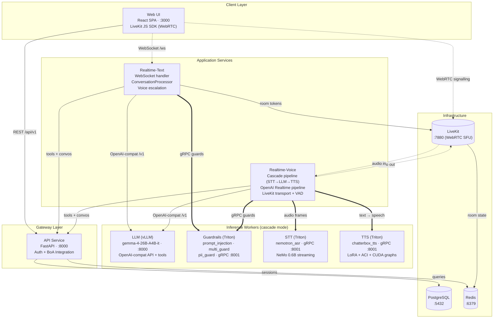
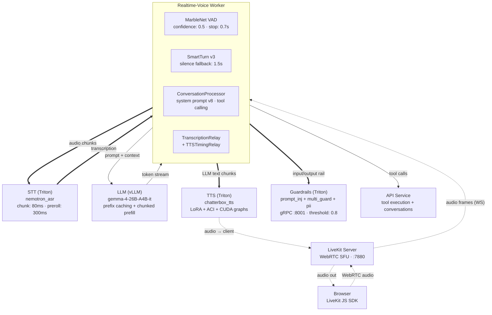
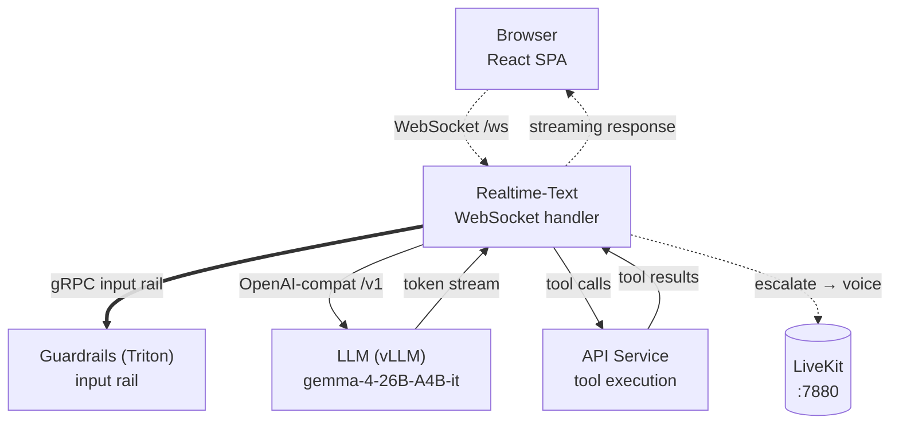

# Architecture — Concierge (Conversational AI Platform)

Financial conversational AI platform with real-time voice and text interactions, deployed on Kubernetes with Tilt for local development.

## Service Map

## Voice Pipeline (Cascade Mode)

## Text Pipeline

## Conditional Modes

| Mode | Config Key | Active Inference Services |
|------|-----------|--------------------------|
| `cascade` | `pipeline-type: cascade` | LLM + STT + TTS + Guardrails (all local GPU) |
| `cascade_remote` | `pipeline-type: cascade_remote` | Remote GPU port-forwards (LLM, STT, TTS, Guardrails from EKS) |
| `cascade_text` | `pipeline-type: cascade_text` | LLM + Guardrails only (no voice tier) |
| `openai` | `pipeline-type: openai` | OpenAI Realtime API (no local STT/TTS/LLM) |

## Data Shapes

| Boundary | Protocol | Data Format |
|----------|----------|-------------|
| Web → API | HTTP REST | JSON (sessions, accounts, feedback) |
| Web → Realtime-Text | WebSocket | JSON messages (client protocol) |
| Web → LiveKit | WebRTC | Opus audio frames + data channels |
| Realtime → API | HTTP Internal | JSON (tools, conversations) |
| Realtime → LLM | HTTP | OpenAI-compat chat completions (streaming) |
| Realtime → Guardrails | gRPC | Triton InferRequest (text tensor) |
| Realtime → STT | gRPC | Triton streaming InferRequest (audio PCM) |
| Realtime → TTS | gRPC | Triton InferRequest (text) → audio PCM |
| API → PostgreSQL | TCP | SQL via SQLAlchemy async |
| API → Redis | TCP | Redis protocol (sessions, rate limiting) |
| LiveKit → Redis | TCP | Redis protocol (room state) |

## Config Snapshot

| Parameter | Value | Source |
|-----------|-------|--------|
| LLM Model | google/gemma-4-26B-A4B-it | tilt_config / values.yaml |
| STT Model | nemotron_asr (NeMo 0.6B) | values.yaml |
| TTS Model | chatterbox_tts | values.yaml |
| LLM Guard | Nemotron-Content-Safety-4B | values.yaml |
| Pipeline Type | cascade (default) | tilt_config.json |
| System Prompt | gemma4_configurable (v8) | realtime-text config |
| STT Chunk | 80ms | values.yaml |
| VAD Confidence | 0.5 | cascade/pipeline.py |
| SmartTurn Stop | 1.5s | cascade/pipeline.py |
| Session TTL | 900s (15 min) | values.yaml |
| Rate Limit | 20 conn / 60s | values.yaml |
| Guardrails Threshold | 0.8 (prompt injection) | values.yaml |
| TTS Features | ACI + CUDA graphs + LoRA | values.yaml |
| Enabled Tools | visualise_data, capture_response | values.yaml |
