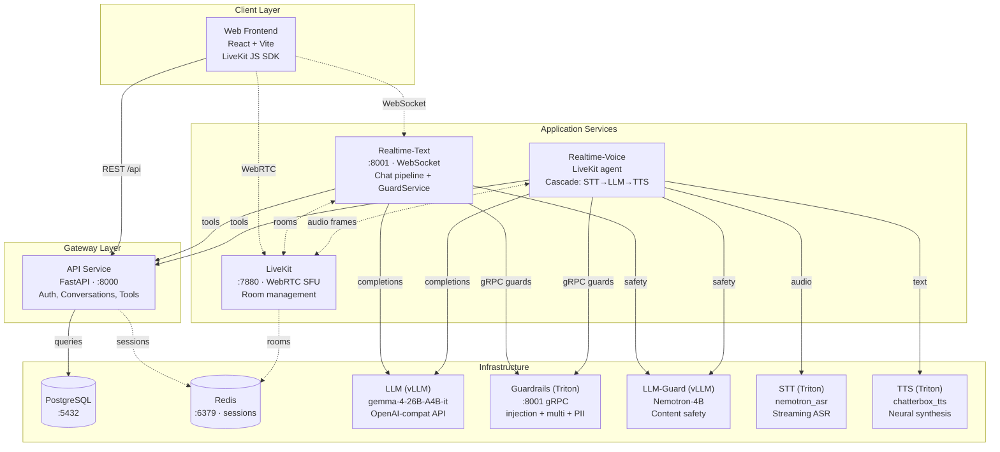
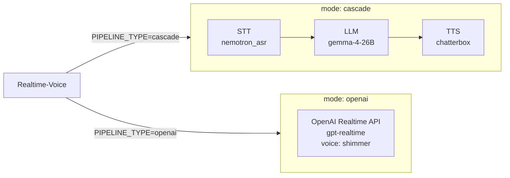
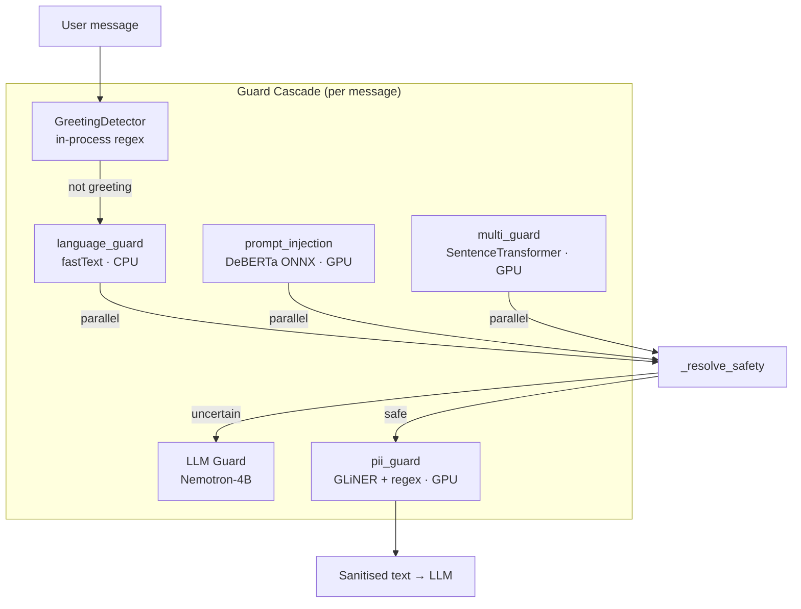

# Architecture

## Service Map

### Cascade vs OpenAI Pipeline Modes

### Guardrails Pipeline

## Data Shapes

| Boundary | Protocol | Data Format |
|---|---|---|
| Web → API | HTTP REST | JSON (sessions, conversations, feedback) |
| Web → Realtime-Text | WebSocket | JSON frames (chat messages, components) |
| Web ↔ LiveKit | WebRTC | Audio/video tracks via SFU |
| Realtime → API | HTTP internal | JSON (tool calls: transactions, cash-flow) |
| Realtime → LLM | HTTP | OpenAI-compat chat completions (streaming) |
| Realtime → Guardrails | gRPC (Triton) | text tensors → bool + confidence |
| Realtime → LLM-Guard | HTTP | OpenAI-compat chat (safety classification) |
| Realtime-Voice → STT | gRPC (Triton) | audio chunks → transcription text |
| Realtime-Voice → TTS | gRPC (Triton) | text → audio PCM |
| LiveKit → Redis | pub/sub | Room state, participant events |
| API → PostgreSQL | SQL (asyncpg) | Conversations, accounts, profiles |
| API → Redis | Redis protocol | Session tokens, rate limits, import state |

## Config Snapshot

| Parameter | Value |
|---|---|
| LLM model | google/gemma-4-26B-A4B-it |
| LLM-Guard model | nvidia/Nemotron-Content-Safety-Reasoning-4B |
| STT model | nemotron_asr |
| TTS model | chatterbox_tts |
| TTS voice (kokoro) | af_heart |
| Pipeline modes | cascade, openai |
| System prompt version | gemma4_configurable (v8) |
| Enabled tools | visualise_data, capture_response |
| VAD confidence | 0.5 |
| VAD start/stop | 0.2s / 0.7s |
| SmartTurn stop | 1.5s |
| Session TTL | 900s |
| Connection rate limit | 20/60s |
| Guardrails threshold | 0.8 (prompt injection) |
| Database | PostgreSQL :5432 |
| Cache | Redis :6379 |
| LiveKit signal port | 7880 |
| Web frontend | React + Vite :3000 |
| API port | 8000 |
| Cluster options | kind, k3s |
