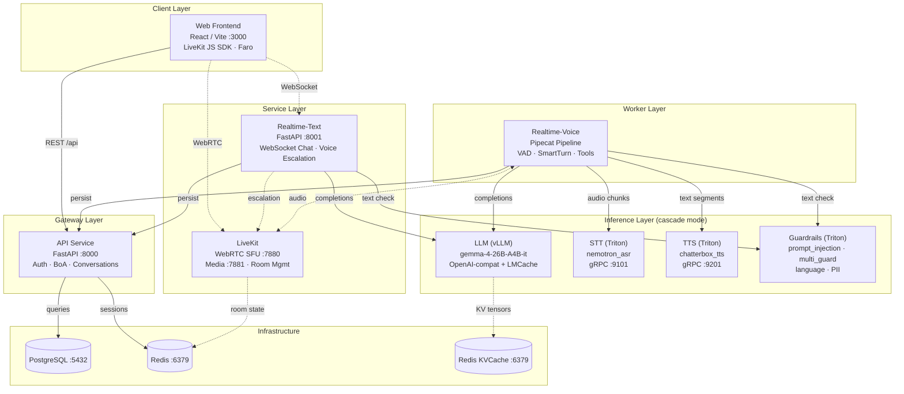
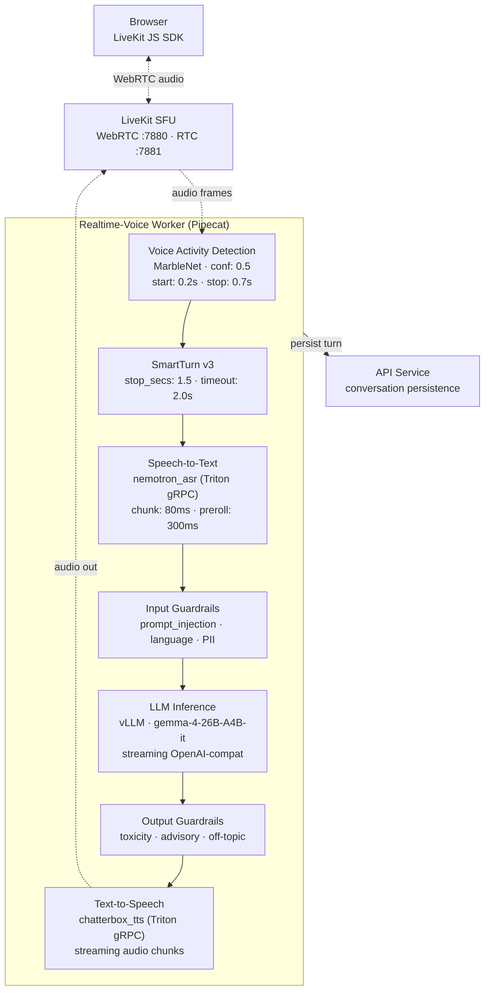
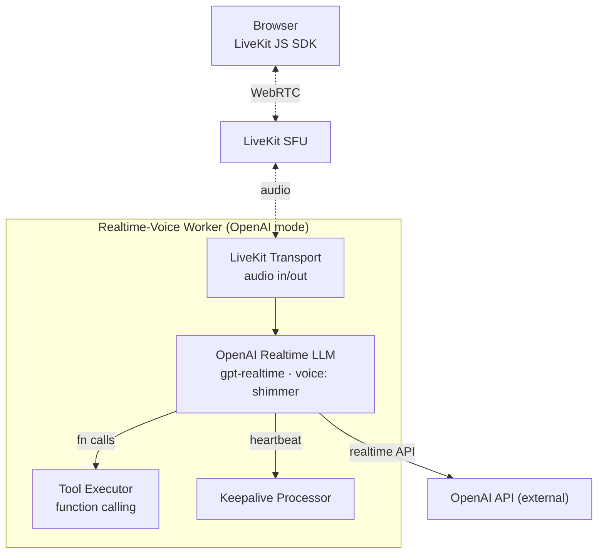

# Architecture — Concierge (ConvAI)

Financial conversational AI platform with real-time voice and text interactions, supporting multiple pipeline modes (cascade with local inference, or OpenAI Realtime).

### Service Map

### Voice Cascade Pipeline

### OpenAI Realtime Mode

## Data Shapes

| Boundary | Input | Output |
|----------|-------|--------|
| Browser → API | HTTP REST (JSON) | Session tokens, conversation state |
| Browser → Realtime-Text | WebSocket frames (JSON) | Chat messages, tool results |
| Browser → LiveKit | WebRTC audio (PCM 16kHz) | WebRTC audio (PCM 24kHz) |
| Realtime-Voice → STT | gRPC: audio chunks (80ms) | Transcription text |
| Realtime-Voice → LLM | HTTP: OpenAI chat completion | Streaming token chunks |
| Realtime-Voice → TTS | gRPC: text segments | Audio PCM chunks |
| Realtime → Guardrails | gRPC: text string | is_safe, confidence, redacted_text |
| API → PostgreSQL | SQL (SQLAlchemy async) | Conversations, users, accounts |
| API → Redis | Key-value (sessions, rate limits) | Session data |
| LLM → Redis KVCache | KV cache tensors (LMCache) | Cached KV state |

## Config Snapshot

| Parameter | Value | Source |
|-----------|-------|--------|
| pipeline-type | cascade (default) | tilt_config.json |
| llm-model | google/gemma-4-26B-A4B-it | tilt_config.json |
| stt-model | nemotron_asr | tilt_config.json |
| tts-model | chatterbox_tts | tilt_config.json |
| tts-voice (kokoro) | af_heart | Tiltfile |
| vad_confidence | 0.5 | cascade/pipeline.py |
| vad_start_secs | 0.2 | cascade/pipeline.py |
| vad_stop_secs | 0.7 | cascade/pipeline.py |
| smart_turn_stop_secs | 1.5 | cascade/pipeline.py |
| stt_chunk_ms | 80 | registries.py |
| stt_preroll_ms | 300 | registries.py |
| voice_join_timeout | 15.0s | config.py |
| voice_reconnect_grace | 5.0s | config.py |
| prompt_injection_threshold | 0.8 | guardrails README |

## Service Summary

| Service | Path | Runtime | Port | Protocol |
|---------|------|---------|------|----------|
| Web | services/web | always-running | 3000 | HTTP |
| API | services/api | always-running | 8000 | HTTP |
| Realtime-Text | services/realtime (tier=text) | always-running | 8001 | HTTP + WS |
| Realtime-Voice | services/realtime (tier=voice) | always-running | 8000 | HTTP + WS |
| LLM (vLLM) | services/llm | always-running | 8000 | HTTP |
| STT (Triton) | services/stt | always-running | 9101 | gRPC |
| TTS (Triton) | services/tts | always-running | 9201 | gRPC |
| Guardrails (Triton) | services/guardrails | always-running | 9021 | gRPC |
| LiveKit | deploy/charts (3rd party) | always-running | 7880/7881 | WS + RTC |
| PostgreSQL | infrastructure | always-running | 5432 | TCP |
| Redis | infrastructure | always-running | 6379 | TCP |
| Redis KVCache | infrastructure | always-running | 6379 | TCP |
