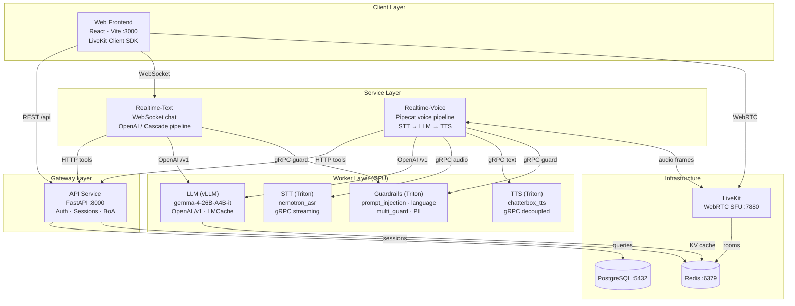
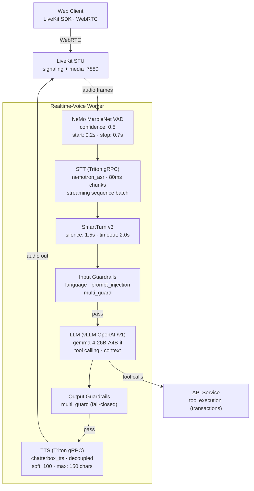
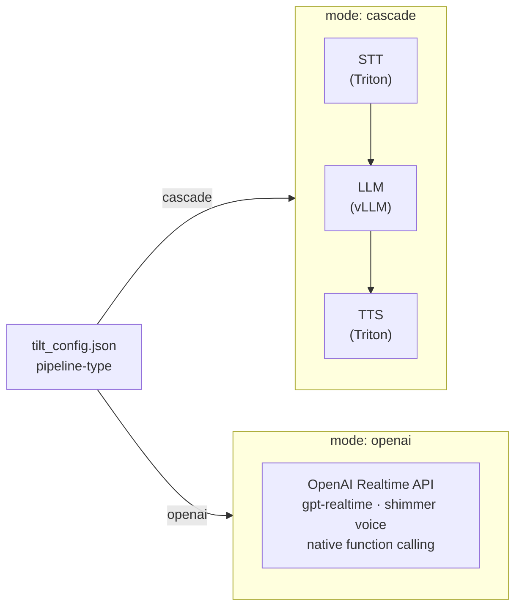

# Architecture

## Service Map Overview

## Voice Pipeline (Cascade Mode)

## Pipeline Modes

## Data Shapes

| Stage | Input | Output |
|---|---|---|
| Web Client | User speech / text | WebRTC audio / WebSocket messages |
| LiveKit | WebRTC stream | Audio frames to worker |
| VAD | Raw audio | Speech segments |
| STT | Audio frames (80ms) | Interim + final transcriptions |
| SmartTurn | Transcription stream | Complete user utterance |
| Guardrails (input) | User text | pass / blocked verdict |
| LLM | Conversation context + tools | Assistant response (streamed) |
| Guardrails (output) | Assistant text | pass / blocked verdict |
| TTS | Text chunks (≤150 chars) | Streamed PCM audio |
| API Tools | Tool call params | Transaction data, charts |

## Config Snapshot

| Parameter | Value | Source |
|---|---|---|
| LLM model | gemma-4-26B-A4B-it | tilt_config.json |
| STT model | nemotron_asr | tilt_config.json |
| TTS model | chatterbox_tts | tilt_config.json |
| Pipeline type | cascade / openai | tilt_config.json |
| VAD confidence | 0.5 | pipeline.py |
| VAD start/stop | 0.2s / 0.7s | pipeline.py |
| SmartTurn silence | 1.5s | pipeline.py |
| TTS soft split | 100 chars | triton.py |
| TTS max length | 150 chars | triton.py |
| STT chunk size | 80ms | TritonSTTClient |
| Session TTL | 900s | values.yaml |
| API port | 8000 | Dockerfile |
| LiveKit port | 7880 | values.yaml |

## Service Dependencies

| Service | Depends On | Protocol |
|---|---|---|
| Web | API, LiveKit, Realtime-Text | HTTP, WebRTC, WebSocket |
| API | PostgreSQL, Redis | SQL, Redis |
| Realtime-Text | API, LLM, Guardrails | HTTP, HTTP, gRPC |
| Realtime-Voice | API, LLM, STT, TTS, Guardrails, LiveKit | HTTP, HTTP, gRPC, gRPC, gRPC, WebSocket |
| LLM | Redis (KV cache) | Redis |
| LiveKit | Redis | Redis |

## Infrastructure

| Component | Image | Purpose |
|---|---|---|
| PostgreSQL | postgres:16-alpine | Conversations, users, accounts |
| Redis | redis:7-alpine | Sessions, LiveKit rooms, LMCache KV |
| LiveKit | livekit/livekit-server | WebRTC SFU, signaling |
| vLLM | vllm/vllm-openai:v0.25 | LLM serving (OpenAI-compatible) |
| Triton STT | tritonserver:26.03 | Speech-to-text inference |
| Triton TTS | tritonserver:26.06 | Text-to-speech inference |
| Triton Guards | tritonserver | Safety model inference |
