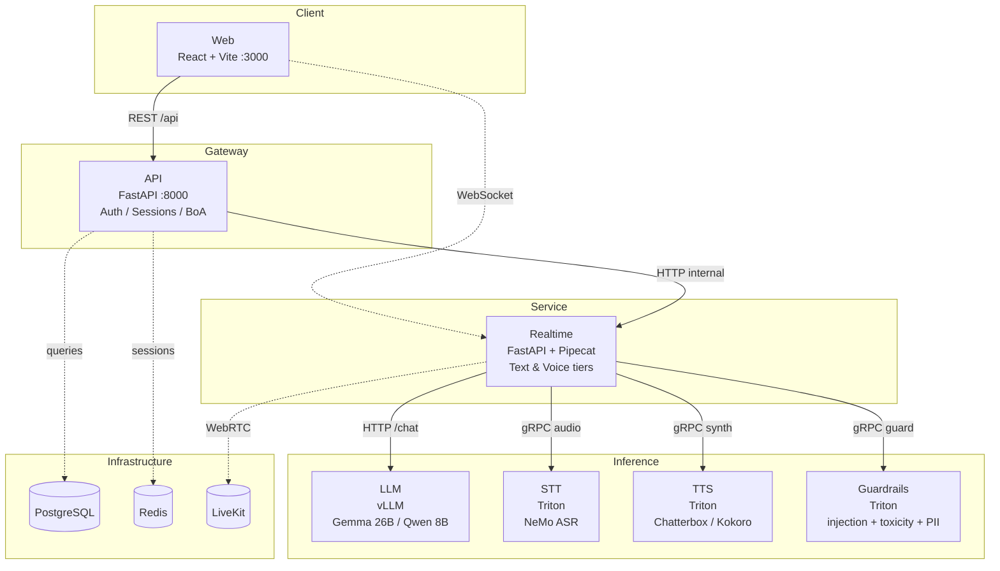
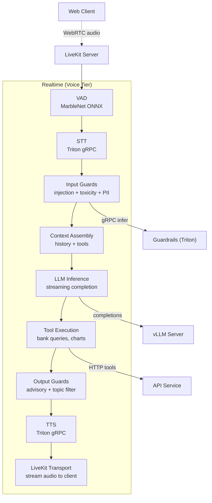

# Concierge — Architecture

Financial conversational AI platform with voice and text interfaces, built as a Kubernetes-native microservice system.

## Service Map Overview

## Voice Pipeline (Data Flow)

## Data Shapes

| Shape | Source | Schema |
|-------|--------|--------|
| Conversation messages | `shared/protocols/` | Discriminated union with `type` field |
| Bank accounts | `shared/models/bank_account.py` | Pydantic v2 models |
| User profile | `shared/models/users.py` | SQLAlchemy Core tables |
| Feature flags | LaunchDarkly SDK | Proxied via `GET /api/v1/feature-flags` |
| Audio frames | LiveKit + Pipecat | PCM audio via WebRTC data channel |
| Guard decisions | Triton response tensors | `is_safe` (bool), `confidence` (float) |

## Config Snapshot

| Parameter | Value | Source |
|-----------|-------|--------|
| Pipeline type | `cascade` or `openai` | `tilt_config.json → PIPELINE_TYPE` |
| LLM model | `google/gemma-4-26B-A4B-it` | `tilt_config.json → llm-model` |
| STT model | `nemotron_asr` | `tilt_config.json → stt-model` |
| TTS model | `chatterbox_tts` | `tilt_config.json → tts-model` |
| VAD confidence | 0.5 | `cascade/pipeline.py` |
| VAD stop secs | 0.7 | `cascade/pipeline.py` |
| Smart turn timeout | 1.5s | `cascade/pipeline.py` |
| Auth provider | `mock` or `lwb` | `AUTH_PROVIDER` env var |
| Infrastructure | PostgreSQL 16, Redis 7, LiveKit | `Tiltfile` |
| Orchestration | Kind (macOS) / k3s (Linux) + Tilt | `tilt_config.json → cluster` |

## Services Summary

| Service | Stack | Port | Role |
|---------|-------|------|------|
| Web | React, Vite, Zustand, Tailwind v4 | 3000 | Browser UI with voice/text chat |
| API | FastAPI, SQLAlchemy Core, Pydantic v2 | 8000 | REST gateway, auth, BoA integration |
| Realtime | FastAPI, Pipecat, LiveKit SDK | — | WebSocket text + LiveKit voice pipelines |
| LLM | vLLM | 8001 | OpenAI-compatible completion endpoint |
| STT | Triton (NeMo nemotron_asr) | 9001 (gRPC) | Speech-to-text streaming |
| TTS | Triton (Chatterbox/Kokoro) | 9011 (gRPC) | Text-to-speech synthesis |
| Guardrails | Triton (4 models) | 9021 (gRPC) | Safety: injection, toxicity, PII, language |
