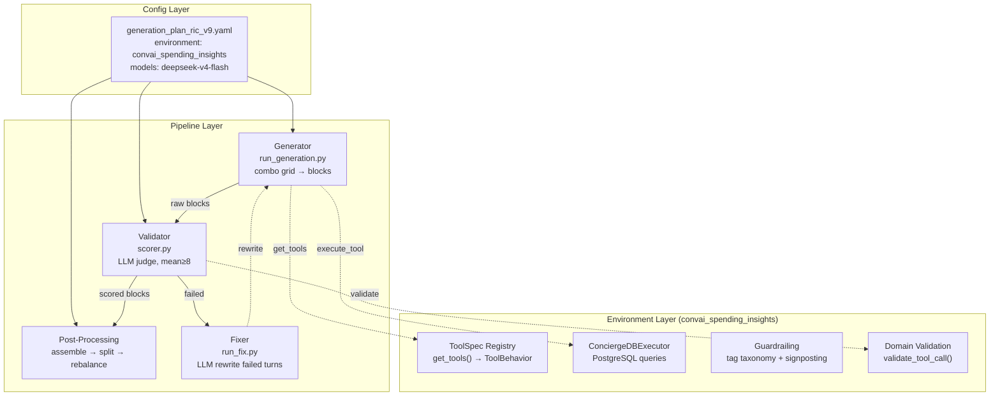
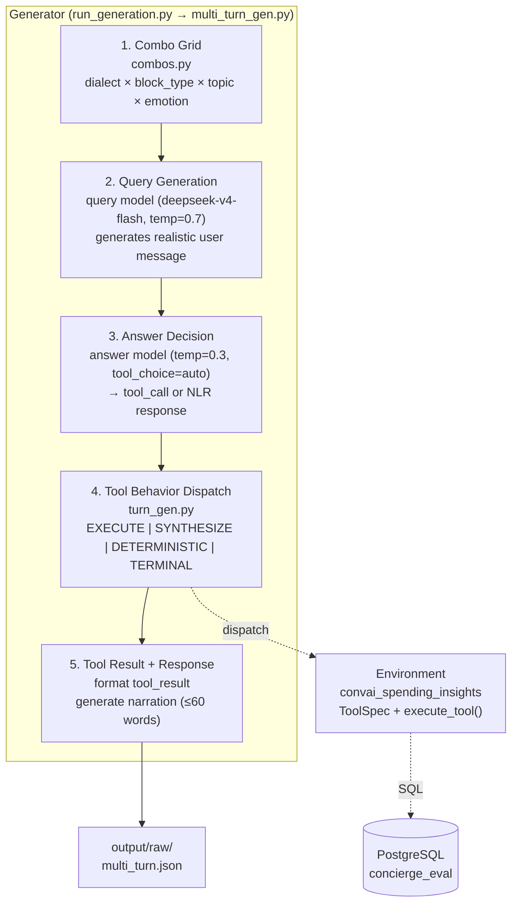

# auto-eval Architecture

## Overview

Environment-driven pipeline for generating and validating synthetic multi-turn conversational datasets. Three-layer architecture: Config drives Pipeline modules, which delegate domain-specific logic to a pluggable Environment.

## Generator Drill-Down

The generator orchestrates 5 sequential stages per block:

## Data Shapes

| Stage | Format | Key Fields |
|-------|--------|------------|
| Generation output | `output/raw/multi_turn.json` | `messages[]`, `metadata{block_id, persona_id, block_type, topic, emotion}` |
| Validation scored | `output/ann/*_scored.json` | `scores{}`, `pass: bool`, `avg_score: float` |
| Fix input | `output/ann/` (failed blocks) | Same as scored, `pass=false` |
| Assembled | `output/final/multi_turn.json` | Stitched conversations with topic pivots |
| Final split | `output/{train,val,eval}.json` | Ratios from `output:` config section |

## Config Snapshot

| Key | Value | Notes |
|-----|-------|-------|
| `environment` | `convai_spending_insights` | Pluggable domain module |
| `generator.query.model` | `deepseek/deepseek-v4-flash` | OpenRouter remote |
| `generator.answer.model` | `deepseek/deepseek-v4-flash` | temp=0.3, tool_choice=auto |
| `validator.model` | `deepseek/deepseek-v4-flash` | temp=0.1 |
| `validator.threshold` | `8` | Mean score pass gate |
| `validator.hard_fail_threshold` | `5` | Single metric floor |
| `generator.batch_size` | `50` | Concurrent block generation |
| `taxonomy.scenarios[0].pipeline` | `block + assemble` | 2-3 followups per block, 2-3 blocks per convo |
| `guardrailing.enabled` | `true` | Adversarial block pool (corpus mode) |
| `generator.concierge.enabled` | `true` | Real PostgreSQL for EXECUTE tools |

## Pipeline Orchestration

`scripts/run_pipeline.sh` runs the full 4-step pipeline in a tmux session:

1. **STEP 1** — Generation (combo grid → block pool)
2. **STEP 1.5** — Guardrailing adversarial gen (optional, corpus/LLM)
3. **STEP 2** — Annotation (LLM judge scoring, ensemble support)
4. **STEP 3** — Fix (rewrite failed turns, re-annotate)
5. **STEP 4** — Re-annotate fixed samples
6. **Merge + Assemble + Split + Rebalance + Analysis**
