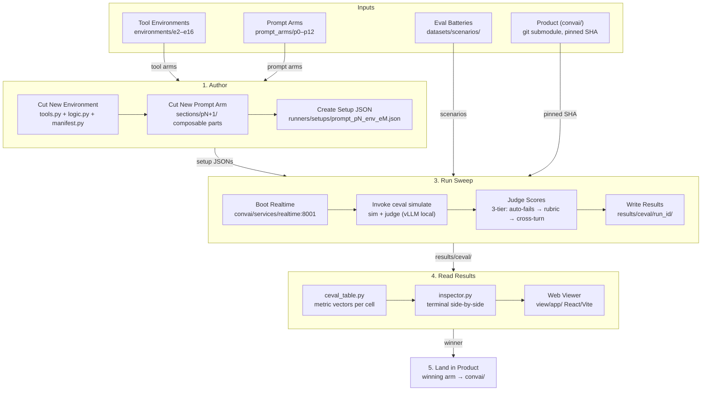

# convai-lab — Architecture

## Overview

convai-lab is an experimentation lab for **convai**, a conversational-AI banking assistant.
The lab follows a **pipeline topology**: a five-stage workflow that authors experimental
arms, runs them against evaluation batteries, reads the results, and graduates winners
into the product.

The dependency points one way: the lab consumes the product (pinned as a git submodule);
the product knows nothing about the lab.



## Key Design Decisions

| Decision | Rationale |
|----------|-----------|
| Environments are frozen snapshots | Results are evidence only if the exact code that produced them still exists |
| Prompt arms are separate axis | Prompt variants don't multiply inside every tool arm |
| Same model judges its own output | Known caveat — scores rank arms against each other, not absolute quality |
| Cells run sequentially | One Postgres, one realtime port; each reseed truncates globally |
| Lab ships nothing to production | Graduation = copy + review in product repo |

## Data Shapes

| Artefact | Location | Format |
|----------|----------|--------|
| Tool environment | `environments/eN/` | `tools.py` + `logic.py` + `manifest.py` + `data.py` |
| Prompt arm | `prompt_arms/pN.json` + `sections/pN/` | JSON metadata + text section files |
| Setup JSON (cell) | `runners/setups/experimental_tools/` | `{"name": "prompt_pN_env_eM", "env": {...}}` |
| Eval params | `runners/eval_params.py` | Python dataclass with ceval argument tail |
| Run output | `results/ceval/<run_id>/` | `manifest.json` + ceval artifacts |
| Metric vector | via `ceval_table.py` | per-cell pass rates from evaluator metrics |

## Config Snapshot

| Parameter | Value | Source |
|-----------|-------|--------|
| Realtime port | 8001 | `runners/utils.py` REALTIME_PORT |
| Max turns (authored batteries) | 3 | `runners/eval_params.py` _DEPTH |
| Default batch size | 4 | ceval default (`--batch-size`) |
| LLM model (local) | derived from `pipeline.env` VLLM_MODEL | `runners/models.py` |
| Sim/Judge provider | vLLM local (default) | `runners/models.py` Target |
| Experimental env selection | EXPERIMENTAL_ENV env var | setup JSON → realtime |
| Prompt selection | SYSTEM_PROMPT_CONFIG env var | setup JSON → realtime |

## Module Relationships

```
environments/     ← frozen tool snapshots (15 arms)
prompt_arms/      ← frozen prompt snapshots (p0–p12)
runners/
  ├── sweep.py       ← matrix driver: eval_params × cells
  ├── run_ceval.py   ← one cell launcher (boot + ceval + teardown)
  ├── eval_params.py ← named parameter sets (what to ask)
  ├── models.py      ← sim/judge model targets
  └── utils.py       ← LAB_ROOT, CONVAI_ROOT, managed_realtime
datasets/
  ├── scenarios/     ← generated batteries for ceval
  └── scripts/       ← harvest_scenarios, prompts_to_scenarios
view/
  ├── ceval_table.py     ← metric vector tabulation
  ├── inspector.py       ← terminal viewer (side-by-side)
  └── app/               ← React/Vite web viewer
convai/             ← product (pinned git submodule)
  └── services/realtime  ← the assistant under test
```
