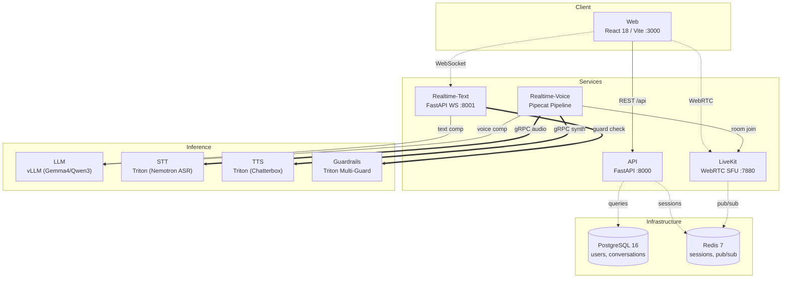
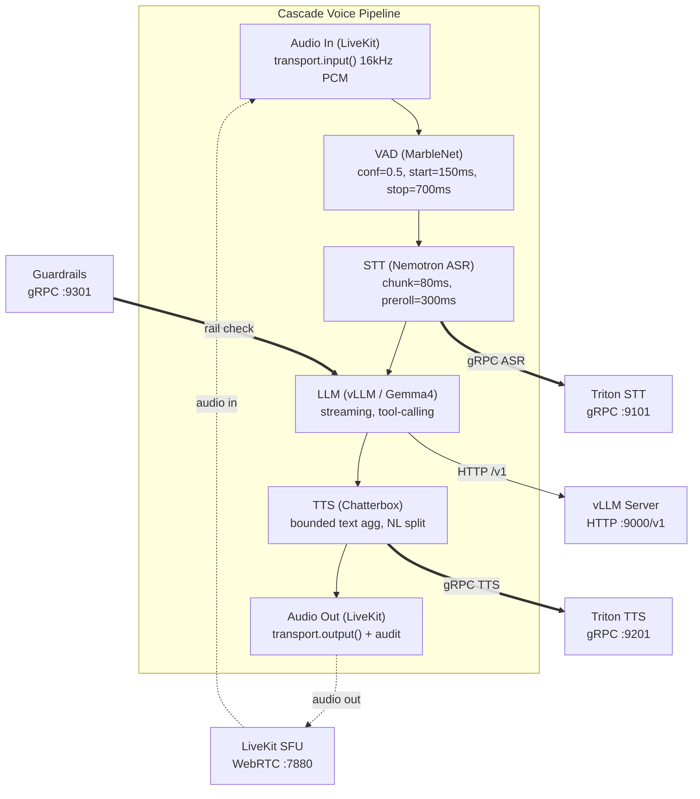

# Concierge Architecture

Financial conversational AI platform with real-time voice and text interactions.

## Overview (Service Map)

## Voice Pipeline (Data Flow)

## Data Shapes

| Service | Input | Output | Protocol |
|---------|-------|--------|----------|
| Web | User interaction | REST requests, WebSocket messages | HTTP, WS |
| API | HTTP requests | JSON responses, DB writes | REST |
| Realtime-Text | WebSocket text | LLM completions, tool results | WS, HTTP |
| Realtime-Voice | Audio frames (16kHz PCM) | Audio frames (TTS output) | WebRTC, gRPC |
| LiveKit | WebRTC signalling | Room events, audio relay | WebSocket, RTP |
| LLM (vLLM) | OpenAI-format messages | Streaming token completions | HTTP /v1 |
| STT (Triton) | Audio chunks (80ms) | Text transcriptions | gRPC |
| TTS (Triton) | Text segments | Audio PCM frames | gRPC |
| Guardrails | User/assistant text | Pass/block decision | gRPC |
| PostgreSQL | SQL queries | Row sets | TCP :5432 |
| Redis | Key/channel ops | Values, pub/sub messages | TCP :6379 |

## Config Snapshot

| Parameter | Value | Source |
|-----------|-------|--------|
| Pipeline type | `cascade` / `openai` | `tilt_config.json` |
| LLM model | `google/gemma-4-26B-A4B-it` | `tilt_config.json` |
| STT model | `nemotron_asr` | Triton model_repository |
| TTS model | `chatterbox_tts` | Triton model_repository |
| TTS fallback | `kokoro_tts` (voice: `af_heart`) | `tilt_config.json` |
| VAD confidence | 0.5 | `cascade/pipeline.py` |
| VAD start | 150ms | `cascade/pipeline.py` |
| VAD stop | 700ms | `cascade/pipeline.py` |
| SmartTurn stop | 1.5s | `cascade/pipeline.py` |
| STT chunk | 80ms | env `STT_CHUNK_MS` |
| STT preroll | 300ms | env `STT_PREROLL_MS` |
| API port | 8000 | Uvicorn config |
| Realtime-Text port | 8001 (host) / 8000 (container) | Helm values |
| LiveKit port | 7880 (signal) / 7881 (RTC) | Helm values |
| Redis | 7-alpine :6379 | `deploy/envs/local/redis.yaml` |
| PostgreSQL | 16-alpine :5432 | `deploy/envs/local/postgres.yaml` |
| Kubernetes | Kind (macOS) / k3s (Linux) | `tilt_config.json` |
| Deployment | Tilt + Helm charts | `Tiltfile` |
