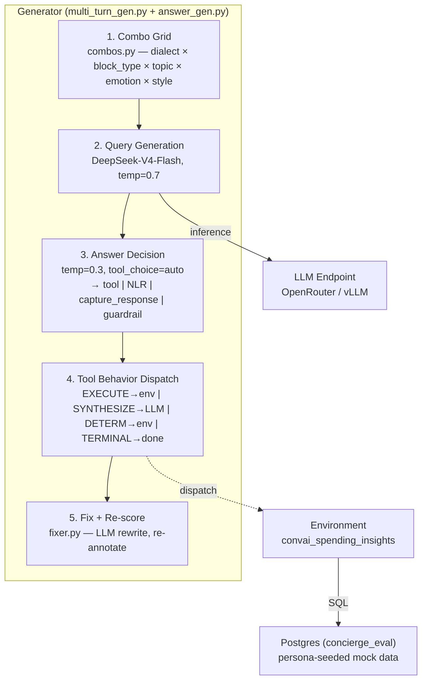

# auto-eval Architecture

Environment-driven pipeline for generating and validating synthetic multi-turn conversational datasets. Three layers: Config drives Pipeline modules which all plug into a shared Environment protocol.

## Overview Diagram

```mermaid
flowchart TB
    subgraph Config["Config Layer"]
        cfg["generation_plan_ric_v9.yaml<br/>environment, models, taxonomy, thresholds"]
    end

    subgraph Pipeline["Pipeline Layer (domain-agnostic)"]
        gen["Generator<br/>combo grid → query → answer → tool dispatch"]
        val["Validator<br/>LLM scorer, mean≥8 pass, fix+re-score"]
        post["Post-Processing<br/>assemble → split → rebalance → analysis"]
    end

    subgraph Environment["Environment Layer (pluggable)"]
        tools["ToolSpec Registry<br/>get_tools() → ToolBehavior enum"]
        exec["Executor<br/>execute_tool() → Postgres"]
        rules["Validation Rules<br/>validate_tool_call() + rubric"]
        prompts["Prompts & Taxonomy<br/>context, query gen, DomainConfig"]
    end

    cfg --> gen
    cfg --> val
    cfg --> post
    gen -->|raw blocks| val
    val -->|pass/fail| post
    gen -.->|get_tools()| tools
    gen -.->|execute_tool()| exec
    val -.->|validate()| rules
    val -.->|rubric| prompts
```

## Generation Detail



## Data Shapes

| Stage | Input | Output | Format |
|-------|-------|--------|--------|
| Combo Grid | config YAML | combo list | `[{persona, emotion, typing_style, dialect, topic, block_type}]` |
| Query Gen | combo + context | user message | OpenAI messages list |
| Answer Decision | messages + schema | tool_call or text | OpenAI response (tool_calls or content) |
| Tool Dispatch | tool_call | tool_result + response | `ToolResult(success, summary)` → assistant text |
| Validation | raw blocks | scored blocks | `{messages, metadata, scores, pass_fail}` |
| Fix | failed turns | rewritten turns | same shape, re-scored |
| Assemble | passing blocks | conversations | multi-block stitched with topic pivots |
| Split | assembled | train/val/eval | `.json` files with configurable ratios |

## Config Snapshot

| Key | Value | Notes |
|-----|-------|-------|
| `environment` | `convai_spending_insights` | Selects domain module |
| `generator.query.model` | `deepseek/deepseek-v4-flash` | Query gen LLM |
| `generator.answer.model` | `deepseek/deepseek-v4-flash` | Answer/tool-choice LLM |
| `generator.answer.temperature` | `0.3` | Low temp for deterministic answers |
| `validator.model` | `deepseek/deepseek-v4-flash` | LLM judge |
| `validator.threshold` | `8` | Mean score pass gate |
| `validator.hard_fail_threshold` | `5` | Single-metric floor |
| `taxonomy.scenarios` | `multi_turn` (block+assemble) | Only scenario type |
| `generator.concierge.enabled` | `true` | Real Postgres for EXECUTE tools |
| `generator.guardrail_in_generation.enabled` | `true` | Guardrail signposting in blocks |
| `fixer.model` | `deepseek/deepseek-v4-flash` | Fix stage LLM |
| `output.eval_ratio` | `1.0` | All output goes to eval |
