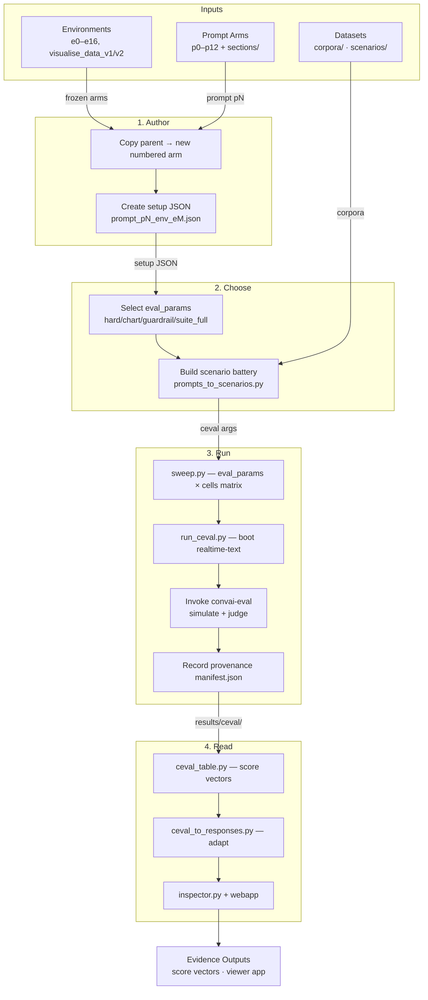

# convai-lab Architecture

> Experiment lab for measuring the **convai** conversational-AI banking assistant.
> The lab consumes the product (pinned submodule); the product knows nothing about the lab.

## Overview

## Pipeline Stages

### 1. Author (`environments/` · `prompt_arms/`)

| Step | What | Key detail |
|------|------|-----------|
| Copy parent | `cp -r environments/parent environments/eN+1` | Never edit an existing arm |
| Create setup | `runners/setups/experimental_tools/prompt_pN_env_eM.json` | Pairs prompt arm + environment |

An environment is a frozen snapshot: tools.py (schemas), logic.py (pure computation), manifest.py (lineage).
A prompt arm is a versioned system prompt from section files under `prompt_arms/sections/`.

### 2. Choose (`datasets/` · `runners/eval_params.py`)

| Step | What | Key detail |
|------|------|-----------|
| Select eval_params | Named parameter sets | `lab_prompts_hard`, `chart`, `guardrail`, `suite_full` |
| Build battery | `prompts_to_scenarios.py` | `--max-turns 3` via exchange_limit_controller |

### 3. Run (`runners/sweep.py`)

| Step | What | Key detail |
|------|------|-----------|
| sweep.py | Iterate matrix | Sequential cells (shared Postgres + port) |
| run_ceval.py | Boot realtime-text | `managed_realtime(cell.env)` via uvicorn |
| convai-eval | simulate + judge | Gemma-4-26B-A4B-it default · batch-size 4 |
| Provenance | manifest.json | lab SHA + product SHA + dirty flags |

### 4. Read (`view/`)

| Step | What | Key detail |
|------|------|-----------|
| ceval_table.py | Score vector per cell | Auto-fails + LLM rubric + cross-turn |
| ceval_to_responses.py | Adapt for viewer | Auto-run after each cell in sweep |
| inspector.py + webapp | Side-by-side comparison | Real chart components from pinned product |

## Data Shapes

| Artifact | Format | Location |
|----------|--------|----------|
| Setup JSON | `{"name": "prompt_p6_env_e14", "env": {...}}` | `runners/setups/experimental_tools/` |
| Eval params | Python dataclass → ceval command tail | `runners/eval_params.py` |
| Scenario battery | JSON array of openings | `datasets/scenarios/` |
| Run manifest | JSON with provenance + status | `results/ceval/<run_id>/manifest.json` |
| Responses | JSON adapted for viewer | `results/ceval/<run_id>/responses.json` |
| Score vector | Terminal table per cell | stdout from `view/ceval_table.py` |

## Config Snapshot

| Parameter | Value | Source |
|-----------|-------|--------|
| Default model | `google/gemma-4-26B-A4B-it` | `VLLM_MODEL` env / `runners/models.py` |
| Max turns (authored) | 3 | `eval_params.py` `_DEPTH` |
| Max turns (suite) | 8 (self-terminating) | convai-eval built-in |
| Batch size | 4 concurrent scenarios | ceval default |
| Python version | ≥3.12, <3.13 | `pyproject.toml` |
| Realtime port | 8001 | `runners/utils.py` |
| API URL | `http://localhost:8000` | `runners/utils.py` |

## Key Constraints

- **Freeze rule**: Once an arm produces citable results, it never changes (including bugs).
- **Provenance**: Every run records lab SHA, product SHA, evaluator SHA, and dirty flags.
- **One-way dependency**: Lab imports product; product imports nothing from lab.
- **Sequential cells**: One Postgres + one realtime port; each batch's reseed truncates globally.
- **No parallelism**: Cells cannot run concurrently; within a cell, scenarios batch at 4.
