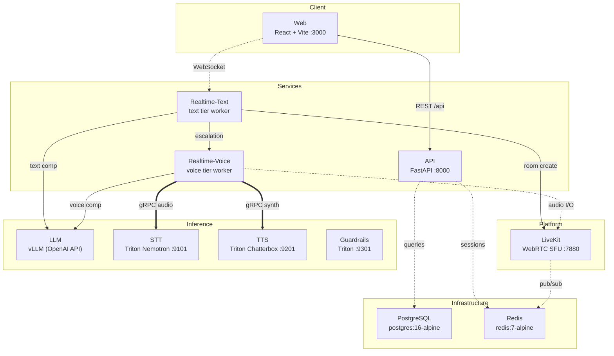
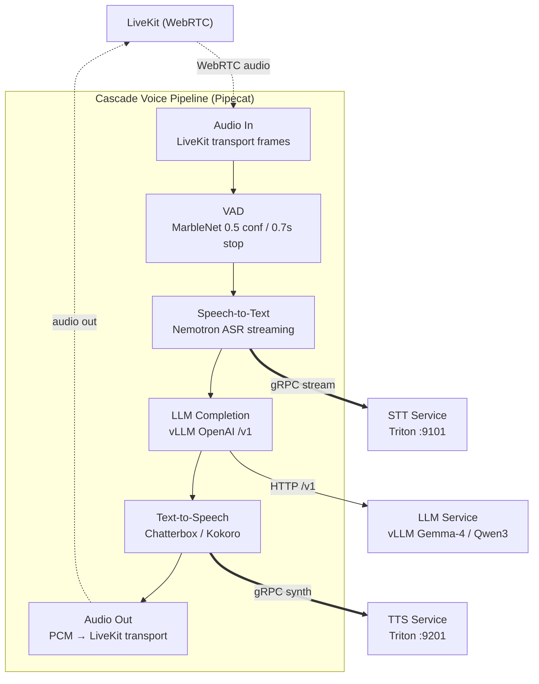

# Concierge — Architecture

Financial conversational AI platform with text and voice modes, deployed on Kubernetes (Kind/k3s locally, EKS in production).

## Overview

## Voice Pipeline (Cascade)

## Data Shapes

| Boundary | Protocol | Format | Notes |
|----------|----------|--------|-------|
| Web → API | HTTP REST | JSON | `/api/v1/*` endpoints |
| Web → RT-Text | WebSocket | JSON frames | Chat messages, voice escalation signals |
| RT-Text → RT-Voice | HTTP | Internal API | Voice session creation via LiveKit |
| RT-Voice ↔ LiveKit | WebSocket | WebRTC | Audio frames (PCM), signalling |
| RT-Voice → STT | gRPC | Streaming audio | Triton Nemotron ASR model |
| RT-Voice → LLM | HTTP | OpenAI-compat JSON | `/v1/chat/completions` (streaming) |
| RT-Voice → TTS | gRPC | Text → audio | Triton Chatterbox/Kokoro model |
| RT-* → Guardrails | gRPC | Text | Input/output safety rails |
| API → PostgreSQL | TCP | SQL (asyncpg) | Sessions, conversations, accounts |
| API → Redis | TCP | Redis protocol | Session cache, rate limiting |
| LiveKit → Redis | TCP | Redis pub/sub | Room state coordination |

## Config Snapshot

| Key | Default | Source |
|-----|---------|--------|
| `pipeline-type` | `cascade` | `tilt_config.json` |
| `llm-model` | `google/gemma-4-26B-A4B-it` | `tilt_config.json` |
| `stt-model` | `nemotron_asr` | `tilt_config.json` |
| `tts-model` | `chatterbox_tts` | `tilt_config.json` |
| VAD confidence | 0.5 | `pipeline/cascade/pipeline.py` |
| VAD stop secs | 0.7s | `pipeline/cascade/pipeline.py` |
| SmartTurn stop | 1.5s | `pipeline/cascade/pipeline.py` |
| VAD min volume | 0.25 | `pipeline/cascade/pipeline.py` |
| LiveKit SFU port | 7880 | Helm chart |
| LiveKit RTC port | 7881 | Helm chart |
| API port | 8000 | Dockerfile |
| RT-Text port | 8001 | Tilt config |
