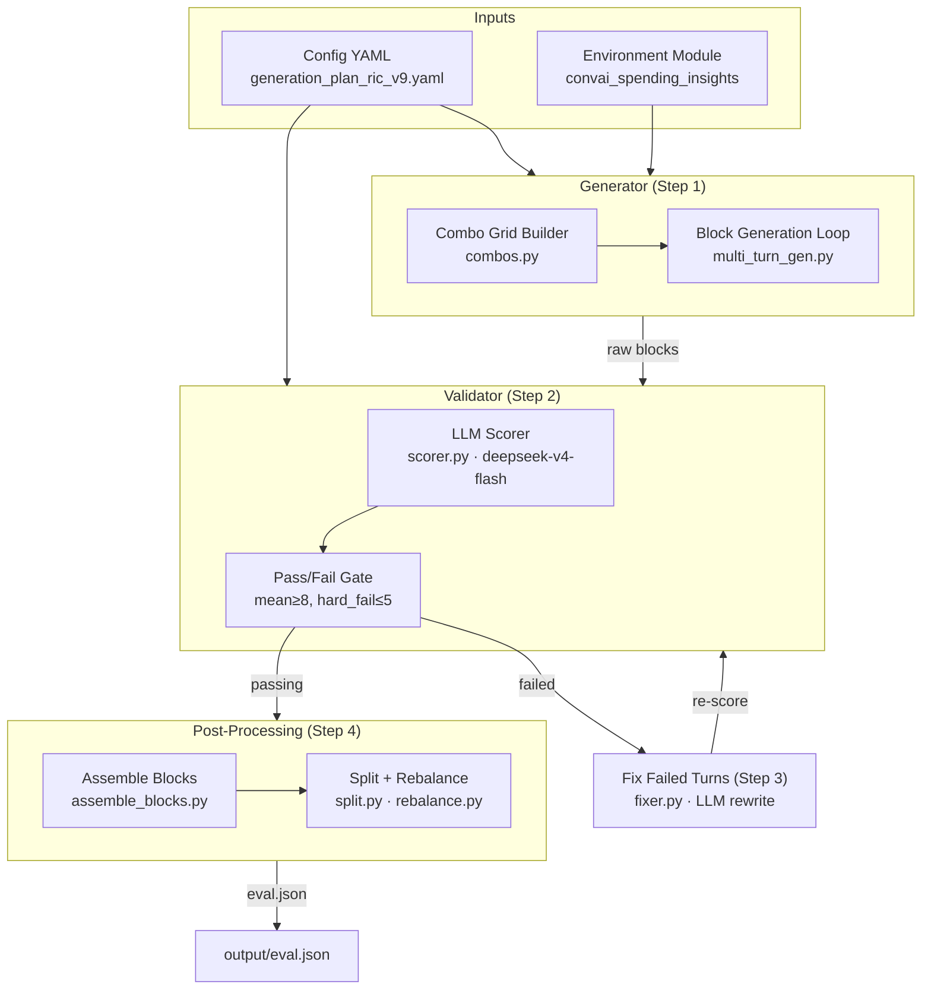
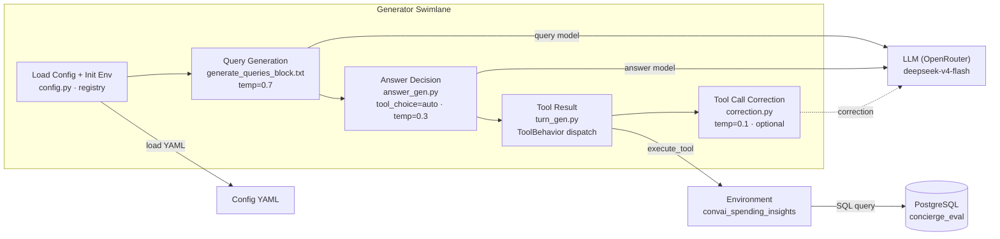

# auto-eval Architecture

> Open [architecture.drawio](architecture.drawio) in draw.io for the editable diagram.
> SVGs: [Page 1 (Overview)](architecture_p1.svg) · [Page 2 (Generator)](architecture_p2.svg)

## Overview (Pipeline)

## Generator Drill-Down

## Data Shapes

| Stage | Input | Output | Format |
|-------|-------|--------|--------|
| Combo Grid | Config YAML | Combo list | `[{dialect, type, topic, emotion, typing_style}]` |
| Block Generation | Combo + Context | Block pool | `{"messages": [...], "metadata": {...}}` |
| Validation | Raw blocks | Scored blocks | Block + per-turn scores (mean, pass/fail) |
| Fix | Failed turns | Rewritten turns | Same block format, re-scored |
| Assemble | Passing blocks | Conversations | Multi-block stitched with topic pivots |
| Split | Conversations | train/val/eval | Configurable ratios (default: 100% eval) |

## Config Snapshot

| Key | Value | Notes |
|-----|-------|-------|
| `environment` | `convai_spending_insights` | Pluggable domain module |
| `generator.query.model` | `deepseek/deepseek-v4-flash` | Via OpenRouter |
| `generator.answer.model` | `deepseek/deepseek-v4-flash` | Via OpenRouter |
| `generator.batch_size` | `50` | Concurrent blocks |
| `validator.model` | `deepseek/deepseek-v4-flash` | Rubric-driven scorer |
| `validator.threshold` | `8` | Mean score gate |
| `validator.hard_fail_threshold` | `5` | Per-metric floor |
| `fixer.model` | `deepseek/deepseek-v4-flash` | Rewrite failed turns |
| `taxonomy.scenarios[0].pipeline[0].followups` | `{min: 2, max: 3}` | Follow-ups per block |
| `taxonomy.scenarios[0].pipeline[1].blocks_per_conversation` | `{min: 2, max: 3}` | Assembly target |
| `concierge.database_url` | `postgresql+asyncpg://...localhost:5432/concierge_eval` | EXECUTE mode |
| `guardrailing.enabled` | `true` | Adversarial block pool |
| `guardrailing.query_source` | `corpus` | Pre-labelled queries |
