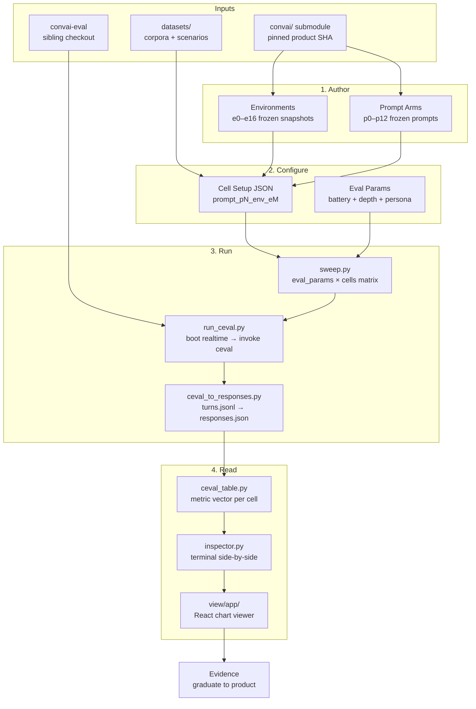
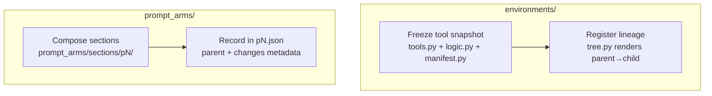
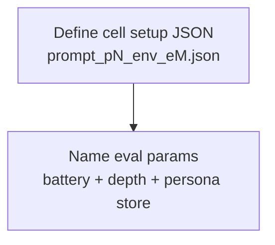
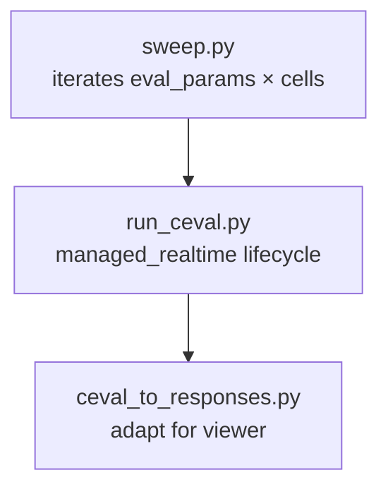
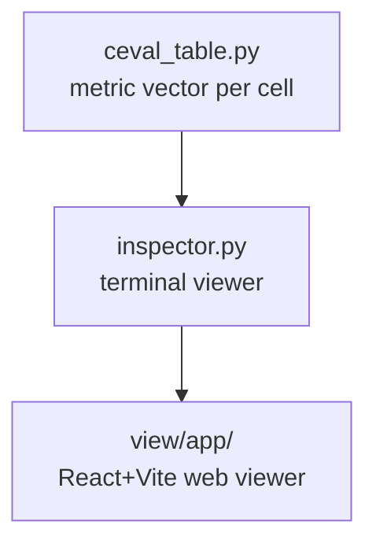

# convai-lab Architecture

## Overview

## Stage Detail

### 1. Author (environments/ + prompt_arms/)

Two parallel authoring tracks produce frozen, numbered snapshots:

- **Environments**: 16 frozen tool environments (e0–e16) plus two chart pipeline snapshots (_charts_v1, _charts_v2). Each has `tools.py`, `logic.py`, `manifest.py`. Selected at runtime via `EXPERIMENTAL_ENV=eN`.
- **Prompt Arms**: 13 frozen system prompts (p0–p12), composed from section files. Never edited after producing results.
- **Freeze rule**: once a snapshot produces cited results, it never changes. Bug fixes cut a new numbered arm.

### 2. Configure (runners/setups/)

- **Cell setup JSON**: pairs one prompt arm with one environment. Located at `runners/setups/experimental_tools/`. Name encodes the cell: `prompt_p4_env_e12.json`.
- **Eval params**: named parameter sets in `runners/eval_params.py`. Six defined: `lab_prompts_hard`, `lab_prompts_chart`, `lab_prompts_guardrail`, `lab_prompts_clarification`, `lab_prompts_smoke5`, `suite_full`.
- **Three-axis matrix**: environment × prompt arm × thinking (on/off).

### 3. Run (runners/sweep.py)

- **sweep.py**: outer loop over the eval_params×cells matrix. Sequential (one Postgres, one port). Calls `run_ceval.py` per pairing.
- **run_ceval.py**: boots realtime-text with the cell's env overrides, invokes `ceval simulate` from the convai-eval checkout, captures provenance (lab SHA, product SHA, evaluator SHA, lock state). Records manifests.
- **Adapter**: converts `turns.jsonl` streaming capture → viewer's `responses.json` format.
- **Models**: default `vllm` (local Gemma-4-26B), configurable via `--sim`/`--judge`.

### 4. Read (view/)

- **ceval_table.py**: aggregate score vector per cell, printed between sweep pairings.
- **inspector.py**: colour-coded terminal viewer, side-by-side columns, section-aligned.
- **view/app/**: React+Vite static bundle importing pinned product chart renderer. Real chart components render from the `component_emitted` events.

## Data Shapes

| Artifact | Format | Location |
|----------|--------|----------|
| Cell setup | JSON (`{name, env}`) | `runners/setups/experimental_tools/*.json` |
| Eval params | Python dataclass | `runners/eval_params.py` |
| Environment manifest | Python module (`NAME`, `PARENT`, `TOOLS`) | `environments/eN/manifest.py` |
| Prompt arm | JSON (`{parent, changes, sections}`) | `prompt_arms/pN.json` |
| Run provenance | JSON (schema_version=2) | `results/ceval/<run_id>/manifest.json` |
| Simulation capture | JSONL (one row per turn) | `<ceval_root>/runs/<run_id>/turns.jsonl` |
| Viewer format | JSON (scenarios + turns + components) | `results/ceval/<run_id>/responses.json` |
| Scenarios battery | JSON (openings + expected outcomes) | `datasets/scenarios/*.json` |

## Config Snapshot

| Parameter | Value | Source |
|-----------|-------|--------|
| Default model | `vllm` (Gemma-4-26B-A4B-it) | `runners/models.py` |
| Eval depth (authored) | `--max-turns 3` | `runners/eval_params.py` |
| Eval depth (suite) | self-terminating, up to 8 | convai-eval built-in |
| Batch concurrency | 4 scenarios | ceval default |
| Realtime port | 8001 | `runners/utils.py` |
| Persona store | `persona_db/` | eval params `--persona-db-dir` |
| Environments | e0–e16 + visualise_data_v1/v2/v2a | `environments/` |
| Prompt arms | p0–p12 | `prompt_arms/` |
| Thinking axis | off (default) or on (`_think` suffix) | cell setup env |
