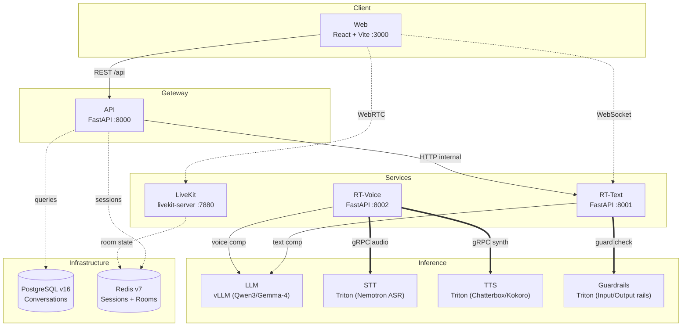
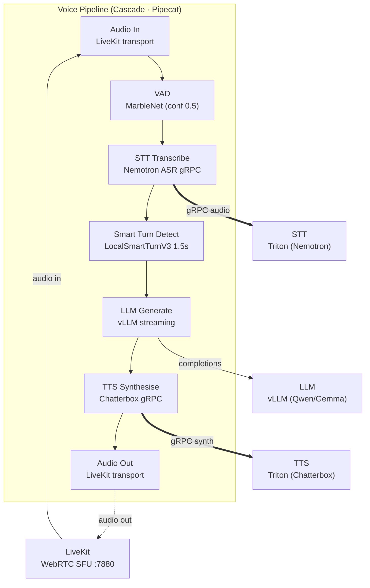

# Concierge Architecture

Financial conversational AI platform with text and voice modes.

## Service Map (Overview)

## Voice Pipeline (Data Flow)

## Data Shapes

| Service | Interface | Protocol | Port |
|---------|-----------|----------|------|
| Web | Vite dev / nginx | HTTP | 3000 |
| API | FastAPI (REST) | HTTP | 8000 |
| RT-Text | FastAPI (WebSocket) | WS | 8001 |
| RT-Voice | FastAPI (Pipecat) | Internal | 8002 |
| LiveKit | livekit-server (WebRTC SFU) | WS/RTC | 7880 |
| LLM | vLLM (OpenAI-compatible API) | HTTP | 9000 |
| STT | Triton Inference Server | gRPC | 9101 |
| TTS | Triton Inference Server | gRPC | 9201 |
| Guardrails | Triton Inference Server | gRPC | 9301 |
| PostgreSQL | postgres:16-alpine | TCP | 5432 |
| Redis | redis:7-alpine | TCP | 6379 |

## Config Snapshot

| Parameter | Value | Source |
|-----------|-------|--------|
| Pipeline type | `cascade` / `openai` | `tilt_config.json` |
| LLM model | `Qwen/Qwen3-8B-FP8` or `google/gemma-4-26B-A4B-it` | `tilt_config.json` |
| STT model | `nemotron_asr` | `tilt_config.json` |
| TTS model | `chatterbox_tts` / `kokoro_tts` | `tilt_config.json` |
| VAD confidence | 0.5 | `pipeline/cascade/pipeline.py` |
| VAD start | 0.15s | `pipeline/cascade/pipeline.py` |
| VAD stop | 0.7s | `pipeline/cascade/pipeline.py` |
| Smart turn timeout | 1.5s | `pipeline/cascade/pipeline.py` |
| Voice join timeout | 15s | `app/config.py` |
| Voice reconnect grace | 5s | `app/config.py` |
| Cluster | Kind (macOS) / k3s (Linux) | `tilt_config.json` |
| Auth | Staff SSO / LaunchDarkly flags | `shared/auth/` |
