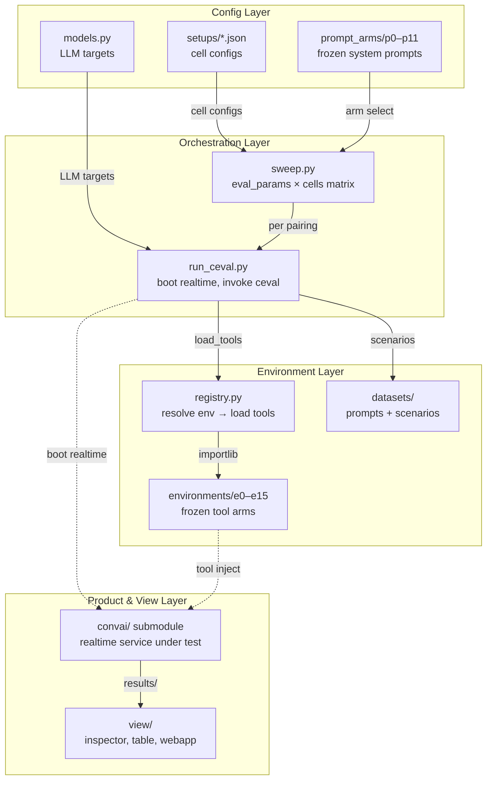

# convai-lab Architecture

## Overview

## Layer Descriptions

| Layer | Purpose | Key Files |
|-------|---------|-----------|
| Config | Defines the experiment matrix axes | `runners/setups/`, `prompt_arms/`, `runners/models.py`, `runners/eval_params.py` |
| Orchestration | Drives the sweep: every eval-params × cell pairing | `runners/sweep.py`, `runners/run_ceval.py` |
| Environment | Frozen tool snapshots + question batteries | `environments/registry.py`, `environments/e0–e15/`, `datasets/` |
| Product & View | The thing being measured + reading results | `convai/` (submodule), `view/inspector.py`, `view/ceval_table.py` |

## Data Flow

1. **Config** defines what to run: which cells (prompt arm + environment + think flag), which eval params (question battery + depth), which LLM targets (local vLLM, gateway).
2. **sweep.py** iterates the matrix — one `run_ceval.py` invocation per pairing.
3. **run_ceval.py** boots the product's realtime service with the cell's environment injected via `EXPERIMENTAL_TOOLS_DIR` + `EXPERIMENTAL_ENV`, invokes `ceval simulate`, tears down.
4. **registry.py** resolves the named environment → `importlib` loads the frozen arm's `tools.py` + `logic.py`.
5. **Results** land in `results/ceval/<run_id>/`. The view layer reads them.

## Key Design Decisions

- **One-way dependency**: lab → product. The product imports nothing from the lab.
- **Freeze rule**: once an environment produces cited results, it never changes.
- **Cells run sequentially**: one Postgres, one realtime port, each reseed truncates globally.
- **Judge = assistant model by default**: scores rank arms, not calibrated quality.

## Config Snapshot

| Parameter | Value |
|-----------|-------|
| Prompt arms | p0–p11 (frozen snapshots) |
| Environments | e0–e15 + visualise_data_v1/v2 |
| Default LLM target | local (vLLM from pipeline.env) |
| Default depth | --max-turns 3 |
| Batch concurrency | 4 scenarios per cell |
