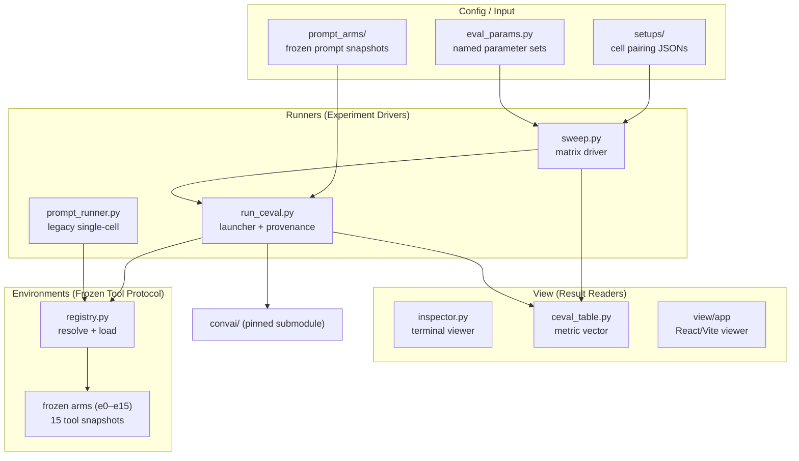

# convai-lab Architecture

## Overview

## Layer Descriptions

### Config / Input
The top layer defines *what* experiments run. Setup JSONs pair a prompt arm with an environment into a cell. `eval_params.py` names the battery (questions, depth, persona store). Prompt arms are frozen system-prompt snapshots composed from versioned sections.

### Runners (Experiment Drivers)
`sweep.py` drives the eval_params × cells matrix, executing cells sequentially (one Postgres, one realtime port). `run_ceval.py` boots the product's realtime service per cell, invokes `convai-eval` as a subprocess, and records provenance. `prompt_runner.py` is the legacy single-cell driver being retired.

### View (Result Readers)
Read-only tools consuming `results/`. `inspector.py` renders runs side-by-side in the terminal. `ceval_table.py` computes per-cell metric vectors (printed by sweep between pairings). The React/Vite app renders responses through the product's real chart components.

### Environments (Frozen Tool Protocol)
The shared lower protocol all runners consume. `registry.py` resolves an environment name to its tools or logic module via `importlib`. Each frozen arm is a complete snapshot: `manifest.py` (name, parent, tools list), `tools.py` (ToolDef schemas), `logic.py` (pure computation), optionally `data.py`.

### convai/ (External Product)
The product under test, pinned as a git submodule. The lab consumes it (boots realtime, imports shared clients); the product knows nothing about the lab.

## Data Shapes

| Artefact | Location | Format |
|----------|----------|--------|
| Cell setup | `runners/setups/experimental_tools/*.json` | `{name, env: {EXPERIMENTAL_ENV, SYSTEM_PROMPT_CONFIG, ...}}` |
| Eval params | `runners/eval_params.py` | Python dataclass → ceval argument tail |
| Prompt arm | `prompt_arms/pN.json` + `sections/pN/` | JSON manifest + text section files |
| Environment manifest | `environments/eN/manifest.py` | `NAME, PARENT, STATUS, TOOLS, DESCRIPTION, CHANGES` |
| Run result | `results/ceval/<run_id>/` | `manifest.json` + `simulate/` + `responses.json` |
| Metric vector | `view/ceval_table.py` output | per-cell score table (auto, rubric, built-in) |

## Config Snapshot

| Key | Source | Example |
|-----|--------|---------|
| `EXPERIMENTAL_ENV` | setup JSON | `e12` |
| `SYSTEM_PROMPT_CONFIG` | setup JSON | `prompt_arms/sections/p6/config.yaml` |
| `ENABLE_THINKING` | setup JSON | `false` |
| `VLLM_MODEL` | pipeline.env | `google/gemma-4-26B-A4B-it` |
| `VLLM_BASE_URL` | pipeline.env | `http://localhost:8000/v1` |
| `--eval-params` | CLI | `lab_prompts`, `suite_full` |
| `--cells` | CLI | `prompt_p4_env_e12` |
