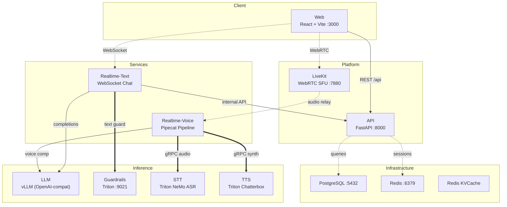
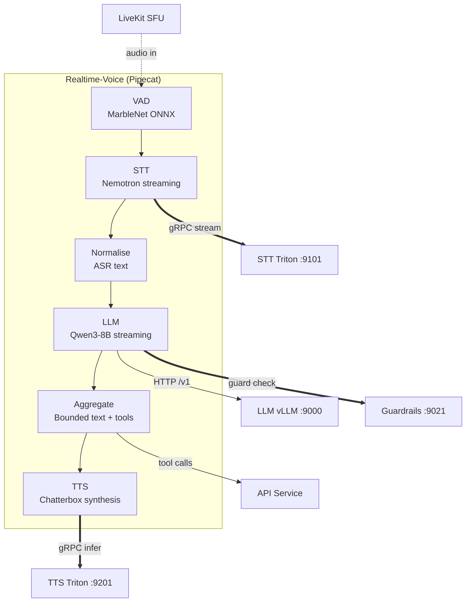

# Concierge Architecture

Financial conversational AI platform with text and voice modes.

## Overview

## Voice Pipeline (Cascade Mode)

## Data Shapes

| Shape | Source | Format | Description |
|-------|--------|--------|-------------|
| Audio frames | LiveKit | PCM 16kHz | Raw audio from WebRTC |
| Transcript | STT | Streaming text | Partial/final ASR output |
| Chat messages | LLM | OpenAI-compat JSON | Streamed completion deltas |
| Guard verdict | Guardrails | gRPC response | is_safe, confidence, redacted_text |
| Synthesised audio | TTS | PCM chunks | Audio frames for playback |
| Tool results | API | JSON | Bank accounts, transactions |

## Config Snapshot

| Key | Default | Description |
|-----|---------|-------------|
| pipeline-type | `cascade` | Inference pipeline mode (cascade, openai, cascade_remote) |
| llm-model | `google/gemma-4-26B-A4B-it` | LLM model served by vLLM |
| stt-model | `nemotron_asr` | Triton STT model name |
| tts-model | `chatterbox_tts` | Triton TTS model name (alt: kokoro_tts) |
| guardrails | `false` | Enable Triton guardrails service |
| VAD confidence | `0.5` | MarbleNet voice activity threshold |
| VAD start | `0.15s` | Speech start detection window |
| VAD stop | `0.7s` | Speech end detection window |
| VAD min volume | `0.25` | Minimum volume for VAD trigger |

## Services

| Service | Port | Framework | Role |
|---------|------|-----------|------|
| Web | 3000 | React + Vite | Browser SPA with LiveKit JS SDK |
| API | 8000 | FastAPI | REST API, auth, sessions, BoA banking, conversations |
| Realtime-Text | 8001 | FastAPI (WS) | Text chat tier with guardrails orchestration |
| Realtime-Voice | 8000 | FastAPI + Pipecat | Voice cascade: VAD → STT → LLM → TTS |
| LiveKit | 7880 | LiveKit Server | WebRTC SFU for media relay and room management |
| LLM | 9000 | vLLM + LMCache | OpenAI-compatible inference with KV cache |
| STT | 9101 | Triton (gRPC) | NeMo ASR (Nemotron/Parakeet) |
| TTS | 9201 | Triton (gRPC) | Chatterbox / Kokoro speech synthesis |
| Guardrails | 9021 | Triton (gRPC) | 4 models: prompt_injection, multi_guard, language_guard, pii_guard |
| PostgreSQL | 5432 | PostgreSQL 16 | Conversations, user profiles, accounts |
| Redis | 6379 | Redis 7 | Sessions, rate limiting, feature flags |
| Redis KVCache | 6379 | Redis 7 | LMCache prefix KV store |
