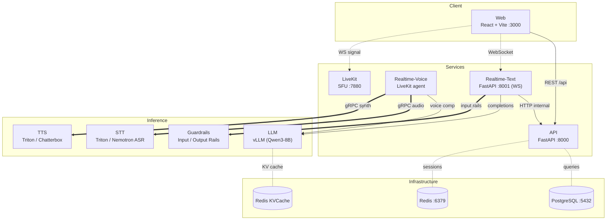
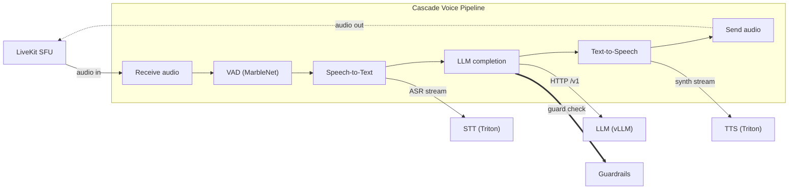

# Concierge — Architecture

Financial conversational AI platform with text and voice interaction modes.

## Service Map Overview

## Voice Pipeline (Cascade Mode)

## Data Shapes

| Shape | Source | Destination | Format |
|-------|--------|-------------|--------|
| Audio frames | LiveKit track | Realtime-Voice | PCM 16kHz |
| Transcript | STT (Triton) | LLM pipeline step | streaming text |
| Chat completion | vLLM | TTS pipeline step | SSE JSON chunks |
| Synthesised audio | TTS (Triton) | LiveKit publish | PCM frames |
| Chat messages | Web (WS) | Realtime-Text | JSON over WebSocket |
| Session state | API | Redis | key-value |
| User/account data | API | PostgreSQL | SQL (Alembic) |
| KV prefix cache | vLLM/LMCache | Redis KVCache | binary blobs |

## Config Snapshot

| Parameter | Value | Source |
|-----------|-------|--------|
| Pipeline type | `cascade` / `openai` | `tilt_config.json` |
| LLM model | `Qwen/Qwen3-8B-FP8` (default) | `tilt_config.json` |
| STT model | `nemotron_asr` | `tilt_config.json` |
| TTS model | `chatterbox_tts` / `kokoro_tts` | `tilt_config.json` |
| API port | 8000 | Helm values |
| Realtime-Text port | 8001 | Helm values |
| LiveKit ports | 7880 (signal), 7881 (RTC) | Helm values |
| Deploy target | Kubernetes (Kind / k3s local, EKS prod) | Tiltfile |
| Observability | Grafana + Tempo + Loki + Alloy (optional) | `tilt_config.json` |
